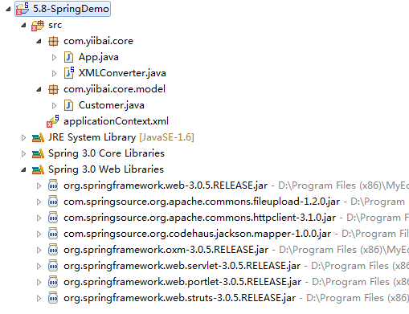

# Spring Object到XML映射实例 - Spring教程

Spring的Object/XML映射将对象转换到XML，或反之亦然。这个过程也被称为

1.  XML Marshalling – 转换对象到XML
2.  XML UnMarshalling – 转换XML到对象

在本教程中，我们将介绍如何使用 Spring 的 OXM 来做转换， Object &lt;--- Spring oxm ---&gt; XML.

### 注: 为什么使用 Spring的OXM 有好处？请阅读本 [Spring 对象/XML映射的文章](http://docs.spring.io/spring/docs/3.0.x/spring-framework-reference/html/oxm.html)。

这里我们创建一个 Java 工程，整个工程的目录如下所示：


## 1\. 一个简单对象

一个简单的对象，之后将其转换成 XML 文件。

```
package com.yiibai.core.model;

public class Customer {

    String name;
    int age;
    boolean flag;
    String address;

    //standard getter, setter and toString() methods.
}
```

## 3\. Marshaller 和 Unmarshaller

这个类将处理通过 Spring 的 OXM 接口的转换： Marshaller 和 Unmarshaller.

```
package com.yiibai.core;

import java.io.FileInputStream;
import java.io.FileOutputStream;
import java.io.IOException;
import javax.xml.transform.stream.StreamResult;
import javax.xml.transform.stream.StreamSource;
import org.springframework.oxm.Marshaller;
import org.springframework.oxm.Unmarshaller;

public class XMLConverter {

    private Marshaller marshaller;
    private Unmarshaller unmarshaller;

    public Marshaller getMarshaller() {
        return marshaller;
    }

    public void setMarshaller(Marshaller marshaller) {
        this.marshaller = marshaller;
    }

    public Unmarshaller getUnmarshaller() {
        return unmarshaller;
    }

    public void setUnmarshaller(Unmarshaller unmarshaller) {
        this.unmarshaller = unmarshaller;
    }

    public void convertFromObjectToXML(Object object, String filepath)
        throws IOException {

        FileOutputStream os = null;
        try {
            os = new FileOutputStream(filepath);
            getMarshaller().marshal(object, new StreamResult(os));
        } finally {
            if (os != null) {
                os.close();
            }
        }
    }

    public Object convertFromXMLToObject(String xmlfile) throws IOException {

        FileInputStream is = null;
        try {
            is = new FileInputStream(xmlfile);
            return getUnmarshaller().unmarshal(new StreamSource(is));
        } finally {
            if (is != null) {
                is.close();
            }
        }
    }

}
```

## 4\. Spring配置

在 Spring 的 bean 配置文件，注入 CastorMarshaller 作为 XML 绑定框架。

```
<beans xmlns="http://www.springframework.org/schema/beans"
    xmlns:xsi="http://www.w3.org/2001/XMLSchema-instance"
    xsi:schemaLocation="http://www.springframework.org/schema/beans
    http://www.springframework.org/schema/beans/spring-beans-3.0.xsd">

    <bean id="XMLConverter" class="com.yiibai.core.XMLConverter">
        <property name="marshaller" ref="castorMarshaller" />
        <property name="unmarshaller" ref="castorMarshaller" />
    </bean>
    <bean id="castorMarshaller" class="org.springframework.oxm.castor.CastorMarshaller" />

</beans>
```

## 5\. 测试

运行它 

```
package com.yiibai.core;

import java.io.IOException;
import org.springframework.context.ApplicationContext;
import org.springframework.context.support.ClassPathXmlApplicationContext;
import com.yiibai.core.model.Customer;

public class App {
    private static final String XML_FILE_NAME = "customer.xml";

    public static void main(String[] args) throws IOException {
        ApplicationContext appContext = new ClassPathXmlApplicationContext("App.xml");
        XMLConverter converter = (XMLConverter) appContext.getBean("XMLConverter");

        Customer customer = new Customer();
        customer.setName("yiibai");
        customer.setAge(28);
        customer.setFlag(true);
        customer.setAddress("Haikou haidiandao");

        System.out.println("Convert Object to XML!");
        //from object to XML file
        converter.convertFromObjectToXML(customer, XML_FILE_NAME);
        System.out.println("Done \n");

        System.out.println("Convert XML back to Object!");
        //from XML to object
        Customer customer2 = (Customer)converter.convertFromXMLToObject(XML_FILE_NAME);
        System.out.println(customer2);
        System.out.println("Done");

    }
}
```

输出结果

```
Convert Object to XML!
Done 

Convert XML back to Object!
Customer [name=yiibai, age=28, flag=true, address=Haikou Haidiandao]
Done
```

下面的 XML 文件“customer.xml”将在项目的根文件夹中生成。

_File : customer.xml_

```
<?xml version="1.0" encoding="UTF-8"?>
<customer flag="true" age="28">
    <address>Haikou Haidiandao</address>
    <name>yiibai</name>
</customer>
```

## XML映射

等等，为什么flag和age可转换为属性？这是一种来控制哪些字段应为属性或元素的使用的方式？ 当然，您可以使用 [Castor XML映射定义对象](http://www.castor.org/) 和XML之间的关系。

创建以下映射文件，并把它放到你的项目的 classpath。

_File : mapping.xml_

```
<mapping>
    <class name="com.yiibai.core.model.Customer">

        <map-to xml="customer" />

        <field name="age" type="integer">
            <bind-xml name="age" node="attribute" />
        </field>

        <field name="flag" type="boolean">
            <bind-xml name="flag" node="element" />
        </field>

        <field name="name" type="string">
            <bind-xml name="name" node="element" />
        </field>

        <field name="address" type="string">
            <bind-xml name="address" node="element" />
        </field>
    </class>
</mapping>
```

在Spring bean配置文件，上述通过“mappingLocation”注入 mapping.xml 到 CastorMarshaller 。注：这里需要加入一个 org.springframework.oxm.***.jar 包，这个包函数在 MyEclipse 库的 Spring 3.0 Web Libaries中。

```
<beans xmlns="http://www.springframework.org/schema/beans"
    xmlns:xsi="http://www.w3.org/2001/XMLSchema-instance"
    xsi:schemaLocation="http://www.springframework.org/schema/beans
    http://www.springframework.org/schema/beans/spring-beans-3.0.xsd">

    <bean id="XMLConverter" class="com.yiibai.core.XMLConverter">
        <property name="marshaller" ref="castorMarshaller" />
        <property name="unmarshaller" ref="castorMarshaller" />
    </bean>
    <bean id="castorMarshaller" class="org.springframework.oxm.castor.CastorMarshaller" >
        <property name="mappingLocation" value="classpath:mapping.xml" />
    </bean>

</beans>
```

再次测试，XML文件“customer.xml”将被更新。

_File : customer.xml_

```
<?xml version="1.0" encoding="UTF-8"?>
<customer age="28">
    <flag>true</flag>
    <name>yiibai</name>
    <address>Haikou Haidiandao</address>
</customer>
```

参考：[http://my.oschina.net/u/1455908/blog/311723](http://my.oschina.net/u/1455908/blog/311723)下载文档 – [http://pan.baidu.com/s/1dEo0bnz](http://pan.baidu.com/s/1dEo0bnz)

