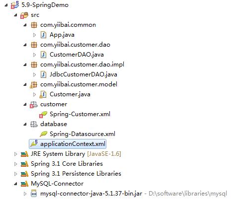

# Spring+JDBC实例 - Spring教程

## 1\. Customer 表

在这个例子中，我们使用的是MySQL数据库。

```
CREATE TABLE `customer` (
  `CUST_ID` int(10) unsigned NOT NULL AUTO_INCREMENT,
  `NAME` varchar(100) NOT NULL,
  `AGE` int(10) unsigned NOT NULL,
  PRIMARY KEY (`CUST_ID`)
) ENGINE=InnoDB AUTO_INCREMENT=1 DEFAULT CHARSET=utf8;
```

## 2\. Customer模型

添加一个客户模型用来存储用户的数据。

```
package com.yiibai.customer.model;

import java.sql.Timestamp;

public class Customer 
{
    int custId;
    String name;
    int age;
    //getter and setter methods

}
```

## 4\. 数据访问对象 (DAO) 模式

Customer Dao 接口.

```
package com.yiibai.customer.dao;

import com.yiibai.customer.model.Customer;

public interface CustomerDAO 
{
    public void insert(Customer customer);
    public Customer findByCustomerId(int custId);
}
```

客户的DAO实现，使用 JDBC 发出简单的 insert 和 select SQL语句。

```
package com.yiibai.customer.dao.impl;

import java.sql.Connection;
import java.sql.PreparedStatement;
import java.sql.ResultSet;
import java.sql.SQLException;
import javax.sql.DataSource;
import com.yiibai.customer.dao.CustomerDAO;
import com.yiibai.customer.model.Customer;

public class JdbcCustomerDAO implements CustomerDAO
{
    private DataSource dataSource;

    public void setDataSource(DataSource dataSource) {
        this.dataSource = dataSource;
    }

    public void insert(Customer customer){

        String sql = "INSERT INTO CUSTOMER " +
                "(CUST_ID, NAME, AGE) VALUES (?, ?, ?)";
        Connection conn = null;

        try {
            conn = dataSource.getConnection();
            PreparedStatement ps = conn.prepareStatement(sql);
            ps.setInt(1, customer.getCustId());
            ps.setString(2, customer.getName());
            ps.setInt(3, customer.getAge());
            ps.executeUpdate();
            ps.close();

        } catch (SQLException e) {
            throw new RuntimeException(e);

        } finally {
            if (conn != null) {
                try {
                    conn.close();
                } catch (SQLException e) {}
            }
        }
    }

    public Customer findByCustomerId(int custId){

        String sql = "SELECT * FROM CUSTOMER WHERE CUST_ID = ?";

        Connection conn = null;

        try {
            conn = dataSource.getConnection();
            PreparedStatement ps = conn.prepareStatement(sql);
            ps.setInt(1, custId);
            Customer customer = null;
            ResultSet rs = ps.executeQuery();
            if (rs.next()) {
                customer = new Customer(
                    rs.getInt("CUST_ID"),
                    rs.getString("NAME"), 
                    rs.getInt("Age")
                );
            }
            rs.close();
            ps.close();
            return customer;
        } catch (SQLException e) {
            throw new RuntimeException(e);
        } finally {
            if (conn != null) {
                try {
                conn.close();
                } catch (SQLException e) {}
            }
        }
    }
}
```

## 5\. Spring bean配置

创建 customerDAO 和数据源在 Spring bean 配置文件中。

_File : Spring-Customer.xml_

```
<beans xmlns="http://www.springframework.org/schema/beans"
    xmlns:xsi="http://www.w3.org/2001/XMLSchema-instance"
    xsi:schemaLocation="http://www.springframework.org/schema/beans
    http://www.springframework.org/schema/beans/spring-beans-2.5.xsd">

    <bean id="customerDAO" class="com.yiibai.customer.dao.impl.JdbcCustomerDAO">
        <property name="dataSource" ref="dataSource" />
    </bean>

</beans>
```

_File : Spring-Datasource.xml_

```
<beans xmlns="http://www.springframework.org/schema/beans"
    xmlns:xsi="http://www.w3.org/2001/XMLSchema-instance"
    xsi:schemaLocation="http://www.springframework.org/schema/beans
    http://www.springframework.org/schema/beans/spring-beans-2.5.xsd">

    <bean id="dataSource"
        class="org.springframework.jdbc.datasource.DriverManagerDataSource">

        <property name="driverClassName" value="com.mysql.jdbc.Driver" />
        <property name="url" value="jdbc:mysql://localhost:3306/yiibaijava" />
        <property name="username" value="root" />
        <property name="password" value="password" />
    </bean>

</beans>
```

_File : Spring-Module.xml_

```
<beans xmlns="http://www.springframework.org/schema/beans"
    xmlns:xsi="http://www.w3.org/2001/XMLSchema-instance"
    xsi:schemaLocation="http://www.springframework.org/schema/beans
    http://www.springframework.org/schema/beans/spring-beans-2.5.xsd">

    <import resource="database/Spring-Datasource.xml" />
    <import resource="customer/Spring-Customer.xml" />

</beans>
```

## 6.项目结构

本实例完整目录结构。



## 7.运行它

```
package com.yiibai.common;

import org.springframework.context.ApplicationContext;
import org.springframework.context.support.ClassPathXmlApplicationContext;
import com.yiibai.customer.dao.CustomerDAO;
import com.yiibai.customer.model.Customer;

public class App 
{
    public static void main( String[] args )
    {
        ApplicationContext context = 
            new ClassPathXmlApplicationContext("applicationContext.xml");

        CustomerDAO customerDAO = (CustomerDAO) context.getBean("customerDAO");
        Customer customer = new Customer(1, "yiibai",29);
        customerDAO.insert(customer);

        Customer customer1 = customerDAO.findByCustomerId(1);
        System.out.println(customer1);

    }
}
```

输出结果：

```
Customer [age=29, custId=1, name=yiibai]
```

下载源代码 – [http://pan.baidu.com/s/1SR2GI](http://pan.baidu.com/s/1SR2GI)

