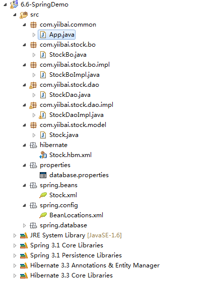

# Spring+Hibernate+MySql实例 - Spring教程

这个例子将创建一个简单的 Java 项目结构，并演示如何使用 Hibernate 在Spring框架进行 MySQL 数据库的数据处理工作(插入，选择，更新和删除)。

## 最终项目结构

最终的项目文件结构应该看起来如下面的图中显示。



## 1.创建表

在MySQL数据库中创建一张 “stock”表。 SQL语句如下：

```
CREATE TABLE  `yiibai`.`stock` (
  `STOCK_ID` int(10) unsigned NOT NULL AUTO_INCREMENT,
  `STOCK_CODE` varchar(10) NOT NULL,
  `STOCK_NAME` varchar(20) NOT NULL,
  PRIMARY KEY (`STOCK_ID`) USING BTREE,
  UNIQUE KEY `UNI_STOCK_NAME` (`STOCK_NAME`),
  UNIQUE KEY `UNI_STOCK_ID` (`STOCK_CODE`) USING BTREE
) ENGINE=InnoDB AUTO_INCREMENT=1 DEFAULT CHARSET=utf8;
```

## 2\. Model & BO & DAO

模型中，业务对象(BO)和数据访问对象(DAO)模式是有助于清楚地识别层，以避免弄乱项目结构。

##### Stock Model

Stock 模型类以后用于存储库存数据。

```
package com.yiibai.stock.model;

import java.io.Serializable;

public class Stock implements Serializable {

    private static final long serialVersionUID = 1L;

    private Long stockId;
    private String stockCode;
    private String stockName;

    //getter and setter methods...
}
```

##### Stock Business Object (BO))

Stock 业务对象(BO)接口和实现，它是用来存储项目的业务功能，真正的数据库操作(CRUD)的工作不应该参与这一个类，而是有一个DAO(StockDao)类来做到这一点。

```
package com.yiibai.stock.bo;

import com.yiibai.stock.model.Stock;

public interface StockBo {

    void save(Stock stock);
    void update(Stock stock);
    void delete(Stock stock);
    Stock findByStockCode(String stockCode);
}
```

```
package com.yiibai.stock.bo.impl;

import com.yiibai.stock.bo.StockBo;
import com.yiibai.stock.dao.StockDao;
import com.yiibai.stock.model.Stock;

public class StockBoImpl implements StockBo{

    StockDao stockDao;

    public void setStockDao(StockDao stockDao) {
        this.stockDao = stockDao;
    }

    public void save(Stock stock){
        stockDao.save(stock);
    }

    public void update(Stock stock){
        stockDao.update(stock);
    }

    public void delete(Stock stock){
        stockDao.delete(stock);
    }

    public Stock findByStockCode(String stockCode){
        return stockDao.findByStockCode(stockCode);
    }
}
```

##### Stock Data Access Object

Stock DAO接口和实现，DAO实现类扩展了 Spring 的“HibernateDaoSupport”，以使Spring框架支持Hibernate。 现在，你可以通过getHibernateTemplate()执行 Hibernate 功能。

```
package com.yiibai.stock.dao;

import com.yiibai.stock.model.Stock;

public interface StockDao {

    void save(Stock stock);
    void update(Stock stock);
    void delete(Stock stock);
    Stock findByStockCode(String stockCode);

}
```

```
package com.yiibai.stock.dao.impl;

import java.util.List;

import org.springframework.orm.hibernate3.support.HibernateDaoSupport;

import com.yiibai.stock.dao.StockDao;
import com.yiibai.stock.model.Stock;

public class StockDaoImpl extends HibernateDaoSupport implements StockDao{

    public void save(Stock stock){
        getHibernateTemplate().save(stock);
    }

    public void update(Stock stock){
        getHibernateTemplate().update(stock);
    }

    public void delete(Stock stock){
        getHibernateTemplate().delete(stock);
    }

    public Stock findByStockCode(String stockCode){
        List list = getHibernateTemplate().find(
                      "from Stock where stockCode=?",stockCode
                );
        return (Stock)list.get(0);
    }

}
```

## 5.资源配置

用于存储 Spring，Hibernate 等配置文件。

##### Hibernate Configuration

创建 Hibernate 映射文件(Stock.hbm.xml)的 Stock 表，把它放在“resources/hibernate/”文件夹中。

```
<?xml version="1.0"?>
<!DOCTYPE hibernate-mapping PUBLIC "-//Hibernate/Hibernate Mapping DTD 3.0//EN"
"http://hibernate.sourceforge.net/hibernate-mapping-3.0.dtd">

<hibernate-mapping>
    <class name="com.yiibai.stock.model.Stock" table="stock" catalog="yiibai">
        <id name="stockId" type="java.lang.Long">
            <column name="STOCK_ID" />
            <generator class="identity" />
        </id>
        <property name="stockCode" type="string">
            <column name="STOCK_CODE" length="10" not-null="true" unique="true" />
        </property>
        <property name="stockName" type="string">
            <column name="STOCK_NAME" length="20" not-null="true" unique="true" />
        </property>
    </class>
</hibernate-mapping>
```

##### Spring Configuration

Database related….

创建一个属性文件(database.properties)数据库的详细信息，把它放在“resources/properties” 文件夹中。这是很好的做法，不同于数据库细节并将 Spring bean 配置成不同的文件。

**database.properties**

```
jdbc.driverClassName=com.mysql.jdbc.Driver
jdbc.url=jdbc:mysql://localhost:3306/yiibai
jdbc.username=root
jdbc.password=password
```

为你的数据库创建一个“dataSource” bean配置文件(DataSource.xml)，并从database.properties导入的属性，把它放入到 “resources/database” 文件夹中。

**DataSource.xml**

```
<beans xmlns="http://www.springframework.org/schema/beans"
xmlns:xsi="http://www.w3.org/2001/XMLSchema-instance"
xsi:schemaLocation="http://www.springframework.org/schema/beans
http://www.springframework.org/schema/beans/spring-beans-2.5.xsd">

<bean 
class="org.springframework.beans.factory.config.PropertyPlaceholderConfigurer">
    <property name="location">
        <value>properties/database.properties</value>
    </property>
</bean>

<bean id="dataSource" 
         class="org.springframework.jdbc.datasource.DriverManagerDataSource">
    <property name="driverClassName" value="${jdbc.driverClassName}" />
    <property name="url" value="${jdbc.url}" />
    <property name="username" value="${jdbc.username}" />
    <property name="password" value="${jdbc.password}" />
</bean>

</beans>
```

Hibernate 关联….

创建一个会话工厂 bean 配置文件(Hibernate.xml)，把它放入 “resources/database” 文件夹中。这个 LocalSessionFactoryBean 中设置一个共享的 Hibernate SessionFactory 在一个 Spring 应用程序上下文。

**Hibernate.xml**

```
<?xml version="1.0" encoding="UTF-8"?>
<beans xmlns="http://www.springframework.org/schema/beans"
xmlns:xsi="http://www.w3.org/2001/XMLSchema-instance"
xsi:schemaLocation="http://www.springframework.org/schema/beans
http://www.springframework.org/schema/beans/spring-beans-2.5.xsd">

<!-- Hibernate session factory -->
<bean id="sessionFactory" 
     class="org.springframework.orm.hibernate3.LocalSessionFactoryBean">

    <property name="dataSource">
      <ref bean="dataSource"/>
    </property>

    <property name="hibernateProperties">
       <props>
         <prop key="hibernate.dialect">org.hibernate.dialect.MySQLDialect</prop>
         <prop key="hibernate.show_sql">true</prop>
       </props>
     </property>

     <property name="mappingResources">
    <list>
           <value>/hibernate/Stock.hbm.xml</value>
    </list>
      </property>    

    </bean>
</beans>
```

Spring beans related….

创建一个bean配置文件(Stock.xml)的BO和DAO类，把它放入 “resources/spring” 文件夹中。依赖的 DAO(stockDao)bean 注入到 bo(stockBo)bean; SessionFactory 的 bean 成stockDao。

**Stock.xml**

```
<beans xmlns="http://www.springframework.org/schema/beans"
xmlns:xsi="http://www.w3.org/2001/XMLSchema-instance"
xsi:schemaLocation="http://www.springframework.org/schema/beans
http://www.springframework.org/schema/beans/spring-beans-2.5.xsd">

    <!-- Stock business object -->
   <bean id="stockBo" class="com.yiibai.stock.bo.impl.StockBoImpl" >
           <property name="stockDao" ref="stockDao" />
   </bean>

   <!-- Stock Data Access Object -->
   <bean id="stockDao" class="com.yiibai.stock.dao.impl.StockDaoImpl" >
           <property name="sessionFactory" ref="sessionFactory"></property>
   </bean>

</beans>
```

导入所有的Spring bean配置文件合并为一个文件(BeanLocations.xml)，把它变成了“resources/config”文件夹。

**BeanLocations.xml**

```
<beans xmlns="http://www.springframework.org/schema/beans"
xmlns:xsi="http://www.w3.org/2001/XMLSchema-instance"
xsi:schemaLocation="http://www.springframework.org/schema/beans
http://www.springframework.org/schema/beans/spring-beans-2.5.xsd">

    <!-- Database Configuration -->
    <import resource="../database/DataSource.xml"/>
    <import resource="../database/Hibernate.xml"/>

    <!-- Beans Declaration -->
    <import resource="../beans/Stock.xml"/>

</beans>
```

## 6\. 运行它

把所有的文件和配置，运行它。

```
package com.yiibai.common;

import org.springframework.context.ApplicationContext;
import org.springframework.context.support.ClassPathXmlApplicationContext;

import com.yiibai.stock.bo.StockBo;
import com.yiibai.stock.model.Stock;

public class App 
{
    public static void main( String[] args )
    {
        ApplicationContext appContext = 
          new ClassPathXmlApplicationContext("spring/config/BeanLocations.xml");

        StockBo stockBo = (StockBo)appContext.getBean("stockBo");

        /** insert **/
        Stock stock = new Stock();
        stock.setStockCode("7668");
        stock.setStockName("HAIO");
        stockBo.save(stock);

        /** select **/
        Stock stock2 = stockBo.findByStockCode("7668");
        System.out.println(stock2);

        /** update **/
        stock2.setStockName("HAIO-1");
        stockBo.update(stock2);

        /** delete **/
        stockBo.delete(stock2);

        System.out.println("Done");
    }
}
```

输出结果：

```
Hibernate: insert into yiibai.stock (STOCK_CODE, STOCK_NAME) values (?, ?)
Hibernate: select stock0_.STOCK_ID as STOCK1_0_, stock0_.STOCK_CODE as STOCK2_0_, stock0_.STOCK_NAME as STOCK3_0_ from yiibai.stock stock0_ where stock0_.STOCK_CODE=?
Stock [stockCode=7667, stockId=1, stockName=HAIO]
Hibernate: update yiibai.stock set STOCK_CODE=?, STOCK_NAME=? where STOCK_ID=?
Done
```

下载代码 – [http://pan.baidu.com/s/1i4f40tB](http://pan.baidu.com/s/1i4f40tB)

