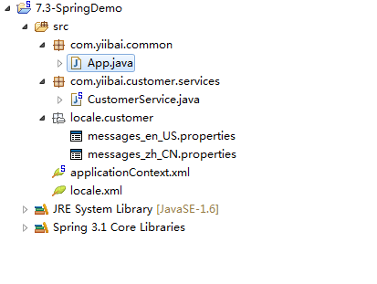
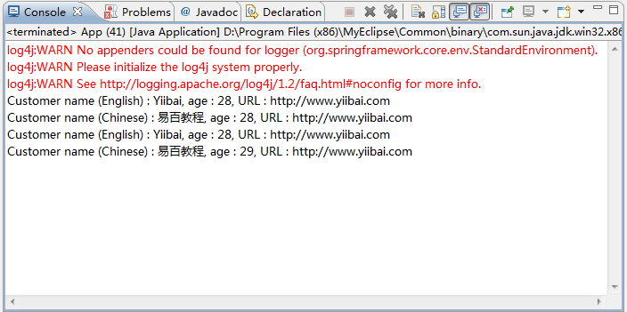

# Spring资源捆绑ResourceBundleMessageSource示例 - Spring教程

在Spring中，你可以使用ResourceBundleMessageSource从属性文件，基于解决所选择的区域设置文本信息。参见下面的例子：

## 1\. 目录结构

本实例审查目录结构如下所示：



## 2\. Properties文件

创建两个属性文件，一个是英文字符(messages_en_US.properties)，另一种为中国字符(messages_zh_CN.properties)。把它放到项目的类路径中(见上图)。

_File : messages_en_US.properties_

```
customer.name=Yong Mook Kim, age : {0}, URL : {1}
```

_File : messages_zh_CN.properties_

```
customer.name=\u6613\u767E\u6559\u7A0B, age \: {0}, URL \: {1}
```

在'\u6613\u767E\u6559\u7A0B' 是中文 Unicode 字符。

## 3\. Bean配置文件

包含属性文件到bean的配置文件。这两个“messages_en_US.properties”和“messages_zh_CN.properties”考虑放 Spring 的一个文件中， 只需要包含文件名一次，Spring 会自动找到正确的语言环境。

```
<?xml version="1.0" encoding="UTF-8"?>
<beans xmlns="http://www.springframework.org/schema/beans"
    xmlns:xsi="http://www.w3.org/2001/XMLSchema-instance"
    xsi:schemaLocation="http://www.springframework.org/schema/beans 
    http://www.springframework.org/schema/beans/spring-beans-2.5.xsd">

    <bean id="messageSource"
        class="org.springframework.context.support.ResourceBundleMessageSource">
        <property name="basename">
            <value>locale\customer\messages</value>
        </property>
    </bean>

</beans>
```

P.S 假设这两个文件位于“项目根目录”文件夹中。

## 4\. 运行它

```
package com.yiibai.common;

import java.util.Locale;
import org.springframework.context.ApplicationContext;
import org.springframework.context.support.ClassPathXmlApplicationContext;

public class App {
    public static void main(String[] args) {

        ApplicationContext context 
            = new ClassPathXmlApplicationContext("locale.xml");

        String name = context.getMessage("customer.name", 
                new Object[] { 28,"http://www.yiibai.com" }, Locale.US);

        System.out.println("Customer name (English) : " + name);

        String namechinese = context.getMessage("customer.name", 
                new Object[] {29, "http://www.yiibai.com" }, 
                                        Locale.SIMPLIFIED_CHINESE);

        System.out.println("Customer name (Chinese) : " + namechinese);

    }
}
```

输出结果



### 解释：

1. 在 context.getMessage()，第二个参数是消息参数，必须把它作为对象数组。如果没有参数值可用，可以只传递一个空(null)。

```
context.getMessage("customer.name",null, Locale.US);
```

2. Locale.US将从“messages_en_US.properties”获取信息，而Locale.SIMPLIFIED_CHINESE将从“messages_zh_CN.properties”获取信息。

下载代码 – [http://pan.baidu.com/s/1gdPt5Ur](http://pan.baidu.com/s/1gdPt5Ur)

