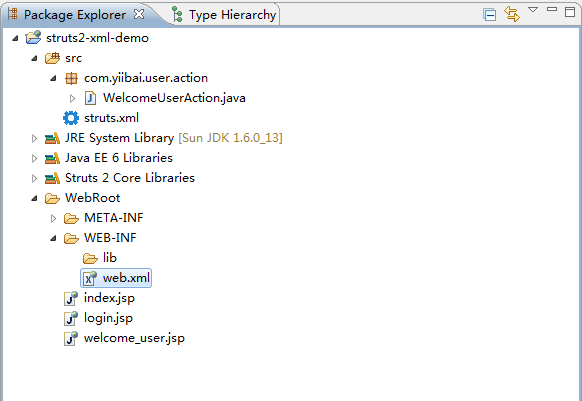
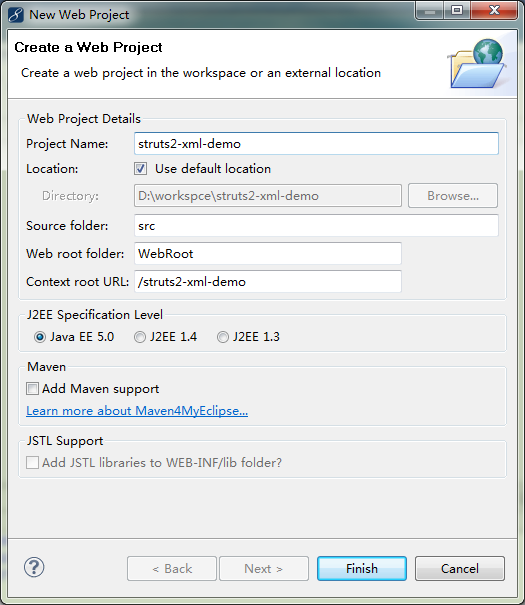
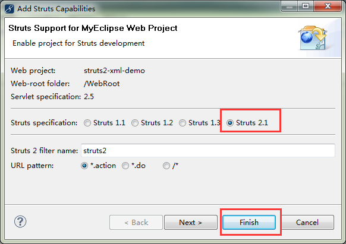
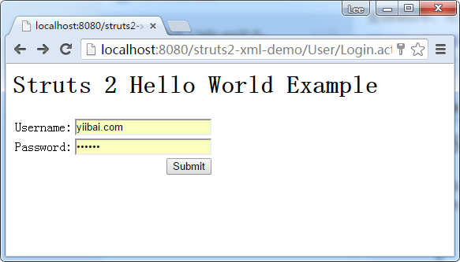
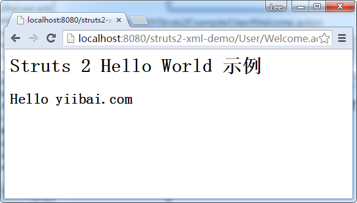

# Struts 2 hello world (XML版本) - Struts2教程

在这个例子中，我们将学习如何在Struts 2中创建一个Hello World例子。

使用以下库或工具：

*   MyEclipse 10
*   Struts 2.1

整个工程结构如下图所示：



## 1\. 创建一个Web项目工程

启动打开 MyEclipse，创建一个Web工程名称为：struts2-xml-demo，选择 File -&gt; New -&gt; Web Project ，如下图所示：




在这个项目上添加 struts2 的支持，右键点击 struts2-xml-demo 工程，选择 MyEclipse -&gt; Add Struts Capabilities，在弹出的对话框中选择 Strut 2.1，如下图所示：




## 2\. JSP视图文件

这是一个JSP登录页面，它使用Struts2标签来显示用户名，密码输入框和提交按钮。

Fie : login.jsp

```
<%@ page contentType="text/html; charset=UTF-8"%>
<%@ taglib prefix="s" uri="/struts-tags"%>
<html>
<head></head>
<body>
    <h1>Struts 2 Hello World Example</h1>

    <s:form action="Welcome">
        <s:textfield name="username" label="Username" />
        <s:password name="password" label="Password" />
        <s:submit />
    </s:form>

</body>
</html>
```

_文件: welcome_user.jsp_ – 一个JSP视图用来页面显示欢迎信息给用户。

```
<%@ page contentType="text/html; charset=UTF-8"%>
<%@ taglib prefix="s" uri="/struts-tags"%>
<html>
<head></head>
<body>
    <h1>Struts 2 Hello World 示例</h1>

    <h2>
        Hello
        <s:property value="username" />
    </h2>

</body>
</html>
```

对 Struts1 和 Struts2 有非常相似的UI标签语法，只是在命名HTML元素，例如，术语有一点不同：

**Struts 1**

```
<%@taglib uri="http://struts.apache.org/tags-html" prefix="html"%>
<html:form action="Welcome">
   <html:text property="username"/>
</html:form>
```

**Struts 2**

```
<%@ taglib prefix="s" uri="/struts-tags" %>
<s:form action="Welcome">
    <s:textfield name="username" label="Username"/>
</s:form>
```

## 5\. 动作，所有的业务逻辑放在这里

一个简单的 Struts2 的 Action 类，它里面声明的所有业务逻辑。

File : WelcomeUserAction.java

```
package com.yiibai.user.action;

/**
 * 
 * @author yiibai.com
 *
 */
public class WelcomeUserAction {

    private String username;

    public String getUsername() {
        return username;
    }

    public void setUsername(String username) {
        this.username = username;
    }

    // all struts logic here
    public String execute() {

        return "SUCCESS";

    }
}
```

在Struts2中，Action类实现任何接口或扩展任何类不是必需的，但它需要创建一个execute()方法来实现所有的业务逻辑，并返回一个字符串值，告诉用户重定向到哪里。

注意
您可能会看到一些用户实现 com.opensymphony.xwork2.Action 类， 但它是完全可选的(不是必须的)，因为com.opensymphony.xwork2.Action只是提供一些方便的常量。Struts1中的Action类需要扩展org.apache.struts.action.Action。 但是，Struts 2的Action类是可选的，但是仍然允许执行com.opensymphony.xwork2.Action的一些方便的常量，或者扩展com.opensymphony.xwork2.ActionSupport 对于一些常见的默认动作执行的功能。

## 5\. Struts配置文件

Strut配置文件是用来连接所有的东西在一起。 XML文件名必须是 “struts.xml”。在这个实例中，它位于 

_File : struts.xml_

```
_<?xml version="1.0" encoding="UTF-8" ?>
<!DOCTYPE struts PUBLIC "-//Apache Software Foundation//DTD Struts Configuration 2.1//EN" "http://struts.apache.org/dtds/struts-2.1.dtd">
<struts>
    <package name="user" namespace="/User" extends="struts-default">
        <action name="Login">
            <result>/login.jsp</result>
        </action>
        <action name="Welcome" class="com.yiibai.user.action.WelcomeUserAction">
            <result name="SUCCESS">/welcome_user.jsp</result>
        </action>
    </package>
</struts>_ 
```

声明包和包含动作类，动作类是不言自明的，但你仍可能会感兴趣下面的新标签：

**1\. package name=”user”**
就在包名，并不真正去关心它。

**2\. namespace=”/User”**
它用于匹配“/User”URL模式。

注意
实际上，Struts2的命名空间相当于Struts的1多个功能模块

**3\. extends=”struts-default”**
这意味着该包是扩展了struts-default 包组件和拦截器，这是在struts-default.xml中文件中声明的，位于struts2-core.jar 文件的根目录。

## 6\. web.xml

配置Web应用程序部署描述符(web.xml)文件Struts2的集成到Web项目。

_File web.xml_

```
_<?xml version="1.0" encoding="UTF-8"?>
<web-app version="3.0" 
    xmlns="http://java.sun.com/xml/ns/javaee" 
    xmlns:xsi="http://www.w3.org/2001/XMLSchema-instance" 
    xsi:schemaLocation="http://java.sun.com/xml/ns/javaee 
    http://java.sun.com/xml/ns/javaee/web-app_3_0.xsd">
  <display-name></display-name>    
  <welcome-file-list>
    <welcome-file>index.jsp</welcome-file>
  </welcome-file-list>
  <filter>
      <filter-name>struts2</filter-name>
      <filter-class>
          org.apache.struts2.dispatcher.ng.filter.StrutsPrepareAndExecuteFilter
      </filter-class>
  </filter>
  <filter-mapping>
      <filter-name>struts2</filter-name>
      <url-pattern>*.action</url-pattern>
  </filter-mapping></web-app>_
```

## 7\. 运行测试结果

在Struts2中，可以直接使用.action后缀访问操作类。如下URL：

http://localhost:8080/struts2-xml-demo/User/Login.action



提交后到 http://localhost:8080/Struts2Example/User/Welcome.action 显示如下：




