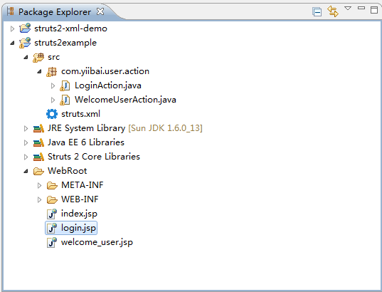
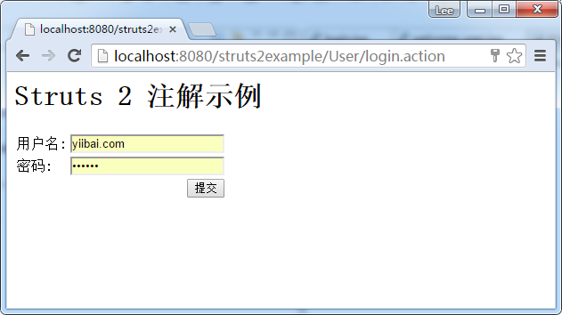
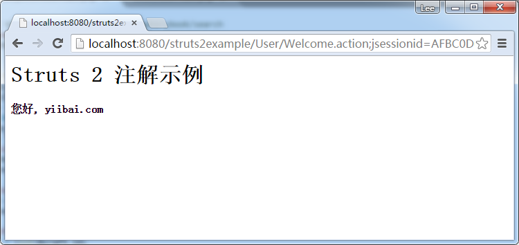

# Struts2注解示例 - Struts2教程

在这个教程，我们重复使用以前 STRUST2  Hello World(XML版本)的例子，并将其转换成注解版本。

## Struts2 注解概念

Struts2注解是由Struts 2的约定插件的支持，所以，必须要了解其背后的“扫描方法”和“命名转换”机制的魔力。

## 1. 扫描方法

许多Struts 2的文章或书籍说，可以配置过滤器的“init-param”或“struts.convention.action.packages”告诉Struts2，其中扫描注解的类。 例如，

**web.xml**

```
<filter>
  <filter-name>struts2</filter-name>
  <filter-class>org.apache.struts2.dispatcher.FilterDispatcher</filter-class>
  <init-param>
    <param-name>actionPackages</param-name>
    <param-value>com.yiibai.common</param-value>
  </init-param>
</filter>
```

从测试(Struts22.1.6和2.1.8版本)，这是不正确的，不管你把在“param-value”还是 “struts.convention.action.packages“, 在Struts 2会忽略它，并只扫描指定的文件夹命名：struts, struts2, action 或 actions 。

下面是扫描工作

1.  扫描其位于包的命名注解的类 “struts, struts2, action 或 actions“.
2.  接着，扫描相匹配下列任一条件的文件：
    *   实例了 com.opensymphony.xwork2.Action 接口。
    *   扩展了 com.opensymphony.xwork2.ActionSupport 类
    *   文件名用动作(例如：UserAction，LoginAction)结束

详细请查看这里[Struts 2 约定插件文件](http://struts.apache.org/docs/convention-plugin.html#ConventionPlugin-Codebehindhelloworld)

## 2. 命名转换器

Struts 2的约定插件将所有的注解操作文件名转换为指定的格式。

例如 : LoginAction.java

1.  首先，去掉“Action”字符在文件名的末尾，如果存在的话。
2.  其次，转换文件名的第一个字母为小写。

因此，去除结束并转换第一个字母为小写后，LoginAction.action 将变为 login.action。Struts2约定插件的“扫描方法”和“命名转换”特性真正带来了很多的便利和好处，只有当你的Struts2项目正确下面的命名约定才会带来好处; 否则，这将是一场灾难。

## Struts 2 注解例子

现在是时候开始转换过程了，我们使用MyEclipse 10 创建一个工程为：struts2example。

## 

最终的项目结构



## 2\. LoginAction

扩展ActionSupport并创建了LoginAction，什么也不做，ActionSupport 默认返回 “success” 字符串,这将匹配 @Result 并重定位到 “pages/login.jsp“.

**注解版本**

```
package com.yiibai.user.action;

import org.apache.struts2.convention.annotation.Namespace;
import org.apache.struts2.convention.annotation.Result;
import org.apache.struts2.convention.annotation.ResultPath;

import com.opensymphony.xwork2.ActionSupport;

@Namespace("/User")
@ResultPath(value="/")
@Result(name="success",location="/login.jsp")
public class LoginAction extends ActionSupport{

}
```

**XML 实现版本**

```
**<package name="user" namespace="/User" extends="struts-default">
    <action name="Login">
        <result>/login.jsp</result>
    </action>
</package>**
```

## 3\. WelcomeUserAction

重写execute()方法并指定 @Action 和 @Result 注解。

**注解版本**

```
package com.yiibai.user.action;

import org.apache.struts2.convention.annotation.Action;
import org.apache.struts2.convention.annotation.Namespace;
import org.apache.struts2.convention.annotation.Result;
import org.apache.struts2.convention.annotation.ResultPath;

import com.opensymphony.xwork2.ActionSupport;

@Namespace("/User")
@ResultPath(value="/")
public class WelcomeUserAction extends ActionSupport{

    private String username;

    public String getUsername() {
        return username;
    }

    public void setUsername(String username) {
        this.username = username;
    }

    @Action(value="Welcome", results={
        @Result(name="success",location="welcome_user.jsp")
    })
    public String execute() {

        return SUCCESS;

    }
}
```

****XML 实现版本****

```
<package name="user" namespace="/User" extends="struts-default">
   <action name="Welcome" class="com.yiibai.user.action.WelcomeUserAction">
    <result name="SUCCESS">/welcome_user.jsp</result>
   </action>
</package>
```

Struts 2 注解 – @Action, @Result 和 @Namespace 不言自明，可以将它与XML比较。@ResultPath 可能需要一点点的解释，请参阅本 [@ResultPath示例](http://www.yiibai.com/struts2/struts-2-resultpath-annotation-example/)

## 4\. JSP视图页面

普通JSP视图页面来接受用户名和密码后点击提交按钮，并重定向到一个欢迎页面。

**login.jsp**

```
<%@ page contentType="text/html; charset=UTF-8"%>
<%@ taglib prefix="s" uri="/struts-tags"%>
<html>
<head></head>
<body>
    <h1>Struts 2 注解示例</h1>

    <s:form action="Welcome">
        <s:textfield name="username" label="用户名" />
        <s:password name="password" label="密码" />
        <s:submit value="提交"/>
    </s:form>

</body>
</html>
```

**welcome_user.jsp**

```
<%@ page contentType="text/html; charset=UTF-8" %>
<%@ taglib prefix="s" uri="/struts-tags" %>
<html>
<head></head>
<body>
<h1>Struts 2 注解示例</h1>

<h4>您好, <s:property value="username"/></h4>

</body>
</html>
```

## 5\. struts.xml

所有类注解无需创建 struts.xml 文件。

## 6\. web.xml

只要创建一个典型的web.xml文件，并声明FilterDispatcher过滤器标准。

```
<!DOCTYPE web-app PUBLIC
 "-//Sun Microsystems, Inc.//DTD Web Application 2.3//EN"
 "http://java.sun.com/dtd/web-app_2_3.dtd" >

<web-app>
  <display-name>Struts 2 Web Application</display-name>

  <filter>
    <filter-name>struts2</filter-name>
    <filter-class>org.apache.struts2.dispatcher.FilterDispatcher</filter-class>
  </filter>

  <filter-mapping>
    <filter-name>struts2</filter-name>
    <url-pattern>/*</url-pattern>
  </filter-mapping>

</web-app>
```

## 7\. 运行测试

LoginAction.action 改为 login.action，请参阅上面的“命名转换器”。

[http://localhost:8080/struts2example/User/login.action](http://localhost:8080/struts2example/User/login.action)




提交到 [http://localhost:8080/Struts2Example/User/Welcome.action](http://localhost:8080/Struts2Example/User/Welcome.action) 后显示：



## 参考

1.  [Struts 2 约定插件文档](http://struts.apache.org/2.1.8/docs/convention-plugin.html)
2.  [Strust 2 Hello World (XML 版本)](http://www.yiibai.com/struts_2/struts-2-hello-world-example.html)

