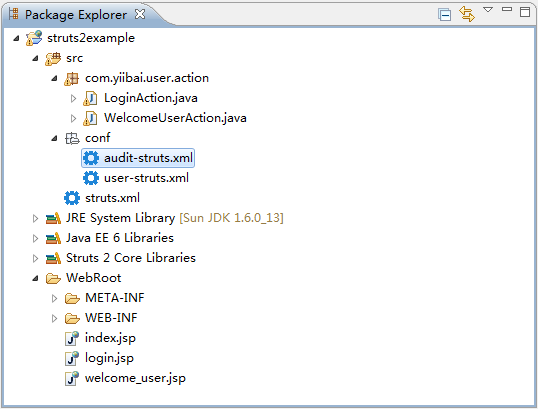

# Struts2 include(包含)多个配置文件 - Struts2教程

Struts 2自带有“包含文件”功能，包含多个Struts配置文件合并为一个单元。

## 单个Struts配置文件

让我们来看看一个糟糕的 Struts 2 配置示例。

**struts.xml**

```
<?xml version="1.0" encoding="UTF-8" ?>
<!DOCTYPE struts PUBLIC
"-//Apache Software Foundation//DTD Struts Configuration 2.0//EN"
"http://struts.apache.org/dtds/struts-2.0.dtd">

<struts>

<package name="default" namespace="/" extends="struts-default">
</package>

<package name="audit" namespace="/audit" extends="struts-default">
    <action name="WelcomeAudit">
        <result>pages/welcome_audit.jsp</result>
    </action>
</package>

<package name="user" namespace="/user" extends="struts-default">
    <action name="WelcomeUser">
        <result>pages/welcome_user.jsp</result>
    </action>
</package>

</struts> 
```

在上面的Struts配置文件中，组织所有“用户”和“审核”配置设置在一个文件中，这不是建议的，必须回避。应该打破这种形式，而将struts.xml文件分成更小的模块相关的部分。

## 多个Struts配置文件

在Struts2，应该给每个模块一个Struts配置文件。在这种情况下，可以创建三个文件：

1.  audit-struts.xml – 将所有审计模块设置在这里。
2.  user-struts.xml – 将所有用户模块设置在这里。
3.  struts.xml – 默认设置，包含 struts-audit.xml 和 Struts-user.xml 两个文件。

**struts-audit.xml**

```
<?xml version="1.0" encoding="UTF-8" ?>
<!DOCTYPE struts PUBLIC
"-//Apache Software Foundation//DTD Struts Configuration 2.0//EN"
"http://struts.apache.org/dtds/struts-2.0.dtd">

<struts>

<package name="audit" namespace="/audit" extends="struts-default">
    <action name="WelcomeAudit">
        <result>pages/welcome_audit.jsp</result>
    </action>
</package>

</struts>
```

**struts-user.xml**

```
<?xml version="1.0" encoding="UTF-8" ?>
<!DOCTYPE struts PUBLIC
"-//Apache Software Foundation//DTD Struts Configuration 2.0//EN"
"http://struts.apache.org/dtds/struts-2.0.dtd">

<struts>

<package name="user" namespace="/user" extends="struts-default">
    <action name="WelcomeUser">
        <result>pages/welcome_user.jsp</result>
    </action>
</package>

</struts>
```

**struts.xml**

```
<?xml version="1.0" encoding="UTF-8" ?>
<!DOCTYPE struts PUBLIC
"-//Apache Software Foundation//DTD Struts Configuration 2.0//EN"
"http://struts.apache.org/dtds/struts-2.0.dtd">

<struts>

<package name="default" namespace="/" extends="struts-default">
</package>

<include file="conf/user-struts.xml"></include>
<include file="conf/audit-struts.xml"></include>

</struts>
```

现在文件夹结构看起来如下：




