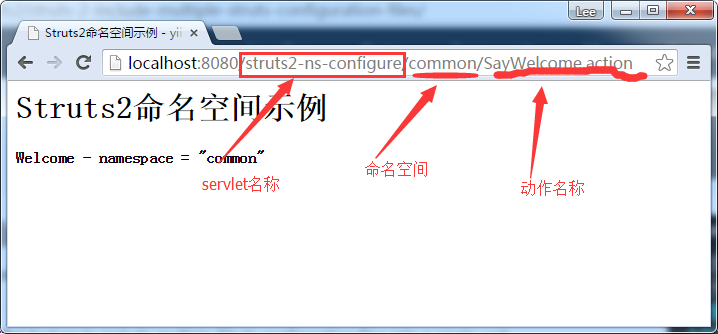
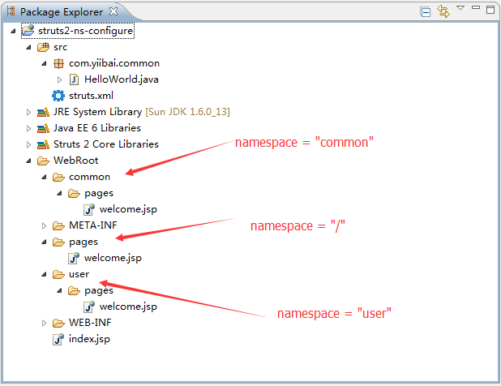

# Struts2命名空间配置和解释 - Struts2教程

Struts 2的命名空间是一个新的概念，用来处理多个模块。由下式给出一个命名空间的每个模块。此外，它还可以用来避免位于不同的模块相同的操作名称之间的冲突。

看下面的一张图来了解一个URL匹配Struts 2的动作命名空间。




## 1\. 命名空间配置

让我们通过一个Struts2的命名空间配置的例子来了解它是如何与URL和文件夹相匹配。

P.S 包中的“name”不会影响结果，只是给一个有意义的名字。

**struts.xml**

```
**<?xml version="1.0" encoding="UTF-8" ?>
<!DOCTYPE struts PUBLIC "-//Apache Software Foundation//DTD Struts Configuration 2.1//EN" "http://struts.apache.org/dtds/struts-2.1.dtd">
<struts>
    <package name="default" namespace="/" extends="struts-default">
        <action name="SayWelcome">
            <result>/pages/welcome.jsp</result>
        </action>
    </package>

    <package name="common" namespace="/common" extends="struts-default">
        <action name="SayWelcome">
            <result>/common/pages/welcome.jsp</result>
        </action>
    </package>

    <package name="user" namespace="/user" extends="struts-default">
        <action name="SayWelcome">
            <result>/common/user/welcome.jsp</result>
        </action>
    </package>
</struts>** 
```

Struts 2的动作命名空间映射到文件夹结构。




## 2\. JSP视图页面

3 JSP页面视图具有相同的文件名，但是在不同的模块位置。

根 –  pages/welcome.jsp

```
<html>
<head>
<title>Struts2命名空间示例 - yiibai.com</title>
</head>
<body>
    <h1>Struts2命名空间示例</h1>
    <h4>Welcome - namespace = "root"</h4>
</body>
</html>
```

Common 模块 –  common/pages/welcome.jsp

```
<html>
<head>
<title>Struts2命名空间示例 - yiibai.com</title>
</head>
<body>
    <h1>Struts2命名空间示例</h1>
    <h4>Welcome - namespace = "common"</h4>
</body>
</html>
```

User 模块 –  user/pages/welcome.jsp

```
<html>
<head>
<title>Struts2命名空间示例 - yiibai.com</title>
</head>
<body>
    <h1>Struts2命名空间示例</h1>

    <h4>Welcome - namespace = "user"</h4>
</body>
</html>
```

## 3\. 映射 – 如何工作?

**示例 1**
URL : http://localhost:8080/Struts2Example/SayWelcome.action

将匹配根命名空间。

```
    <package name="default" namespace="/" extends="struts-default">
        <action name="SayWelcome">
            <result>/pages/welcome.jsp</result>
        </action>
    </package>
```

这会显示 pages/welcome.jsp 页面的内容

**示例 2**
URL : http://localhost:8080/Struts2Example/common/SayWelcome.action
这会匹配 common 命名空间的内容：

```
    <package name="common" namespace="/common" extends="struts-default">
        <action name="SayWelcome">
            <result>/common/pages/welcome.jsp</result>
        </action>
    </package>
```

这会显示 ****common/pages/welcome.jsp** **页面的内容

**示例 3**
URL : http://localhost:8080/Struts2Example/user/SayWelcome.action
这会匹配 common 命名空间的内容：

```
<package name="user" namespace="/user" extends="struts-default">
    <action name="SayWelcome">
        <result>/common/user/welcome.jsp</result>
    </action>
</package>
```

这会显示 **user/pages/welcome.jsp** 页面的内容.

## 参考

1.  [Struts2命名空间配置参考](http://struts.apache.org/2.0.14/docs/namespace-configuration.html)

代码下载：[http://pan.baidu.com/s/1hqe1nZe](http://pan.baidu.com/s/1hqe1nZe)

