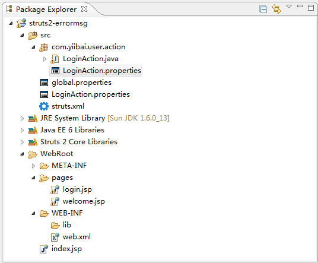
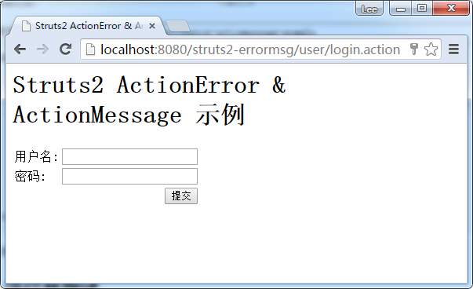
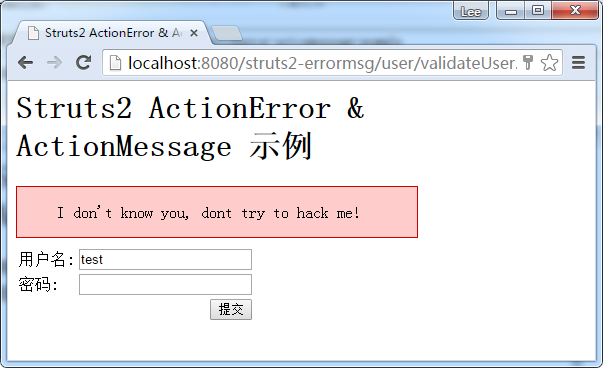
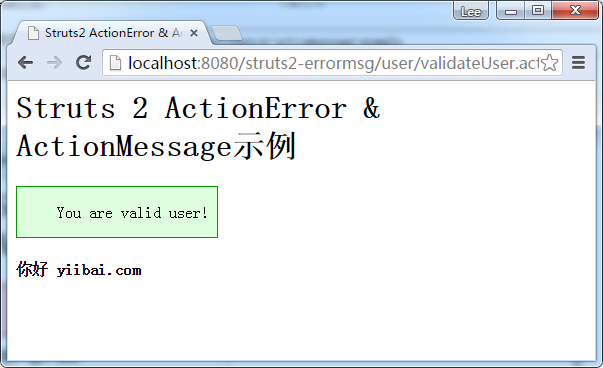

# Struts2的ActionError＆ActionMessage示例 - Struts2教程

本教程显示使用Struts2的 ActionError 和 ActionMessage 类。

1. ActionError – 是用来发送错误信息反馈给用户 - 通过 &lt;s:actionerror/&gt; 来显示。

```
<s:if test="hasActionErrors()">
   <div class="errors">
      <s:actionerror/>
   </div>
</s:if>
```

2. **ActionMessage** – 用于发送信息的反馈消息给用户，通过 **&lt;s:actionmessage/&gt; **来显示。

```
<s:if test="hasActionMessages()">
   <div class="welcome">
      <s:actionmessage/>
   </div>
</s:if> 
```

这里有一个简单的登录表单，如果用户名不等于“yiibai.com”将显示错误消息(actionerror)，否则重定向到另一个页面，显示欢迎信息(ActionMessage)。此外，所有的标签和错误消息检索来自资源包(属性文件)。

## 1\. 文件夹结构

在MyEclipse中创建一个web工程，名称为：struts2-errormsg，看这个项目结构，如下图：




## 2. 属性文件

一共有两个属性文件用来存储信息，其中 LoginAction.properties 文件放在 com.yiibai.user.action 包下。

LoginAction.properties

```
#Welcome messages
welcome.hello = 你好
#error message
username.required = 用户名不可以为空
password.required = 密码不可以为空
```

global.properties

```
#Global messages
global.username = 用户名
global.password = 密码
global.submit = 提交
global.reset = 重置
```

## 3\. 动作-Action

一个经典的动作类，做一个简单的检查，以确认用户名是否等于“yiibai.com"，并使用 addActionError()设置错误信息或addActionMessage()设置成功的消息。

```
package com.yiibai.user.action;

import com.opensymphony.xwork2.ActionSupport;

public class LoginAction extends ActionSupport{

    private String username;
    private String password;

    public String getPassword() {
        return password;
    }

    public void setPassword(String password) {
        this.password = password;
    }

    public String getUsername() {
        return username;
    }

    public void setUsername(String username) {
        this.username = username;
    }

    //business logic
    public String execute() {

        return "SUCCESS";

    }

    //simple validation
    public void validate(){
        if("yiibai.com".equals(getUsername())){
            addActionMessage("You are valid user!");
        }else{
            addActionError("I don't know you, dont try to hack me!");
        }
    }
}
```

## 4\. JSP页面视图

两个简单的JSP页面以及CSS样式自定义错误消息。

login.jsp

```
<%@ page contentType="text/html; charset=UTF-8" %>
<%@ taglib prefix="s" uri="/struts-tags" %>
<html>
<head>
<title>Struts2 ActionError & ActionMessage 示例</title>
<style type="text/css">
.errors {
    background-color:#FFCCCC;
    border:1px solid #CC0000;
    width:400px;
    margin-bottom:8px;
}
.errors li{ 
    list-style: none; 
}
</style>
</head>
<body>
<h1>Struts2 ActionError & ActionMessage 示例</h1>
<s:if test="hasActionErrors()">
   <div class="errors">
      <s:actionerror/>
   </div>
</s:if>
<s:form action="validateUser">
    <s:textfield key="global.username" name="username"/>
    <s:password key="global.password" name="password"/>
    <s:submit key="global.submit" name="submit"/>
</s:form>
</body>
</html>
```

**welcome.jsp**

```
**<%@ page contentType="text/html; charset=UTF-8"%>
<%@ taglib prefix="s" uri="/struts-tags"%>
<html>
<head>
<title>Struts2 ActionError & ActionMessage 示例</title>
<style type="text/css">
.welcome {
    background-color: #DDFFDD;
    border: 1px solid #009900;
    width: 200px;
}
.welcome li {
    list-style: none;
}
</style>
</head>
<body>
    <h1>Struts 2 ActionError & ActionMessage示例</h1>
    <s:if test="hasActionMessages()">
        <div class="welcome">
            <s:actionmessage />
        </div>
    </s:if>
    <h4>
        <s:property value="getText('welcome.hello')" />
        <s:property value="username" />
    </h4>
</body>
</html>**
```

## 5\. struts.xml

链接所有的在一起

```
<?xml version="1.0" encoding="UTF-8" ?>
<!DOCTYPE struts PUBLIC
"-//Apache Software Foundation//DTD Struts Configuration 2.0//EN"
"http://struts.apache.org/dtds/struts-2.0.dtd">

<struts>
  <constant name="struts.custom.i18n.resources" value="global" />

  <package name="user" namespace="/user" extends="struts-default">
     <action name="login">
     <result>/pages/login.jsp</result>
     </action>
     <action name="validateUser" class="com.yiibai.user.action.LoginAction">
     <result name="SUCCESS">/pages/welcome.jsp</result>
     <result name="input">/pages/login.jsp</result>
     </action>
   </package>

</struts>
```

在Struts2，ActionError和ActionMessage功能和用法与Struts1非常相似。

## 6\. 运行并测试

_http://localhost:8080/struts2-errormsg/user/login.action_

_
_

用户名是无效的，显示错误信息：&lt;s:actionerror/&gt;



用户名是有效的，显示欢迎信息：&lt;s:actionmessage/&gt;



源代码下载 – [Struts2-ActionError-ActionMessage.zip](http://pan.baidu.com/s/1pJkYCPH)

