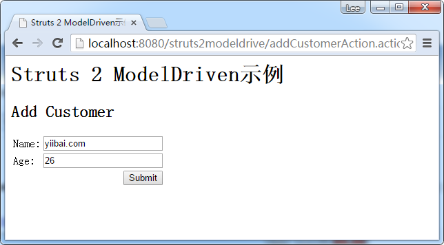
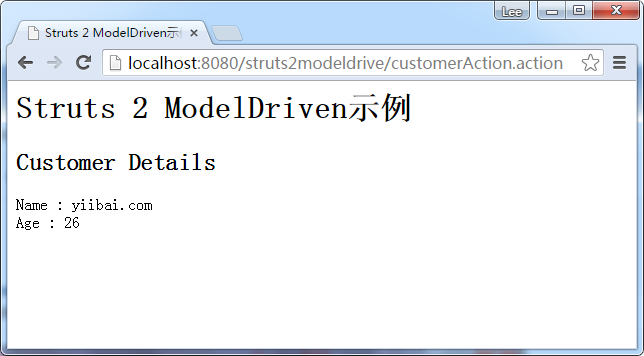

# Struts2模型驱动实例 - Struts2教程

这里我们创建一个web工程为：struts2-modeldrive ，用于讲解演示Struts2模型驱动这一章内容的学习。

如果一个动作实现了“模型驱动”- ModelDriven 接口，它就获得了表单数据自动传输到对象的额外能力。请参见下面的完整的例子：

## 1. 域对象

一个顾客(customer)对象，有 setter 和 getter 方法。

**Customer.java**

```
package com.yiibai.common;

public class Customer{

    String name;
    int age;

    public String getName() {
        return name;
    }
    public void setName(String name) {
        this.name = name;
    }
    public int getAge() {
        return age;
    }
    public void setAge(int age) {
        this.age = age;
    }

}
```

## 2\. 动作 - Action

Action类，实现了模型驱动ModelDriven 接口，声明getModel()方法返回客户的对象。当表单数据提交到这个动作，它会自动将表单数据传输到客户的属性。

客户对象必须手动初始化。

**CustomerAction.java**

```
package com.yiibai.common.action;

import com.yiibai.common.Customer;
import com.opensymphony.xwork2.ActionSupport;
import com.opensymphony.xwork2.ModelDriven;

public class CustomerAction extends ActionSupport 
    implements ModelDriven{

    //have to initialize it
    Customer customer = new Customer();

    public String execute() throws Exception {

        return SUCCESS;

    }

    public Object getModel() {

        return customer;

    }
}
```

## 3\. JSP页面

JSP页面的模型驱动(ModelDriven)的示范。

**addCustomer.jsp**

```
<%@ taglib prefix="s" uri="/struts-tags" %>
<html>
<head>
</head>

<body>
<h1>Struts 2 ModelDriven example</h1>

<h2>Add Customer</h2>
<s:form  action="customerAction" >
  <s:textfield name="name" label="Name" />
  <s:textfield name="age" label="Age" value=""/>
  <s:submit />
</s:form>

</body>
</html>
```

**success.jsp**

```
<%@ taglib prefix="s" uri="/struts-tags" %>
<html>
<head>
</head>

<body>
<h1>Struts 2 ModelDriven example</h1>

<h2>Customer Details</h2>
Name : <s:property value="name" /><br>
Age : <s:property value="age" /><br>

</body>
</html>
```

## 4\. struts.xml

```
<?xml version="1.0" encoding="UTF-8" ?>
<!DOCTYPE struts PUBLIC
"-//Apache Software Foundation//DTD Struts Configuration 2.0//EN"
"http://struts.apache.org/dtds/struts-2.0.dtd">

<struts>
     <constant name="struts.devMode" value="true" />

    <package name="default" namespace="/" extends="struts-default">

        <action name="addCustomerAction" 
            class="com.yiibai.common.action.CustomerAction" >
            <result name="success">pages/addCustomer.jsp</result>
        </action>

        <action name="customerAction" 
            class="com.yiibai.common.action.CustomerAction" >
            <result name="success">pages/success.jsp</result>
        </action>

    </package>

</struts>
```

## 5\. 示例

访问客户表，填写表格 (name : “yiibai.com”, age ” “26”) 并点击提交按钮，表单数据(name & age) 将自动转移到客户的属性(name & age) (按属性名称匹配)。

http://localhost:8080/struts2-modeldrive/addCustomerAction.action



http://localhost:8080/struts2-modeldrive/customerAction.action


工程源代码下载 - [http://pan.baidu.com/s/1hqxyjf2](http://pan.baidu.com/s/1hqxyjf2)

