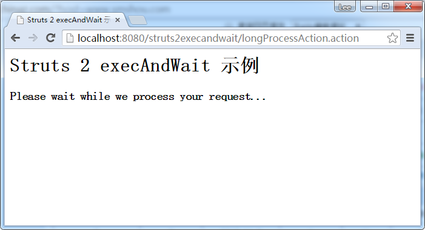

# Struts2 execAndWait拦截器例子 - Struts2教程

在Struts2中附带一个名为“execAndWait”一个非常有趣的“执行和等待”拦截器，这是一个非常方便的拦截器长时间运行操作在后台，显示用户的自定义的等待页面。在本教程中，它显示了一个完整的使用 Struts2 execAndWait 拦截器的例子。

## 1\. 动作

一个普通的动作类，有一个长时间运行进程，证明了execAndWait效果。

**LongProcessAction.java**

```
package com.yiibai.common.action;

import com.opensymphony.xwork2.ActionSupport;

public class LongProcessAction extends ActionSupport{

    public String execute() throws Exception {

        //it should be delay few seconds, 
        //unless you have a super powerful computer.
        for(int i =0; i<1000000; i++){
            System.out.println(i);
        }
        return SUCCESS;

    }
}
```

## 2\. JSP页面

创建两个页面：

1.  wait.jsp - 显示给用户，长时间运行的进程。
2.  success.jsp - 显示给用户的过程完成之后。

HTML meta refresh
记得把元刷新的等待页面顶部; 否则，该网页将不重定向到成功页面，即使该过程完成。

在这个wait.jsp，元刷新设置在每5秒网页重新加载，如果该过程完成后，将重定向到 success.jsp, 否则留在同一个页面。

**wait.jsp**

```
<%@ page contentType="text/html; charset=UTF-8"%>
<%@ taglib prefix="s" uri="/struts-tags" %>
<html>
<head>
<title>Struts 2 execAndWait 示例</title>
<meta http-equiv="refresh" content="5;url=<s:url includeParams="all" />"/>
</head>

<body>
<h1>Struts 2 execAndWait 示例</h1>

<h3>Please wait while we process your request...</h3>

</body>
</html>
```

**success.jsp**

```
<%@ page contentType="text/html; charset=UTF-8"%>
<%@ taglib prefix="s" uri="/struts-tags" %>
<html>
<head>
<title>Struts 2 execAndWait 示例</title>
</head>

<body>
<h1>Struts 2 execAndWait 示例</h1>

<h3>Done</h3>

</body>
</html>
```

## 3. 执行和等待拦截器

链接动作类并声明“execAndWait”拦截器。execAndWait 参数

1.  delay (optional) : 以毫秒为单位初始延迟显示在wait.jsp。默认是没有延迟的。
2.  delaySleepInterval (optional) : 时间间隔是以毫秒为单位来检查后台进程是否已经完成，默认值是100毫秒。

**struts.xml**

```
<?xml version="1.0" encoding="UTF-8" ?>
<!DOCTYPE struts PUBLIC
"-//Apache Software Foundation//DTD Struts Configuration 2.0//EN"
"http://struts.apache.org/dtds/struts-2.0.dtd">

<struts>
     <constant name="struts.devMode" value="true" />
    <package name="default" namespace="/" extends="struts-default">
        <action name="longProcessAction" 
            class="com.yiibai.common.action.LongProcessAction" >

            <interceptor-ref name="execAndWait">
                <param name="delay">1000</param>
                <param name="delaySleepInterval">500</param>
            </interceptor-ref>

            <result name="wait">/pages/wait.jsp</result>
            <result name="success">/pages/success.jsp</result>
        </action>

    </package>
</struts> 
```

在这种情况下，将延迟1秒显示至wait.jsp，并检查后台进程是否在每500毫秒完成。即使这个过程完成后，它仍然需要等待 wait.jsp 元刷新来触发页面重载。

## 4\. 示例

访问网址： http://localhost:8080/struts2execandwait/longProcessAction.action



延时1秒，显示在 wait.jsp 。

当该过程完成时，自动显示在 success.jsp。


代码下载：[http://pan.baidu.com/s/1o62BHGY](http://pan.baidu.com/s/1o62BHGY)

## 参考

1.  [Struts2 execAndWait拦截器文档](http://struts.apache.org/2.1.8/docs/execute-and-wait-interceptor.html)
2.  [HTML Meta Refresh](http://en.wikipedia.org/wiki/Meta_refresh)

