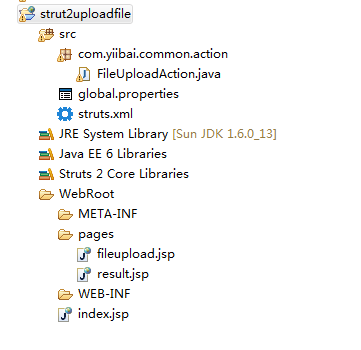
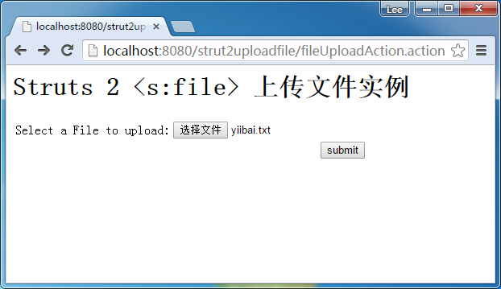
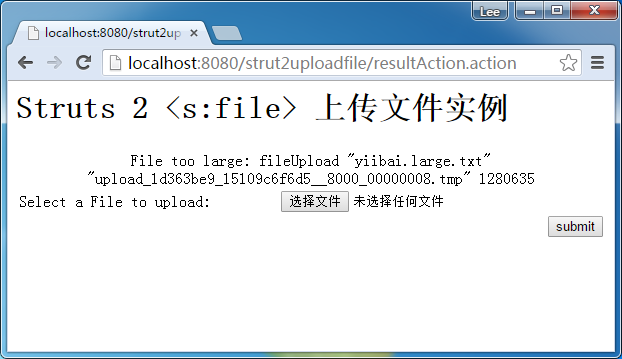
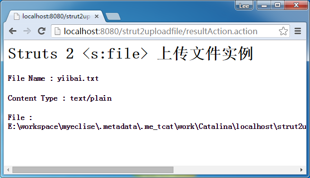

# Struts2文件上传例子 - Struts2教程

在Struts2， &lt;s:file&gt; 标签用于创建一个HTML文件上传组件，允许用户从本地磁盘选择文件，并将其上传到服务器。在本教程中，您将创建与文件上传组件JSP页面，设置最大大小和允许上传文件的内容类型，并显示上传文件的详细信息。

这里创建一个Web工程：strut2uploadfile，来演示在多个复选框如何设置的默认值，整个项目的结构如下图所示：



## 1\. 动作类

Action类的文件上传，声明“File”变量来存储用户上传的文件，两个字符串变量以存储文件名和内容类型。“文件上传拦截器”通过设置“X”的ContentType()，并设置“X”FileName()会自动注入上传的文件细节，确保方法名拼写正确。

P.S X是以存储上传的文件中的变量。

文件上传功能是依赖于“文件上传拦截器”，确保将其纳入行动的堆栈。幸运的是，默认的堆栈已经包含了“文件上传拦截器”。

**FileUploadAction.java**

```
package com.yiibai.common.action;

import java.io.File;

import com.opensymphony.xwork2.ActionSupport;

public class FileUploadAction extends ActionSupport{

    private File fileUpload;
    private String fileUploadContentType;
    private String fileUploadFileName;

    public String getFileUploadContentType() {
        return fileUploadContentType;
    }

    public void setFileUploadContentType(String fileUploadContentType) {
        this.fileUploadContentType = fileUploadContentType;
    }

    public String getFileUploadFileName() {
        return fileUploadFileName;
    }

    public void setFileUploadFileName(String fileUploadFileName) {
        this.fileUploadFileName = fileUploadFileName;
    }

    public File getFileUpload() {
        return fileUpload;
    }

    public void setFileUpload(File fileUpload) {
        this.fileUpload = fileUpload;
    }

    public String execute() throws Exception{

        return SUCCESS;

    }

    public String display() {
        return NONE;
    }

}
```

## 2\. 结果页面

使用&lt;s:file&gt;标签来渲染一个文件上传组件，并设置表单的enctype类型为：“multipart/form-data”。

**fileupload.jsp**

```
<%@ taglib prefix="s" uri="/struts-tags" %>
<html>
<head>
<s:head />
</head>

<body>
<h1>Struts 2 <s:file> file upload example</h1>

<s:form action="resultAction" namespace="/" 
method="POST" enctype="multipart/form-data">

<s:file name="fileUpload" label="Select a File to upload" size="40" />

<s:submit value="submit" name="submit" />

</s:form>

</body>
</html>
```

**result.jsp**

```
<%@ taglib prefix="s" uri="/struts-tags" %>
<html>

<body>
<h1>Struts 2 <s:file> file upload example</h1>

<div><div class="ads-in-post hide_if_width_less_800">
<script async src="//pagead2.googlesyndication.com/pagead/js/adsbygoogle.js"></script>
<!-- 728x90 - After2ndH4 -->
<ins class="adsbygoogle hide_if_width_less_800" 
     style="display:inline-block;width:728px;height:90px"
     data-ad-client="ca-pub-2836379775501347"
     data-ad-slot="3642936086"
     data-ad-region="yiibairegion"></ins>
<script>
(adsbygoogle = window.adsbygoogle || []).push({});
</script>
</div></div><h2>
   File Name : <s:property value="fileUploadFileName"/> 
</h2> 

<h2>
   Content Type : <s:property value="fileUploadContentType"/> 
</h2> 

<h2>
   File : <s:property value="fileUpload"/> 
</h2> 

</body>
</html>
```

## 3\. struts.xml

```
<?xml version="1.0" encoding="UTF-8" ?>
<!DOCTYPE struts PUBLIC
"-//Apache Software Foundation//DTD Struts Configuration 2.0//EN"
"http://struts.apache.org/dtds/struts-2.0.dtd">

<struts>

     <constant name="struts.devMode" value="true" />
     <constant name="struts.custom.i18n.resources" value="global" />

    <package name="default" namespace="/" extends="struts-default">

    <action name="fileUploadAction" 
        class="com.yiibai.common.action.FileUploadAction" method="display">
        <result name="none">/pages/fileupload.jsp</result>
    </action>

    <action name="resultAction" class="com.yiibai.common.action.FileUploadAction">
        <interceptor-ref name="exception"/>
            <interceptor-ref name="i18n"/>
            <interceptor-ref name="fileUpload">
               <param name="allowedTypes">text/plain</param>
               <param name="maximumSize">10240</param>
          </interceptor-ref> 
            <interceptor-ref name="params">
                <param name="excludeParams">dojo\..*,^struts\..*</param>
            </interceptor-ref>
            <interceptor-ref name="validation">
                <param name="excludeMethods">input,back,cancel,browse</param>
            </interceptor-ref>
            <interceptor-ref name="workflow">
                <param name="excludeMethods">input,back,cancel,browse</param>
            </interceptor-ref>

        <result name="success">/pages/result.jsp</result>
        <result name="input">/pages/fileupload.jsp</result>

    </action>
   </package>    
</struts>
```

**文件大小限制**
在这个例子中，您将通过“文件上传拦截”上传文件大小的限制, 该值以字节为单位计数。在本实例中，上载文件的最大尺寸是10KB。

注：上传文件的默认最大文件大小为2MB

**文件类型**
可以通过设置“文件上传拦截器”允许的文件类型。在这种情况下，上传文件只接受“text/plain”的类型。

在Struts2中，有好几种方面做到这一点，查看[Struts2的文件上传文档](http://struts.apache.org/2.0.14/docs/file-upload.html)。

## 4\. 示例

_http://localhost:8080/Struts2Example/fileUploadAction.action_



错误信息提示，如果您上传一个文件，该文件超过10KB，或者未选文本文件。



上传名为“yiibai.com.txt”的文本文件, 文件大小 : 5kb.



上传的文件将被视为一个临时文件，具有长的随机文件名，如：upload__376584a7_12981122379__8000_00000010.tmp. 请确保这个临时文件复制到其他地方。 阅读[文件实用文档](http://commons.apache.org/io/api-1.4/org/apache/commons/io/FileUtils.html)复制文件。

## 参考

1.  [Struts 2 文件文档](http://struts.apache.org/2.x/docs/file.html)
2.  [http://struts.apache.org/2.0.14/docs/file-upload.html](http://struts.apache.org/2.0.14/docs/file-upload.html)
3.  [http://struts.apache.org/2.0.14/docs/how-do-we-upload-files.html](http://struts.apache.org/2.0.14/docs/how-do-we-upload-files.html)
4.  [http://commons.apache.org/io/api-1.4/org/apache/commons/io/FileUtils.html](http://commons.apache.org/io/api-1.4/org/apache/commons/io/FileUtils.html)

下载代码 – [http://pan.baidu.com/s/1eQDH07S](http://pan.baidu.com/s/1eQDH07S)

