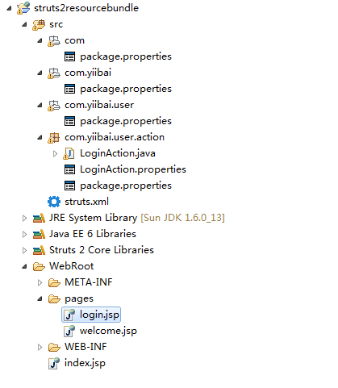
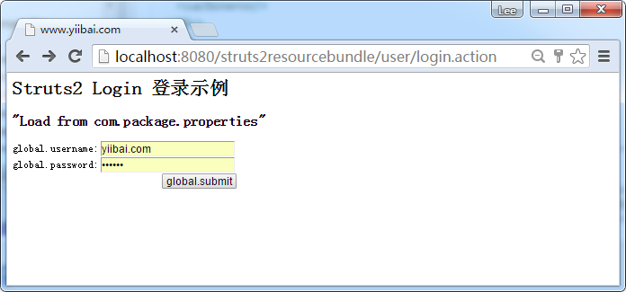

# Struts2资源包使用示例 - Struts2教程

要使用资源包从属性文件检索消息，必须了解Struts2的资源包搜索顺序：

## 资源包搜索顺序

资源包中搜索按以下顺序：

1.  ActionClass.properties
2.  Interface.properties
3.  BaseClass.properties
4.  ModelDriven’s model
5.  package.properties
6.  搜索国际化消息键的层次结构本身
7.  全局资源属性

请参阅[Struts2资源包](http://struts.apache.org/docs/localization.html)文档详细解释。

在实践中，是不可能组织属性的文件的顺序。所以，只要了解几个常用的搜索顺序应该是足够了： package.properties 和 global resource properties。参见下图：



如果com.yiibai.user.action.LoginAction想通过资源包获得消息，它将搜索

1.  com.yiibai.user.action.LoginAction.properties (找到，退出，否则下一个)
2.  com.yiibai.user.action.package.properties (找到，退出，否则下一个)
3.  com.yiibai.user.package.properties (找到，退出，否则下一个)
    …一路不断在每个父目录的根目录查找package.properties
4.  查找[全局资源属性](http://www.yiibai.com/struts_2/how-to-configure-global-resource-bundle-in-struts-2.html)，如果将其配置在应用程序中。

明白这搜索顺序可以给你更多的信心来决定正确的文件夹的属性文件。

## 获取资源包

下面是访问该资源包的几个例子：

P.S ‘username.required‘  和 ‘username‘ 在一个属性文件中的键。

## 1\. 动作类

在Action类，可以扩展了ActionSupport和通过getText(‘key’) 函数获取资源包。

```
...
public class LoginAction extends ActionSupport{
    ...
    public void validate(){
        if("".equals(getUsername())){
            addFieldError("username", getText("username.required"));
        }
    }
}
```

## 2\. &lt;s:property&gt;标签

在属性标记，使用 getText(‘key’).

```
<s:property value="getText('username')" />
```

## 3\. &lt;s:text&gt;标签

在text标签，设置“name”属性的键。

```
<s:text name="username" />
```

## 4\. Key属性

UI组件的主要属性有特殊的功能，查看这个[key属性例子详细信息](http://www.yiibai.com/struts_2/struts-2-key-attribute-example.html)。

```
<s:textfield key="username" />
```

## 5\. I18n标签

国际化i18n 标签可以从“name”属性声明指定资源包得到消息。在这个例子中，它要求从com/yiibai/user/package.properties文件中以获得 “username” 的消息。

```
<s:i18n name="com.yiibai.user.package" >
     <s:text name="username" />
</s:i18n> 
```

访问 URL [http://localhost:8080/struts2resourcebundle/user/login.action](http://localhost:8080/struts2resourcebundle/user/login.action)，输出以下结果：

下载完整的项目实践(struts2resourcebundle) – [http://pan.baidu.com/s/1dD2UQ2l](http://pan.baidu.com/s/1dD2UQ2l)

