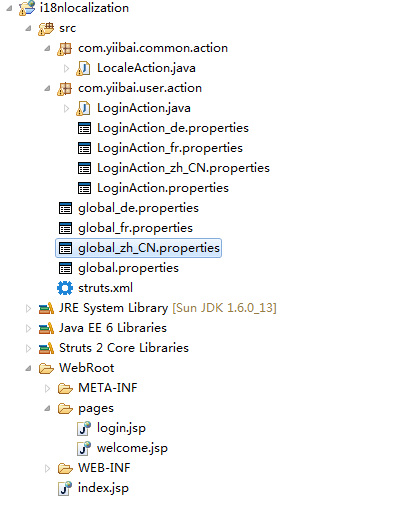
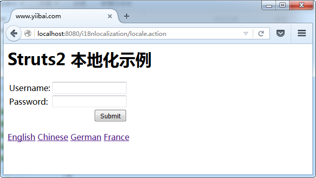
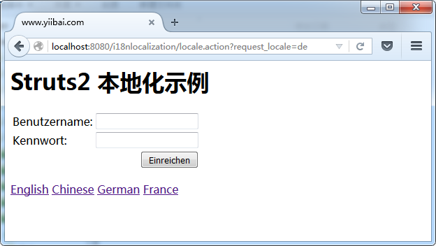

# Struts2本地化和国际化 - Struts2教程

Struts 2的国际化(I18N)和本地化(i10n)或多语言的例子，来说明如何使用资源包来显示不同语言的消息。在这个例子中，您将创建一个简单的登录屏幕，通过Struts 2的UI组件显示来自资源包的消息， 并更改基于所选的语言选项的语言环境。

## 1\. 工程结构

项目结构，如下图片显示：



## 2\. Properties文件

确保属性文件命名为国家指定的代码。在一些“非欧洲”或“非英语”之类的字符，应该始终编码的内容 [native2ascii属性](http://www.yiibai.com/java/java-convert-chinese-character-to-unicode-with-native2ascii.html)

**global.properties**

```
#Global messages
global.username = Username
global.password = Password
global.submit = Submit
```

**global_zh_CN.properties**

```
#Global messages
global.username = \u7528\u6237\u540d
global.password = \u5bc6\u7801
global.submit=\u63d0\u4ea4
```

**global_fr.properties**

```
#Global messages
global.username = Nom d'utilisateur
global.password = Mot de passe
global.submit = Soumettre
```

**global_de.properties**

```
#Global messages
global.username = Benutzername
global.password = Kennwort
global.submit = Einreichen 
```

请仔细阅读[Struts2资源包](http://www.yiibai.com/struts_2/struts-2-resource-bundle-example.html)的例子来了解Struts 2的自动搜索属性文件。

## 3\. 动作类

两个动作类，LocaleAction基本上是什么都不做， 而 LoginAction 会做一个简单的验证和通过gettext()显示来自资源包错误信息。

LocaleAction.java

```
package com.yiibai.common.action;

import com.opensymphony.xwork2.ActionSupport;

public class LocaleAction extends ActionSupport{

    //business logic
    public String execute() {
        return "SUCCESS";
    }
}
```

**LoginAction.java**

```
package com.yiibai.user.action;

import com.opensymphony.xwork2.ActionSupport;

public class LoginAction extends ActionSupport{

    private String username;
    private String password;

    //...getter and setter methods

    //business logic
    public String execute() {
        return "SUCCESS";
    }

    //simple validation
    public void validate(){
        if("".equals(getUsername())){
            addFieldError("username", getText("username.required"));
        }
        if("".equals(getPassword())){
            addFieldError("password", getText("password.required"));
        }
    }
}
```

## 4\. 视图页面

一个登录页面带有一个文本框，密码和提交UI组件。为了支持Struts2 本地化，必须声明 <%@ page contentType=”text/html;charset=UTF-8″ %>在您的视图页面，否则能将有问题的“UTF-8数据”正确显示，尤其是中国汉字。阅读这篇文章，关于[Struts2中国本土化问题](http://www.yiibai.com/struts_2/struts-2-chinese-localization-issue.html)。

**login.jsp**

```
<%@ page contentType="text/html;charset=UTF-8" %>
<%@ taglib prefix="s" uri="/struts-tags" %>
<html>
<head>
</head>

<body>
<h1>Struts 2 localization example</h1>

<s:form action="validateUser" namespace="/user">

    <s:textfield key="global.username" name="username" />
    <s:password key="global.password" name="password"/>    
    <s:submit key="global.submit" name="submit" />

</s:form>

<s:url id="localeEN" namespace="/" action="locale" >
   <s:param name="request_locale" >en</s:param>
</s:url>
<s:url id="localezhCN" namespace="/" action="locale" >
   <s:param name="request_locale" >zh_CN</s:param>
</s:url>
<s:url id="localeDE" namespace="/" action="locale" >
   <s:param name="request_locale" >de</s:param>
</s:url>
<s:url id="localeFR" namespace="/" action="locale" >
   <s:param name="request_locale" >fr</s:param>
</s:url>

<s:a href="%{localeEN}" >English</s:a>
<s:a href="%{localezhCN}" >Chinese</s:a>
<s:a href="%{localeDE}" >German</s:a>
<s:a href="%{localeFR}" >France</s:a>

</body>
</html> 
```

要更改默认的语言环境，只需要声明“request_locale”参数，设置你喜欢的语言代码，并传递给一个Action类。在 Struts2中，com.opensymphony.xwork2.interceptor.I18nInterceptor 拦截器, 在 struts-default.xml中声明将拦截Action类，并相应地处理语言环境。

## 5. 显示资源包的消息？

在Struts2，有很多的方式来显示所选择的语言或语言环境的资源包的信息。有关示例，

```
<s:textfield key="global.username" name="username" />
<s:text name="global.username" />    
<s:property value="getText('global.username')" />
<s:text name="global.password" /> 
```

在Struts1，有一个标准的 bean:message 来显示资源包的消息。但是在Struts 2中，有这么多相当于显示资源包的消息(甚至内部的工作不同)方式，基本上，无论选择的是什么，在 Struts2 也将显示正确的资源包的消息。

## 6\. struts.xml

Struts2 的配置文件，链接一起。

```
<?xml version="1.0" encoding="UTF-8" ?>
<!DOCTYPE struts PUBLIC
"-//Apache Software Foundation//DTD Struts Configuration 2.0//EN"
"http://struts.apache.org/dtds/struts-2.0.dtd">

<struts>

    <constant name="struts.custom.i18n.resources" value="global" />
     <constant name="struts.devMode" value="true" />

    <package name="user" namespace="/user" extends="struts-default">
       <action name="login">
        <result>/pages/login.jsp</result>
       </action>
       <action name="validateUser" class="com.yiibai.user.action.LoginAction">
        <result name="SUCCESS">/pages/welcome.jsp</result>
        <result name="input">/pages/login.jsp</result>
       </action>
    </package>

    <package name="default" namespace="/" extends="struts-default">
       <action name="locale" class="com.yiibai.common.action.LocaleAction">
        <result name="SUCCESS">/user/pages/login.jsp</result>
       </action>
    </package>

</struts>
```

## 7\. 示例

http://localhost:8080/i18nlocalization/user/login.action



http://localhost:8080/i18nlocalization/locale.action?request_locale=en


http://localhost:8080/i18nlocalization/locale.action?request_locale=zh_CN


http://localhost:8080/i18nlocalization/locale.action?request_locale=de



http://localhost:8080/i18nlocalization/locale.action?request_locale=fr


## 参考

1.  [http://struts.apache.org/2.1.8/docs/localization.html
    ](http://struts.apache.org/2.1.8/docs/localization.html)
2.  [http://www.yiibai.com/java/java-convert-chinese-character-to-unicode-with-native2ascii/](http://www.yiibai.com/java/java-convert-chinese-character-to-unicode-with-native2ascii.html)
3.  [http://www.yiibai.com/struts2/struts-2-resource-bundle-example/](http://www.yiibai.com/struts_2/struts-2-resource-bundle-example.html)
4.  [http://www.yiibai.com/struts/struts-internationalizing-or-localization-example/](http://www.yiibai.com/struts_2/struts-internationalizing-or-localization-example.html)

代码下载 - [http://pan.baidu.com/s/1jGCUaJ8](http://pan.baidu.com/s/1jGCUaJ8)

