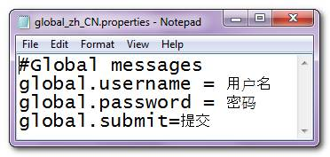
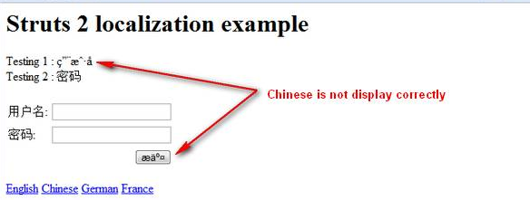
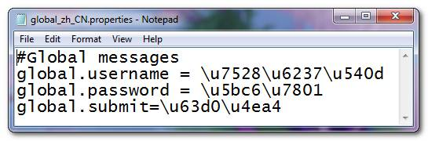
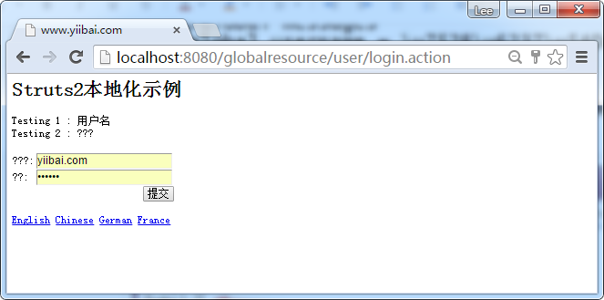
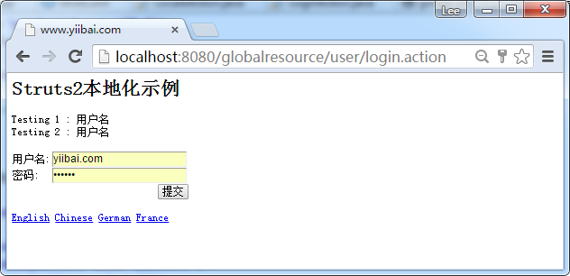

# Struts2中文本地化问题 - Struts2教程

一个 Struts2 的国际化定位的问题，用来显示中国汉字...

## 案例1：属性有特殊字符的文件

属性文件存储用户名，密码信息，并以中文字符提交。此属性文件以UTF-8格式创建的，但内容不使用 native2ascii 编码。




让我们试着通过一些UI标签，来显示中国汉字。查看页面声明为UTF-8格式的HTML元标记来显示。

```
...
<head>
<meta http-equiv="Content-Type" content="text/html; charset=UTF-8" />
</head>
...
<s:form action="validateUser">
    <s:textfield key="global.username" name="username"/>
    <s:password key="global.password" name="password"/>    
    <s:submit key="global.submit" name="submit" />

    <div>Testing 1 : <s:property value="getText('global.username')" /></div>
    <div>Testing 2 : <s:text name="global.password" /></div></br/>
</s:form>
...
<s:url id="localezhCN" namespace="/" action="locale" >
   <s:param name="request_locale" >zh_CN</s:param>
</s:url>
...
<s:a href="%{localezhCN}" >Chinese</s:a>
...
```

结果


令人惊奇的是，以下三个UI标签都能够正确地显示中国消息

```
<s:textfield key="global.username" name="username"/>
<s:password key="global.password" name="password"/>    
Testing 2 : <s:text name="global.password" />
```

然而，“s:submit” 和 “getText()” 却无法显示呢？据Java的国际化文档，要使用资源包正确显示特殊字符，则必须用 native2ascii 工具进行处理。

深入到 TextProvider.getText()的源代码后，它使用的资源 bundle.getString()来从资源包检索的消息，所以不正确的消息是合理的。但是，为什么“s:text“, “s:textfield” 和 “s:password” 能够正确显示了中文的消息，为什么“s:submit”会失败？在有太多的问题，让我们看看示例2...

## 案例2：有特殊字符的属性文件(编码)

这一次，属性文件使用native2ascii工具处理中国汉字的编码正确。




结果如下所示：




其结果是完全逆转，现在 “s:submit” 和 “getText()” 是能够正确地显示它，但其他UI组件失败。 这里是按预期方式工作的，因为在Struts 2推荐使用getText()，以显示国际化或本地化的消息。问题是，为什么“s:submit”会不同呢？

## Struts2..哪里有问题？

这里有几个问题：

1.  为什么 s:submit 有如此不同的效果？
2.  对国际化应该是非常简单的，为什么在Struts 2有这种问题？ 或者我们误解了Struts2 国际化如何工作了？
3.  为什么有这么多的方式来显示来自资源包的消息？为什么不直接组织成一个方法？ 在Struts1，只需使用“bean:message”，为什么Struts 2中它看起来很复杂？
4.  Struts2的支持XML资源包？ 我们可能不太喜欢用native2ascii工具对数据进行编码为UTF-8格式，它使属性文件不可读。 Apache Wicket的在这个问题做了很好的工作，可能是在Struts 2中吸取教训。
5.  那么，如何正确地在 Struts2 中显示中国汉字？

许多文章和教程使用以下方法来显示资源包的消息：

```
<s:text name="global.username"/>
<s:property value="getText('global.username')"/> 
```

然而，这仅适用于英国或一些“英语状(欧洲)” 的字符，如法文，德文。但对中文或日文，这两种方法将返回完全不同的输出。真的不知道Struts2的本地化该怎么办了。

## 解决办法

问题是在HTML meta标签，

```
<head>
<meta http-equiv="Content-Type" content="text/html; charset=UTF-8" />
</head>
```

在Struts1，上述meta标签必须正确显示UTF-8的数据，但这在 Struts2 是有问题的。

在Struts2，meta标签不起作用，我们应该把 &lt;%@ page contentType=”text/html;charset=UTF-8″ %&gt;标签放在页面的第一行。例如下面的代码片断：

```
<%@ page contentType="text/html;charset=UTF-8" %>
<%@ taglib prefix="s" uri="/struts-tags" %>
<html>
<head>
</head>
...
```

结果显示如下：



所有的中文消息正确显示。

## 回答之前的问题

1.  为什么 s:submit 有如此不同的效果？**A: **暂无评论
2.  对国际化应该是非常简单的，为什么在Struts 2有这种问题？ 或者我们误解了Struts2 国际化如何工作了？**A: **确保把**** **&lt;%@ page contentType=”text/html;charset=UTF-8″ %&gt;**” 放在页面的第一行。****
3.  为什么有这么多的方式来显示来自资源包的消息？为什么不直接组织成一个方法？ 在Struts1，只需使用“bean:message”，为什么Struts 2中它看起来很复杂？**A: s:text, key, getText(), name… , **所有的都能够正确地显示中文或UTF-8编码的数据，****只要确保把正确的“字符集”放在视图页面中。********
4.  Struts2的支持XML资源包？ 我们可能不太喜欢用native2ascii工具对数据进行编码为UTF-8格式，它使属性文件不可读。 Apache Wicket的在这个问题做了很好的工作，可能是在Struts 2中吸取教训。**A:**希望在Struts2的下一版本可以支持在XML资源包。
5.  那么，如何正确地在 Struts2 中显示中国汉字？**A: 看看上页的解决办法**

## 参考

1.  [http://www.yiibai.com/java/java-convert-chinese-character-to-unicode-with-native2ascii](http://www.yiibai.com/java/java-convert-chinese-character-to-unicode-with-native2ascii/).html
2.  [http://forums.sun.com/thread.jspa?threadID=5185040](http://forums.sun.com/thread.jspa?threadID=5185040)
3.  [http://www.coderanch.com/t/452139/Struts/applicationresources-properties-utf-characters#2013557](http://www.coderanch.com/t/452139/Struts/applicationresources-properties-utf-characters#2013557)
4.  [http://struts.apache.org/2.1.8/docs/localization.html](http://struts.apache.org/2.1.8/docs/localization.html)
5.  [http://hxzon00.blog.163.com/blog/static/10489241620088121449163/](http://hxzon00.blog.163.com/blog/static/10489241620088121449163/)

下载代码(globalresource) – [http://pan.baidu.com/s/1mgzt3dQ](http://pan.baidu.com/s/1mgzt3dQ)
