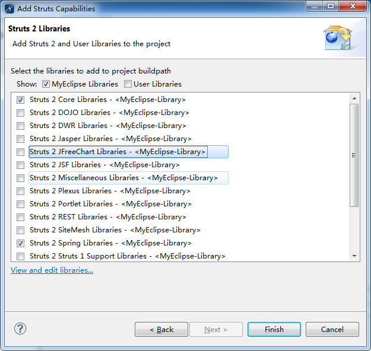
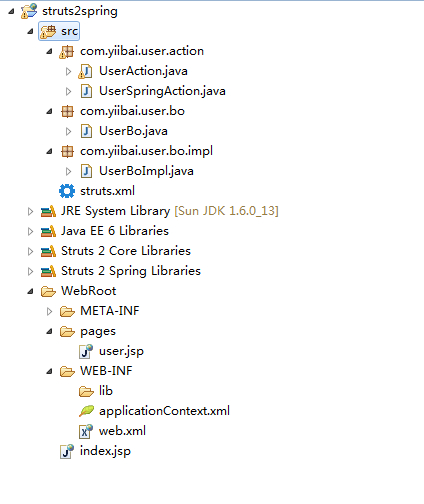
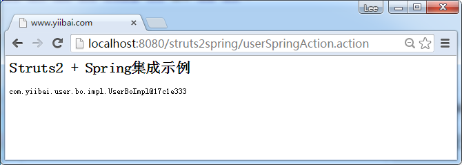

# Struts2+Spring集成实例 - Struts2教程

在本教程中，我们来学习Struts2和Spring的集成。


## 1\. 工程结构

下面的图是本教程的项目文件夹结构。



## 2\. Spring监听器

配置Spring监听器 “org.springframework.web.context.ContextLoaderListener” 到 web.xml 文件中。

**web.xml**

```
<!DOCTYPE web-app PUBLIC
 "-//Sun Microsystems, Inc.//DTD Web Application 2.3//EN"
 "http://java.sun.com/dtd/web-app_2_3.dtd" >

<web-app>
  <display-name>Struts 2 Web Application</display-name>

  <filter>
    <filter-name>struts2</filter-name>
    <filter-class>
         org.apache.struts2.dispatcher.ng.filter.StrutsPrepareAndExecuteFilter
        </filter-class>
  </filter>

  <filter-mapping>
    <filter-name>struts2</filter-name>
    <url-pattern>/*</url-pattern>
  </filter-mapping>

  <listener>
    <listener-class>
      org.springframework.web.context.ContextLoaderListener
    </listener-class>
  </listener>

</web-app>
```

## 3\. 注册Spring Bean

注册所有的Spring Beans 配置在 applicationContext.xml 文件中, Spring监听器会自动找到这个 XML 文件。

**applicationContext.xml**

```
<beans xmlns="http://www.springframework.org/schema/beans"
xmlns:xsi="http://www.w3.org/2001/XMLSchema-instance"
xsi:schemaLocation="http://www.springframework.org/schema/beans
http://www.springframework.org/schema/beans/spring-beans-2.5.xsd">

    <bean id="userBo" class="com.yiibai.user.bo.impl.UserBoImpl" />

    <bean id="userSpringAction" class="com.yiibai.user.action.UserSpringAction">
        <property name="userBo" ref="userBo" />    
    </bean>

</beans>
```

**UserBo.java**

```
package com.yiibai.user.bo;

public interface UserBo{

    public void printUser();

}
```

**UserBoImpl.java**

```
package com.yiibai.user.bo.impl;

import com.yiibai.user.bo.UserBo;

public class UserBoImpl implements UserBo{

    public void printUser(){
        System.out.println("printUser() is executed...");
    }

}
```

**UserSpringAction.java**

```
package com.yiibai.user.action;

import com.yiibai.user.bo.UserBo;

public class UserSpringAction{

    //DI via Spring
    UserBo userBo;

    public UserBo getUserBo() {
        return userBo;
    }

    public void setUserBo(UserBo userBo) {
        this.userBo = userBo;
    }

    public String execute() throws Exception {

        userBo.printUser();
        return "success";

    }
}
```

## 4\. Struts.xml

在此声明的所有关系。

```
<?xml version="1.0" encoding="UTF-8" ?>
<!DOCTYPE struts PUBLIC
"-//Apache Software Foundation//DTD Struts Configuration 2.0//EN"
"http://struts.apache.org/dtds/struts-2.0.dtd">

<struts>
     <constant name="struts.devMode" value="true" />

    <package name="default" namespace="/" extends="struts-default">

        <action name="userAction" 
            class="com.yiibai.user.action.UserAction" >
            <result name="success">pages/user.jsp</result>
        </action>

        <action name="userSpringAction" 
            class="userSpringAction" >
            <result name="success">pages/user.jsp</result>
        </action>

    </package>

</struts>
```

## 5\. 示例

现在，所有的Struts2和Spring的集成工作已经完成，现在看到下面的用例来访问 Spring 的 “userBo” Bean。

*   用例 1 : 让 Spring 充当 Struts2的Action类，并访问Spring的Bean。
*   用例 2 : 在Struts2的Action类中访问Spring的Bean。

## 用例1

在这个例子中，userSpringAction充当Struts2的Action类，也可以使用普通Spring的方式注入Spring的userBo。

```
//struts.xml
<action name="userSpringAction" 
    class="userSpringAction" >
    <result name="success">pages/user.jsp</result>
</action>

//applicationContext.xml
<bean id="userSpringAction" class="com.yiibai.user.action.UserSpringAction">
    <property name="userBo" ref="userBo" />    
</bean> 
```

要访问此操作，请使用网址： [http://localhost:8080/struts2spring/userSpringAction.action](http://localhost:8080/struts2spring/userSpringAction.action)

## 用例 2

默认情况下，Spring监听器启用 “通过匹配bean的名字自动装配“。 因此，它会通过setUserBo自动传递Spring “userBo” Bean 到UserAction。请参阅下面的Struts2动作：

Spring的自动装配功能可以修改为 **name**(默认), **type**, **auto** 或 **constructor**, 可能需要参考 [Struts2的Spring插件文档](http://struts.apache.org/docs/spring-plugin.html)。

**UserAction.java**

```
package com.yiibai.user.action;

import com.yiibai.user.bo.UserBo;
import com.opensymphony.xwork2.ActionSupport;

public class UserAction extends ActionSupport{

    //DI via Spring
    UserBo userBo;

    public UserBo getUserBo() {
        return userBo;
    }

    public void setUserBo(UserBo userBo) {
        this.userBo = userBo;
    }

    public String execute() throws Exception {

        userBo.printUser();
        return SUCCESS;

    }
}
```

要访问此操作，请使用网址： http://localhost:8080/struts2spring/userAction.action




**WebApplicationContextUtils**
另外，也可以使用Spring 通用 **WebApplicationContextUtils** 类来直接获得Spring的bean。

```
package com.yiibai.user.action;

import org.apache.struts2.ServletActionContext;
import org.springframework.web.context.WebApplicationContext;
import org.springframework.web.context.support.WebApplicationContextUtils;

import com.yiibai.user.bo.UserBo;
import com.opensymphony.xwork2.ActionSupport;

public class UserAction extends ActionSupport{

    public String execute() throws Exception {

        WebApplicationContext context =
            WebApplicationContextUtils.getRequiredWebApplicationContext(
                                    ServletActionContext.getServletContext()
                        );

        UserBo userBo1 = (UserBo)context.getBean("userBo");
        userBo1.printUser();

        return SUCCESS;

    }
}
```

这是一个又长又臭的文章(包教不包会)，请下载完整的项目并按照源代码去一步步实现。

## 参考

1.  [Struts2 Spring 插件文档](http://struts.apache.org/2.x/docs/spring-plugin.html)
2.  [Struts + Spring 集成实例](http://www.yiibai.com/struts/struts-spring-integration-example/)

代码下载 - [http://pan.baidu.com/s/1dDhqQ5b](http://pan.baidu.com/s/1dDhqQ5b)

