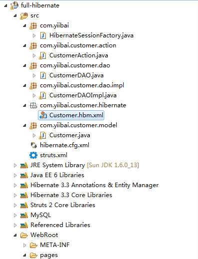
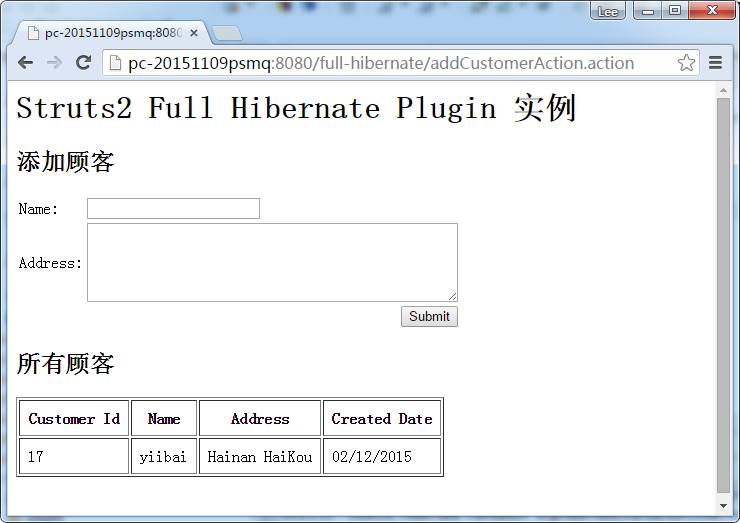
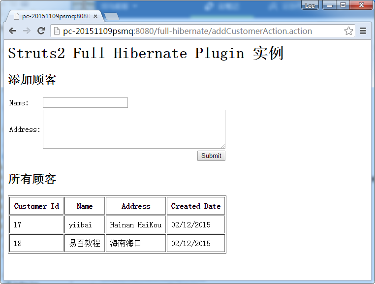

# Struts2+Hibernate使用Full Hibernate Plugin集成 - Struts2教程

在上篇 [Struts2 + Hibernate集成](http://www.yiibai.com/struts_2/struts-2-hibernate-integration-example.html) 实例中, 它使用 servlet 上下文监听 Hibernate 的 Session，而且把Struts2和Hibernate框架集成。

但是，总有一些东西要提高。在本教程中，我们将展示如何整合Struts2+Hibernate，并使用Struts2一个名为“[Full Hibernate Plugin](http://code.google.com/p/full-hibernate-plugin-for-struts2/)“的插件。

见下面的集成步骤：

1.  把 “Full Hibernate Plugin” jar 放入到工程类路径。
2.  使用 “@SessionTarget” 注释来注入到 Hibernate session; 当“@TransactionTarget” 注释注入到Hibernate 事务。
3.  在 struts.xml, 让包扩展 “hibernate-default“，而不是默认的堆栈。

看看下面的关系：

```
Struts 2 <-- (Full Hibernate Plugin) ---> Hibernate <-----> Database
```

**注，**
本教程是从以前的[ Struts2 + Hibernate集成](http://www.yiibai.com/struts_2/struts-2-hibernate-integration-example.html) 实例(servlet context listener)更新版本。因此，JSP 和 Hibernate 配置基本相同，只是整合的部分是有点不同，尝试比较既能发现不同。

## 1\. 工程结构

在节教程，我们创建一个工程名为 full-hibernate 的web工程。看看这个项目文件夹的完整结构。



## 2\. MySQL创建表脚本

Customer表结构

```
CREATE TABLE `customer` (
  `customer_id` bigint(20) unsigned NOT NULL AUTO_INCREMENT,
  `name` varchar(45) NOT NULL,
  `address` varchar(255) NOT NULL,
  `create_date` datetime NOT NULL,
  PRIMARY KEY (`customer_id`)
) ENGINE=InnoDB AUTO_INCREMENT=2 DEFAULT CHARSET=utf8;
```

## 3\. Hibernate相关配置

所有 Hibernate 的模型和配置的东西。

**Customer.java** – 为customer 表创建一个类。

```
package com.yiibai.customer.model;

import java.util.Date;

public class Customer implements java.io.Serializable {

    private Long customerId;
    private String name;
    private String address;
    private Date createdDate;

    //getter and setter methods
}
```

**Customer.hbm.xml** – Hibernate 的 customer 表映射。

```
<?xml version="1.0"?>
<!DOCTYPE hibernate-mapping PUBLIC "-//Hibernate/Hibernate Mapping DTD 3.0//EN"
"http://hibernate.sourceforge.net/hibernate-mapping-3.0.dtd">
<!-- Generated 20 Julai 2010 11:40:18 AM by Hibernate Tools 3.2.5.Beta -->
<hibernate-mapping>
    <class name="com.yiibai.customer.model.Customer" 
        table="customer" catalog="yiibai">
        <id name="customerId" type="java.lang.Long">
            <column name="CUSTOMER_ID" />
            <generator class="identity" />
        </id>
        <property name="name" type="string">
            <column name="NAME" length="45" not-null="true" />
        </property>
        <property name="address" type="string">
            <column name="ADDRESS" not-null="true" />
        </property>
        <property name="createdDate" type="timestamp">
            <column name="CREATED_DATE" length="19" not-null="true" />
        </property>
    </class>
</hibernate-mapping>
```

文件: hibernate.cfg.xml, Hibernate 数据库配置

```
<?xml version="1.0" encoding="utf-8"?>
<!DOCTYPE hibernate-configuration PUBLIC
"-//Hibernate/Hibernate Configuration DTD 3.0//EN"
"http://hibernate.sourceforge.net/hibernate-configuration-3.0.dtd">
<hibernate-configuration>
  <session-factory>
    <property name="hibernate.bytecode.use_reflection_optimizer">false</property>
    <property name="hibernate.connection.password">password</property>
    <property name="hibernate.connection.url">jdbc:mysql://localhost:3306/yiibai</property>
    <property name="hibernate.connection.username">root</property>
    <property name="hibernate.dialect">org.hibernate.dialect.MySQLDialect</property>
    <property name="show_sql">true</property>
    <property name="format_sql">true</property>
    <property name="use_sql_comments">false</property>
    <mapping resource="com/yiibai/customer/hibernate/Customer.hbm.xml" />
  </session-factory>
</hibernate-configuration>
```

## 5\. DAO

实现DAO设计模式执行数据库操作。在 CustomerDAOImpl 类, 声明Hibernate会话和事务为类成员。在Struts 2的项目初始化， “Full Hibernate Plugin” 使用 @SessionTarget 和 @TransactionTarget 分别标注将注入相应的 Hibernate 会话和事务成为类成员。

**CustomerDAO.java**

```
package com.yiibai.customer.dao;

import java.util.List;

import com.yiibai.customer.model.Customer;

public interface CustomerDAO{

    void addCustomer(Customer customer);

    List<Customer> listCustomer();

}
```

**CustomerDAOImpl.java**

```
package com.yiibai.customer.dao.impl;

import java.util.List;

import org.hibernate.Session;
import org.hibernate.Transaction;

import com.googlecode.s2hibernate.struts2.plugin.annotations.SessionTarget;
import com.googlecode.s2hibernate.struts2.plugin.annotations.TransactionTarget;
import com.yiibai.customer.dao.CustomerDAO;
import com.yiibai.customer.model.Customer;

public class CustomerDAOImpl implements CustomerDAO{

    @SessionTarget
    Session session;

    @TransactionTarget
    Transaction transaction;

    //add the customer
    public void addCustomer(Customer customer){

        session.save(customer);

    }

    //return all the customers in list
    public List<Customer> listCustomer(){

        return session.createQuery("from Customer").list();

    }

}
```

## 6\. Action

在Action类，调用DAO类来执行数据库操作。

**CustomerAction.java**

```
package com.yiibai.customer.action;

import java.util.ArrayList;
import java.util.Date;
import java.util.List;

import com.yiibai.customer.dao.CustomerDAO;
import com.yiibai.customer.dao.impl.CustomerDAOImpl;
import com.yiibai.customer.model.Customer;
import com.opensymphony.xwork2.ActionSupport;
import com.opensymphony.xwork2.ModelDriven;

public class CustomerAction extends ActionSupport 
    implements ModelDriven{

    Customer customer = new Customer();
    List<Customer> customerList = new ArrayList<Customer>();
    CustomerDAO customerDAO = new CustomerDAOImpl();

    public String execute() throws Exception {
        return SUCCESS;
    }

    public Object getModel() {
        return customer;
    }

    public List<Customer> getCustomerList() {
        return customerList;
    }

    public void setCustomerList(List<Customer> customerList) {
        this.customerList = customerList;
    }

    //save customer
    public String addCustomer() throws Exception{

        //save it
        customer.setCreatedDate(new Date());
        customerDAO.addCustomer(customer);

        //reload the customer list
        customerList = null;
        customerList = customerDAO.listCustomer();

        return SUCCESS;

    }

    //list all customers
    public String listCustomer() throws Exception{

        customerList = customerDAO.listCustomer();

        return SUCCESS;

    }

}
```

## 7\. JSP 页面

JSP页面添加并列出客户。

**customer.jsp**

```
<%@ taglib prefix="s" uri="/struts-tags" %>
<%@ taglib prefix="s" uri="/struts-tags" %>
<html>
<head>
</head>

<body>
<h1>Struts 2 Full Hibernate Plugin example</h1>

<h2>Add Customer</h2>
<s:form action="addCustomerAction" >
  <s:textfield name="name" label="Name" value="" />
  <s:textarea name="address" label="Address" value="" cols="50" rows="5" />
  <s:submit />
</s:form>

<h2>All Customers</h2>

<s:if test="customerList.size() > 0">
<table border="1px" cellpadding="8px">
    <tr>
        <th>Customer Id</th>
        <th>Name</th>
        <th>Address</th>
        <th>Created Date</th>
    </tr>
    <s:iterator value="customerList" status="userStatus">
        <tr>
            <td><s:property value="customerId" /></td>
            <td><s:property value="name" /></td>
            <td><s:property value="address" /></td>
            <td><s:date name="createdDate" format="dd/MM/yyyy" /></td>
        </tr>
    </s:iterator>
</table>
</s:if>
<br/>
<br/>

</body>
</html>
```

## 8\. struts.xml

链接所有〜让包扩展 “hibernate-default” 来代替 “struts-default“.

```
<?xml version="1.0" encoding="UTF-8" ?>
<!DOCTYPE struts PUBLIC
"-//Apache Software Foundation//DTD Struts Configuration 2.0//EN"
"http://struts.apache.org/dtds/struts-2.0.dtd">

<struts>
  <constant name="struts.devMode" value="true" />

  <package name="default" namespace="/" extends="hibernate-default">

    <action name="addCustomerAction" 
    class="com.yiibai.customer.action.CustomerAction" method="addCustomer" >
       <result name="success">pages/customer.jsp</result>
    </action>

    <action name="listCustomerAction" 
    class="com.yiibai.customer.action.CustomerAction" method="listCustomer" >
        <result name="success">pages/customer.jsp</result>
    </action>

</package>    
</struts>
```

## 9\. 实例

访问以下网址 : [http://localhost:8080/full-hibernate/addCustomerAction.action](http://localhost:8080/full-hibernate/addCustomerAction.action)





## 参考

1.  [Struts2 Full Hibernate插件文档](http://code.google.com/p/full-hibernate-plugin-for-struts2/)
2.  [Struts2 + Hibernate集成实例](http://www.yiibai.com/struts_2/struts-2-hibernate-integration-example.html)
3.  [安装库到Maven本地资源库](http://www.yiibai.com/maven/how-to-include-library-manully-into-maven-local-repository.html)

## 下载代码

下载所有源代码 – [http://pan.baidu.com/s/1o6tjSam](http://pan.baidu.com/s/1o6tjSam)

