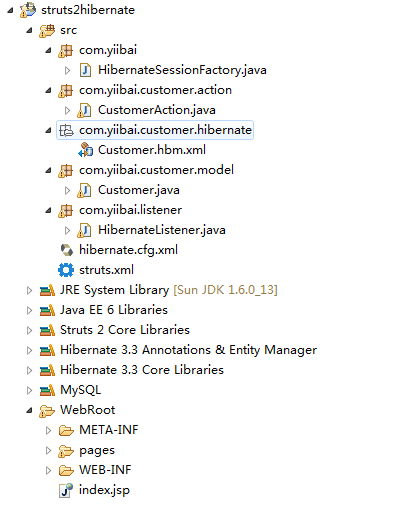
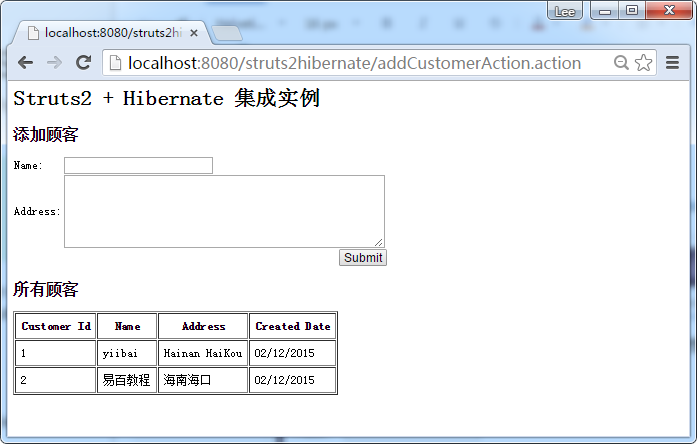

# Struts2+Hibernate集成实例 - Struts2教程

在 Struts2 中，没有官方的插件集成Hibernate框架。但是，可以通过以下步骤解决方法：

1.  注册一个自定义的 ServletContextListener
2.  在 ServletContextListener 类, 初始化Hibernate会话，并将其存储到servlet上下文。
3.  在动作类, 可以通过servlet上下文的Hibernate会话，并执行任务正常的Hibernate操作。

请参阅它们的关系：

```
Struts 2 <-- (Servlet Context) ---> Hibernate <-----> Database  
```

在本教程中，在Struts中2开发我们显示了一个简单的客户模块(添加和列表功能)，并使用 Hibernate 进行数据库操作。使用上述部分机制集成(存储和检索在servlet上下文Hibernate的Session)。

## 1\. 工程目录结构

来看看这个完整的项目文件夹结构。


## 2\. MySQL表结构脚本

创建一个客户(customer)表。下面是SQL表脚本。

```
CREATE TABLE `customer` (
  `customer_id` bigint(20) unsigned NOT NULL AUTO_INCREMENT,
  `name` varchar(45) NOT NULL,
  `address` varchar(255) NOT NULL,
  `create_date` datetime NOT NULL,
  PRIMARY KEY (`customer_id`)
) ENGINE=InnoDB AUTO_INCREMENT=2 DEFAULT CHARSET=utf8;
```

## 4\. Hibernate 相关配置

Hibernate的模型和配置的东西。

Customer.java – 创建客户表对应的一个类。

```
package com.yiibai.customer.model;

import java.util.Date;

public class Customer implements java.io.Serializable {

    private Long customerId;
    private String name;
    private String address;
    private Date createdDate;

    //getter and setter methods
}
```

**Customer.hbm.xml** – Hibernate映射文件客户表。

```
<?xml version="1.0"?>
<!DOCTYPE hibernate-mapping PUBLIC "-//Hibernate/Hibernate Mapping DTD 3.0//EN"
"http://hibernate.sourceforge.net/hibernate-mapping-3.0.dtd">
<hibernate-mapping>
    <class name="com.yiibai.customer.model.Customer" 
    table="customer" catalog="yiibai">

        <id name="customerId" type="java.lang.Long">
            <column name="CUSTOMER_ID" />
            <generator class="identity" />
        </id>
        <property name="name" type="string">
            <column name="NAME" length="45" not-null="true" />
        </property>
        <property name="address" type="string">
            <column name="ADDRESS" not-null="true" />
        </property>
        <property name="createdDate" type="timestamp">
            <column name="CREATED_DATE" length="19" not-null="true" />
        </property>
    </class>
</hibernate-mapping>
```

**hibernate.cfg.xml** – Hibernate数据库配置文件

```
<?xml version="1.0" encoding="utf-8"?>
<!DOCTYPE hibernate-configuration PUBLIC
"-//Hibernate/Hibernate Configuration DTD 3.0//EN"
"http://hibernate.sourceforge.net/hibernate-configuration-3.0.dtd">
<hibernate-configuration>
  <session-factory>
    <property name="hibernate.bytecode.use_reflection_optimizer">false</property>
    <property name="hibernate.connection.password">password</property>
    <property name="hibernate.connection.url">jdbc:mysql://localhost:3306/yiibai</property>
    <property name="hibernate.connection.username">root</property>
    <property name="hibernate.dialect">org.hibernate.dialect.MySQLDialect</property>
    <property name="show_sql">true</property>
    <property name="format_sql">true</property>
    <property name="use_sql_comments">false</property>
    <mapping resource="com/yiibai/customer/hibernate/Customer.hbm.xml" />
  </session-factory>
</hibernate-configuration>
```

## 5\. Hibernate ServletContextListener

创建一个类 ServletContextListener, 并初始化Hibernate会话，并将其存储到servlet上下文。

**HibernateListener .java**

```
package com.yiibai.listener;

import java.net.URL;

import javax.servlet.ServletContextEvent;
import javax.servlet.ServletContextListener;

import org.hibernate.SessionFactory;
import org.hibernate.cfg.Configuration;

public class HibernateListener implements ServletContextListener{

    private Configuration config;
    private SessionFactory factory;
    private String path = "/hibernate.cfg.xml";
    private static Class clazz = HibernateListener.class;

    public static final String KEY_NAME = clazz.getName();

    public void contextDestroyed(ServletContextEvent event) {
      //
    }

    public void contextInitialized(ServletContextEvent event) {

     try { 
            URL url = HibernateListener.class.getResource(path);
            config = new Configuration().configure(url);
            factory = config.buildSessionFactory();

            //save the Hibernate session factory into serlvet context
            event.getServletContext().setAttribute(KEY_NAME, factory);
      } catch (Exception e) {
             System.out.println(e.getMessage());
       }
    }
}
```

在 web.xml 文件中注册监听器。

**web.xml**

```
<!DOCTYPE web-app PUBLIC
 "-//Sun Microsystems, Inc.//DTD Web Application 2.3//EN"
 "http://java.sun.com/dtd/web-app_2_3.dtd" >

<web-app>
  <display-name>Struts 2 Web Application</display-name>

  <filter>
    <filter-name>struts2</filter-name>
    <filter-class>
      org.apache.struts2.dispatcher.ng.filter.StrutsPrepareAndExecuteFilter
    </filter-class>
  </filter>

  <filter-mapping>
    <filter-name>struts2</filter-name>
    <url-pattern>/*</url-pattern>
  </filter-mapping>

  <listener>
    <listener-class>
      com.yiibai.listener.HibernateListener
    </listener-class>
  </listener>

</web-app>
```

## 6\. Action

在动作类, 可以通过servlet上下文的Hibernate会话和执行正常的Hibernate任务。

**CustomerAction.java**

```
package com.yiibai.customer.action;

import java.util.ArrayList;
import java.util.Date;
import java.util.List;

import org.apache.struts2.ServletActionContext;
import org.hibernate.Session;
import org.hibernate.SessionFactory;

import com.yiibai.customer.model.Customer;
import com.yiibai.listener.HibernateListener;
import com.opensymphony.xwork2.ActionSupport;
import com.opensymphony.xwork2.ModelDriven;

public class CustomerAction extends ActionSupport 
    implements ModelDriven{

    Customer customer = new Customer();
    List<Customer> customerList = new ArrayList<Customer>();

    public String execute() throws Exception {
        return SUCCESS;
    }

    public Object getModel() {
        return customer;
    }

    public List<Customer> getCustomerList() {
        return customerList;
    }

    public void setCustomerList(List<Customer> customerList) {
        this.customerList = customerList;
    }

    //save customer
    public String addCustomer() throws Exception{

        //get hibernate session from the servlet context
        SessionFactory sessionFactory = 
             (SessionFactory) ServletActionContext.getServletContext()
                     .getAttribute(HibernateListener.KEY_NAME);

        Session session = sessionFactory.openSession();

        //save it
        customer.setCreatedDate(new Date());

        session.beginTransaction();
        session.save(customer);
        session.getTransaction().commit();

        //reload the customer list
        customerList = null;
        customerList = session.createQuery("from Customer").list();

        return SUCCESS;

    }

    //list all customers
    public String listCustomer() throws Exception{

        //get hibernate session from the servlet context
        SessionFactory sessionFactory = 
             (SessionFactory) ServletActionContext.getServletContext()
                     .getAttribute(HibernateListener.KEY_NAME);

        Session session = sessionFactory.openSession();

        customerList = session.createQuery("from Customer").list();

        return SUCCESS;

    }    
}
```

## 7\. JSP 页面

JSP页面用来添加和列出的客户。

**customer.jsp**

```
<%@ taglib prefix="s" uri="/struts-tags" %>
<html>
<head>
</head>

<body>
<h1>Struts 2 + Hibernate integration example</h1>

<h2>Add Customer</h2>
<s:form action="addCustomerAction" >
  <s:textfield name="name" label="Name" value="" />
  <s:textarea name="address" label="Address" value="" cols="50" rows="5" />
  <s:submit />
</s:form>

<h2>All Customers</h2>

<s:if test="customerList.size() > 0">
<table border="1px" cellpadding="8px">
    <tr>
        <th>Customer Id</th>
        <th>Name</th>
        <th>Address</th>
        <th>Created Date</th>
    </tr>
    <s:iterator value="customerList" status="userStatus">
        <tr>
            <td><s:property value="customerId" /></td>
            <td><s:property value="name" /></td>
            <td><s:property value="address" /></td>
            <td><s:date name="createdDate" format="dd/MM/yyyy" /></td>
        </tr>
    </s:iterator>
</table>
</s:if>
<br/>
<br/>

</body>
</html>
```

## 8\. struts.xml

```
<?xml version="1.0" encoding="UTF-8" ?>
<!DOCTYPE struts PUBLIC
"-//Apache Software Foundation//DTD Struts Configuration 2.0//EN"
"http://struts.apache.org/dtds/struts-2.0.dtd">

<struts>
  <constant name="struts.devMode" value="true" />

  <package name="default" namespace="/" extends="struts-default">

    <action name="addCustomerAction" 
    class="com.yiibai.customer.action.CustomerAction" method="addCustomer" >
       <result name="success">pages/customer.jsp</result>
    </action>

    <action name="listCustomerAction" 
    class="com.yiibai.customer.action.CustomerAction" method="listCustomer" >
        <result name="success">pages/customer.jsp</result>
    </action>        

  </package>    
</struts>
```

## 9\. 实例测试执行

访问客户模块：http://localhost:8080/struts2hibernate/listCustomerAction.action


在名称和地址字段填写，点击提交按钮，插入的客户的详细信息会马上列出结果。


## 参考

1.  [Struts2 + Hibernate使用“Full Hibernate Plugin"集成](http://www.yiibai.com/struts_2/struts-2-hibernate-integration-with-full-hibernate-plugin.html)
2.  [ServletContextListener 文档](http://java.sun.com/products/servlet/2.3/javadoc/javax/servlet/ServletContextListener.html)
3.  [Struts + Hibernate集成实例](http://www.yiibai.com/struts/struts-hibernate-integration-example/)

代码下载 - [http://pan.baidu.com/s/1hqhQJ7A](http://pan.baidu.com/s/1hqhQJ7A)

