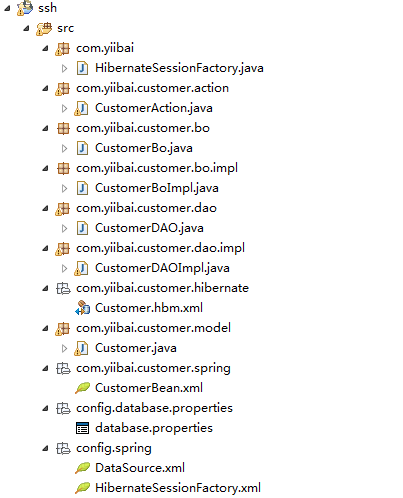
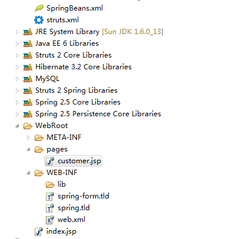
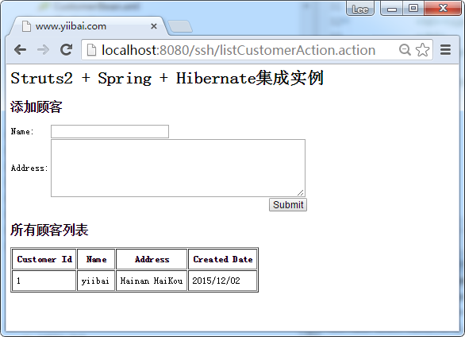
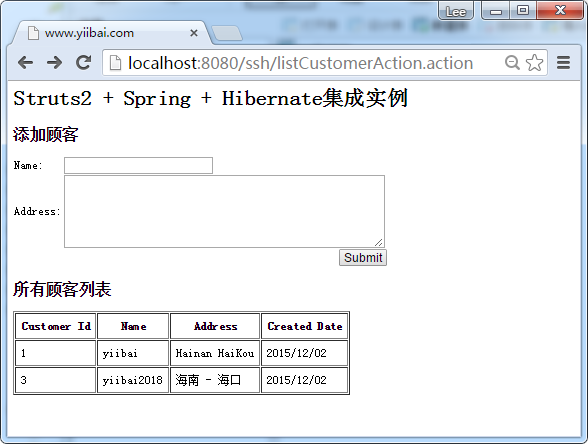

# Struts2+Spring+Hibernate集成实例 - Struts2教程

在本教程中，它显示的集成 “Struts2 + Spring + Hibernate“，请务必检查以下之前继续学习教程。

1.  [Struts2 + Hibernate集成实例](http://www.yiibai.com/struts2/struts-2-hibernate-integration-example/)
2.  [Struts2 + Spring 集成实例](http://www.yiibai.com/struts2/struts-2-spring-integration-example/)

参见集成步骤总结：

1.  获取所有的依赖库(很多)。
2.  注册 Spring 的 ContextLoaderListener 来整合 Struts2 和 Spring。
3.  使用 Spring 的 LocalSessionFactoryBean 来集成 Spring 和 Hibernate。
4.  完成所有连接。

请参阅它们之的关系：

```
Struts 2 <-- (ContextLoaderListener) --> Spring <-- (LocalSessionFactoryBean) --> Hibernate
```

这将是一个很长的教程，相关解释并不是很多，请务必阅读上述2篇文章的详细情况说明以方面学习。

这将要创建一个客户页面，以添加客户和列表的自定义函数。前端使用Struts2显示，Spring作为依赖注入引擎，而 Hibernate 用来执行数据库操作。让我们开始...

## 1\. 工程文件夹结构

在本章中，我们创建一个 ssh 的web工程，工程的目录结构如下图所示：





## 2\. MySQL表结构结构

客户(customer)表脚本。

```
DROP TABLE IF EXISTS `yiibai`.`customer`;
CREATE TABLE  `yiibai`.`customer` (
  `CUSTOMER_ID` bigint(20) unsigned NOT NULL AUTO_INCREMENT,
  `NAME` varchar(45) NOT NULL,
  `ADDRESS` varchar(255) NOT NULL,
  `CREATED_DATE` datetime NOT NULL,
  PRIMARY KEY (`CUSTOMER_ID`)
) ENGINE=InnoDB AUTO_INCREMENT=17 DEFAULT CHARSET=utf8;
```

## 3\. Hibernate相关配置

只有模型和映射文件是必需的，因为这里要用Spring处理Hibernate配置。

**Customer.java** – 创建客户表对应的一个类。

```
package com.yiibai.customer.model;

import java.util.Date;

public class Customer implements java.io.Serializable {

    private Long customerId;
    private String name;
    private String address;
    private Date createdDate;

    //getter and setter methods
}
```

**Customer.hbm.xml** – Hibernate的客户映射文件。

```
<?xml version="1.0"?>
<!DOCTYPE hibernate-mapping PUBLIC "-//Hibernate/Hibernate Mapping DTD 3.0//EN"
"http://hibernate.sourceforge.net/hibernate-mapping-3.0.dtd">
<!-- Generated 20 Julai 2010 11:40:18 AM by Hibernate Tools 3.2.5.Beta -->
<hibernate-mapping>
    <class name="com.yiibai.customer.model.Customer" 
        table="customer" catalog="yiibai">
        <id name="customerId" type="java.lang.Long">
            <column name="customer_id" />
            <generator class="identity" />
        </id>
        <property name="name" type="string">
            <column name="name" length="45" not-null="true" />
        </property>
        <property name="address" type="string">
            <column name="address" not-null="true" />
        </property>
        <property name="createdDate" type="timestamp">
            <column name="create_date" length="19" not-null="true" />
        </property>
    </class>
</hibernate-mapping>
```

## 5\. Struts2相关

实现了 Bo 和 DAO 设计模式。所有Bo和DAO将由Spring Spring bean配置文件注入。在DAO中，让它扩展Spring的HibernateDaoSupport来集成 Spring 和 Hibernate。

**CustomerBo.java**

```
package com.yiibai.customer.bo;

import java.util.List;
import com.yiibai.customer.model.Customer;

public interface CustomerBo{

    void addCustomer(Customer customer);
    List<Customer> listCustomer();

}
```

**CustomerBoImpl.java**

```
package com.yiibai.customer.bo.impl;

import java.util.List;
import com.yiibai.customer.bo.CustomerBo;
import com.yiibai.customer.dao.CustomerDAO;
import com.yiibai.customer.model.Customer;

public class CustomerBoImpl implements CustomerBo{

    CustomerDAO customerDAO;
    //DI via Spring
    public void setCustomerDAO(CustomerDAO customerDAO) {
        this.customerDAO = customerDAO;
    }

    //call DAO to save customer
    public void addCustomer(Customer customer){
        customerDAO.addCustomer(customer);
    }

    //call DAO to return customers
    public List<Customer> listCustomer(){
        return customerDAO.listCustomer();
    }
}
```

**CustomerDAO.java**

```
package com.yiibai.customer.dao;

import java.util.List;
import com.yiibai.customer.model.Customer;

public interface CustomerDAO{

    void addCustomer(Customer customer);
    List<Customer> listCustomer();    

}
```

**CustomerDAOImpl.java**

```
package com.yiibai.customer.dao.impl;

import java.util.List;
import org.springframework.orm.hibernate3.support.HibernateDaoSupport;
import com.yiibai.customer.dao.CustomerDAO;
import com.yiibai.customer.model.Customer;

public class CustomerDAOImpl extends HibernateDaoSupport 
    implements CustomerDAO{

    //add the customer
    public void addCustomer(Customer customer){
        getHibernateTemplate().save(customer);
    }

    //return all the customers in list
    public List<Customer> listCustomer(){
        return getHibernateTemplate().find("from Customer");        
    }

}
```

**CustomerAction.java** – Struts2 的动作不再需要扩展ActionSupport，它将由 Spring 来处理。

```
package com.yiibai.customer.action;

import java.util.ArrayList;
import java.util.Date;
import java.util.List;

import com.yiibai.customer.bo.CustomerBo;
import com.yiibai.customer.model.Customer;
import com.opensymphony.xwork2.ModelDriven;

public class CustomerAction implements ModelDriven{

    Customer customer = new Customer();
    List<Customer> customerList = new ArrayList<Customer>();

    CustomerBo customerBo;
    //DI via Spring
    public void setCustomerBo(CustomerBo customerBo) {
        this.customerBo = customerBo;
    }

    public Object getModel() {
        return customer;
    }

    public List<Customer> getCustomerList() {
        return customerList;
    }

    public void setCustomerList(List<Customer> customerList) {
        this.customerList = customerList;
    }

    //save customer
    public String addCustomer() throws Exception{

        //save it
        customer.setCreatedDate(new Date());
        customerBo.addCustomer(customer);

        //reload the customer list
        customerList = null;
        customerList = customerBo.listCustomer();

        return "success";

    }

    //list all customers
    public String listCustomer() throws Exception{

        customerList = customerBo.listCustomer();

        return "success";

    }

}
```

## 6\. Spring相关配置

几乎所有的配置都是在这里完成是由Spring专门来整合。

**CustomerBean.xml** – 声明 Spring 的 bean：Action, BO 和 DAO.

```
<?xml version="1.0" encoding="UTF-8"?>
<beans xmlns="http://www.springframework.org/schema/beans"
    xmlns:xsi="http://www.w3.org/2001/XMLSchema-instance"
    xsi:schemaLocation="http://www.springframework.org/schema/beans 
    http://www.springframework.org/schema/beans/spring-beans-2.5.xsd">

     <bean id="customerAction" class="com.yiibai.customer.action.CustomerAction">
        <property name="customerBo" ref="customerBo" />    
    </bean>

    <bean id="customerBo" class="com.yiibai.customer.bo.impl.CustomerBoImpl" >
        <property name="customerDAO" ref="customerDAO" />
    </bean>

       <bean id="customerDAO" class="com.yiibai.customer.dao.impl.CustomerDAOImpl" >
        <property name="sessionFactory" ref="sessionFactory" />
    </bean>

</beans>
```

**database.properties** – 声明数据库详细信息

```
jdbc.driverClassName=com.mysql.jdbc.Driver
jdbc.url=jdbc:mysql://localhost:3306/yiibai
jdbc.username=root
jdbc.password=password
```

**DataSource.xml** – 创建一个数据库源的Bean 

```
<beans xmlns="http://www.springframework.org/schema/beans"
xmlns:xsi="http://www.w3.org/2001/XMLSchema-instance"
xsi:schemaLocation="http://www.springframework.org/schema/beans
http://www.springframework.org/schema/beans/spring-beans-2.5.xsd">

 <bean 
   class="org.springframework.beans.factory.config.PropertyPlaceholderConfigurer">
   <property name="location">
     <value>WEB-INF/classes/config/database/properties/database.properties</value>
   </property>
</bean>

  <bean id="dataSource" 
         class="org.springframework.jdbc.datasource.DriverManagerDataSource">
    <property name="driverClassName" value="${jdbc.driverClassName}" />
    <property name="url" value="${jdbc.url}" />
    <property name="username" value="${jdbc.username}" />
    <property name="password" value="${jdbc.password}" />
  </bean>

</beans>
```

**HibernateSessionFactory.xml** – 创建一个SessionFactory Bean来集成Spring和Hibernate。

```
<?xml version="1.0" encoding="UTF-8"?>
<beans xmlns="http://www.springframework.org/schema/beans"
xmlns:xsi="http://www.w3.org/2001/XMLSchema-instance"
xsi:schemaLocation="http://www.springframework.org/schema/beans
http://www.springframework.org/schema/beans/spring-beans-2.5.xsd">

<!-- Hibernate session factory -->
<bean id="sessionFactory" 
    class="org.springframework.orm.hibernate3.LocalSessionFactoryBean">

    <property name="dataSource">
      <ref bean="dataSource"/>
    </property>

    <property name="hibernateProperties">
       <props>
         <prop key="hibernate.dialect">org.hibernate.dialect.MySQLDialect</prop>
         <prop key="hibernate.show_sql">true</prop>
       </props>
    </property>

    <property name="mappingResources">
        <list>
          <value>com/yiibai/customer/hibernate/Customer.hbm.xml</value>
        </list>
    </property>    

</bean>
</beans>
```

**SpringBeans.xml** – 创建一个核心 Spring 的 bean 配置文件，作为中央的 bean 管理层。

```
<beans xmlns="http://www.springframework.org/schema/beans"
xmlns:xsi="http://www.w3.org/2001/XMLSchema-instance"
xsi:schemaLocation="http://www.springframework.org/schema/beans
http://www.springframework.org/schema/beans/spring-beans-2.5.xsd">

    <!-- Database Configuration -->
    <import resource="config/spring/DataSource.xml"/>
    <import resource="config/spring/HibernateSessionFactory.xml"/>

    <!-- Beans Declaration -->
    <import resource="com/yiibai/customer/spring/CustomerBean.xml"/>

</beans>
```

## 7\. JSP 页面

JSP页面来显示使用 Struts2 标签的元素。

**customer.jsp**

```
<%@ taglib prefix="s" uri="/struts-tags" %>
<html>
<head>
</head>

<body>
<h1>Struts 2 + Spring + Hibernate integration example</h1>

<h2>Add Customer</h2>
<s:form action="addCustomerAction" >
  <s:textfield name="name" label="Name" value="" />
  <s:textarea name="address" label="Address" value="" cols="50" rows="5" />
  <s:submit />
</s:form>

<h2>All Customers</h2>

<s:if test="customerList.size() > 0">
<table border="1px" cellpadding="8px">
    <tr>
        <th>Customer Id</th>
        <th>Name</th>
        <th>Address</th>
        <th>Created Date</th>
    </tr>
    <s:iterator value="customerList" status="userStatus">
        <tr>
            <td><s:property value="customerId" /></td>
            <td><s:property value="name" /></td>
            <td><s:property value="address" /></td>
            <td><s:date name="createdDate" format="dd/MM/yyyy" /></td>
        </tr>
    </s:iterator>
</table>
</s:if>
<br/>
<br/>

</body>
</html>
```

## 8\. struts.xml

```
<?xml version="1.0" encoding="UTF-8" ?>
<!DOCTYPE struts PUBLIC
"-//Apache Software Foundation//DTD Struts Configuration 2.0//EN"
"http://struts.apache.org/dtds/struts-2.0.dtd">

<struts>
     <constant name="struts.devMode" value="true" />

    <package name="default" namespace="/" extends="struts-default">

        <action name="addCustomerAction" 
            class="customerAction" method="addCustomer" >
            <result name="success">pages/customer.jsp</result>
        </action>

        <action name="listCustomerAction"
            class="customerAction" method="listCustomer" >
            <result name="success">pages/customer.jsp</result>
        </action>

    </package>

</struts>
```

## 9\. Struts 2 + Spring

要集成Struts2和Spring，只需注册ContextLoaderListener监听器类，定义一个“contextConfigLocation”参数要求Spring容器来解析“SpringBeans.xml”，而不使用默认的“applicationContext.xml”。

**web.xml**

```
<!DOCTYPE web-app PUBLIC
 "-//Sun Microsystems, Inc.//DTD Web Application 2.3//EN"
 "http://java.sun.com/dtd/web-app_2_3.dtd" >

<web-app>
  <display-name>Struts 2 Web Application</display-name>

  <filter>
    <filter-name>struts2</filter-name>
    <filter-class>
      org.apache.struts2.dispatcher.ng.filter.StrutsPrepareAndExecuteFilter
    </filter-class>
  </filter>

  <filter-mapping>
    <filter-name>struts2</filter-name>
    <url-pattern>/*</url-pattern>
  </filter-mapping>

  <context-param>
    <param-name>contextConfigLocation</param-name>
    <param-value>/WEB-INF/classes/SpringBeans.xml</param-value>
  </context-param>

  <listener>
    <listener-class>
      org.springframework.web.context.ContextLoaderListener
    </listener-class>
  </listener>

</web-app>
```

## 10\. 运行实例

在浏览器中打开网址 : http://localhost:8080/ssh/listCustomerAction.action




## 参考

1.  [Struts2 + Hibernate集成实例](http://www.yiibai.com/struts2/struts-2-hibernate-integration-example/)
2.  [Struts2 + Spring集成实例](http://www.yiibai.com/struts2/struts-2-spring-integration-example/)
3.  [Struts2 + Hibernate 使用 Full Hibernate Plugin插件集成](http://www.yiibai.com/struts2/struts-2-hibernate-integration-with-full-hibernate-plugin/)

代码下载 - [http://pan.baidu.com/s/1mgzt1Xm](http://pan.baidu.com/s/1mgzt1Xm) (含ssh相关类库，详见 lib 目录，文件大小约：18M)。

