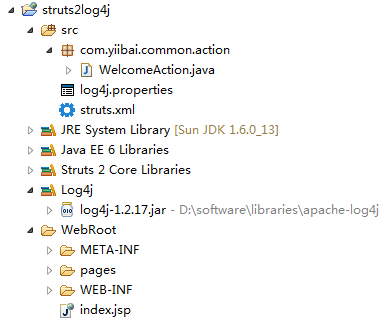
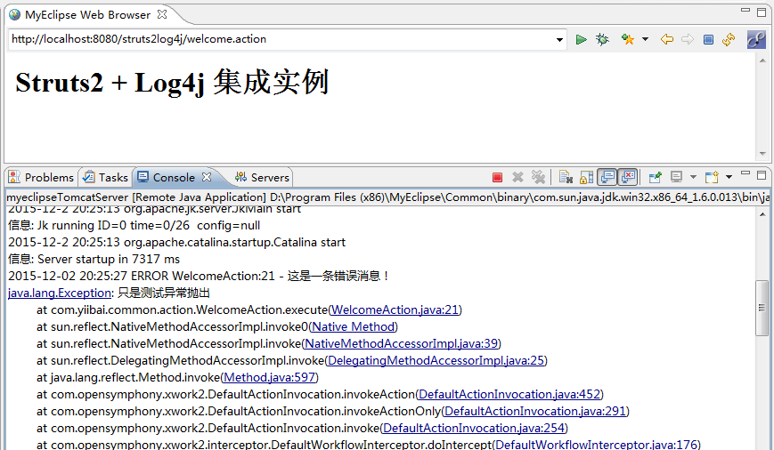
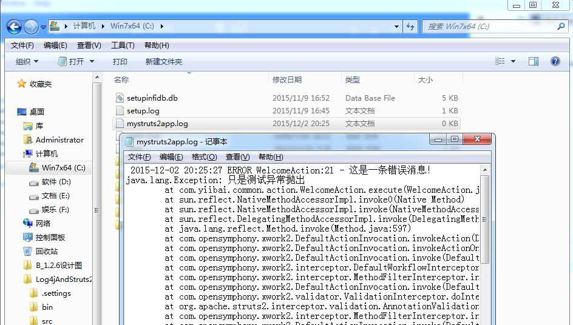

# Struts2+Log4j集成 - Struts2教程

在本教程中，我们学习如何将log4j框架在Struts2的Web应用程序集成。所有需要做的有：

1.  包含 log4j.jar 作为项目依赖
2.  创建一个 log4j.properties 文件，并把它放入 classpath 的根目录-放到资源文件夹中。

相关技术和工具的使用：

1.  Log4j 1.2.17
2.  Struts 2.1.8
3.  Tomcat 6
4.  MyEclipse 10

## 1\. 工程结构

这里我们创建一个web工程为：struts2log4j，参见下面最终的工程结构：



## 2\. log4j.properties

创建log4j的属性文件，并把它放入资源文件夹，请参阅步骤＃1。log4j.properties

```
# Root logger option
log4j.rootLogger=ERROR, stdout, file

# Redirect log messages to console
log4j.appender.stdout=org.apache.log4j.ConsoleAppender
log4j.appender.stdout.Target=System.out
log4j.appender.stdout.layout=org.apache.log4j.PatternLayout
log4j.appender.stdout.layout.ConversionPattern=%d{yyyy-MM-dd HH:mm:ss} %-5p %c{1}:%L - %m%n

# Redirect log messages to a log file, support rolling backup file.
log4j.appender.file=org.apache.log4j.RollingFileAppender
log4j.appender.file.File=${catalina.home}/logs/mystruts2app.log
log4j.appender.file.MaxFileSize=5MB
log4j.appender.file.MaxBackupIndex=10
log4j.appender.file.layout=org.apache.log4j.PatternLayout
log4j.appender.file.layout.ConversionPattern=%d{yyyy-MM-dd HH:mm:ss} %-5p %c{1}:%L - %m%n
```

## 4\. Struts2 Action 和 Logging

一个简单的动作返回一个页面，并显示了如何来执行 log4j 消息日志记录。WelcomeAction.java

```
package com.yiibai.common.action;

import org.apache.log4j.Logger;
import com.opensymphony.xwork2.ActionSupport;

public class WelcomeAction extends ActionSupport {

    private static final long serialVersionUID = 1L;

    //get log4j
    private static final Logger logger = Logger.getLogger(WelcomeAction.class);

    public String execute() throws Exception {

        // logs debug message
        if (logger.isDebugEnabled()) {
            logger.debug("execute()!");
        }

        // logs exception
        logger.error("This is Error message", new Exception("Testing"));

        return SUCCESS;

    }
}
```

## 5\. Struts2配置

Struts2 的配置和JSP页面，如果想了解的话。struts.xml

```
<?xml version="1.0" encoding="UTF-8" ?>
<!DOCTYPE struts PUBLIC
"-//Apache Software Foundation//DTD Struts Configuration 2.0//EN"
"http://struts.apache.org/dtds/struts-2.0.dtd">

<struts>
    <constant name="struts.devMode" value="true" />

    <package name="welcome" namespace="/" extends="struts-default">

        <action name="welcome" class="com.yiibai.common.action.WelcomeAction">
            <result name="success">pages/success.jsp</result>
        </action>

    </package>

</struts>
```

web.xml

```
<web-app xmlns="http://java.sun.com/xml/ns/javaee"
    xmlns:xsi="http://www.w3.org/2001/XMLSchema-instance"
    xsi:schemaLocation="http://java.sun.com/xml/ns/javaee
    http://java.sun.com/xml/ns/javaee/web-app_2_5.xsd"
    version="2.5">

    <display-name>Struts 2 Web Application</display-name>

    <filter>
        <filter-name>struts2</filter-name>
        <filter-class>
            org.apache.struts2.dispatcher.ng.filter.StrutsPrepareAndExecuteFilter
        </filter-class>
    </filter>

    <filter-mapping>
        <filter-name>struts2</filter-name>
        <url-pattern>/*</url-pattern>
    </filter-mapping>

</web-app>
```

pages/success.jsp

```
<%@ taglib prefix="s" uri="/struts-tags" %>
<html>
<head>
</head>

<body>
<h1>Struts 2 + Log4j integration example</h1>

</body>
</html>
```

## 6\. 实例测试

运行Struts 2的Web应用程序，并访问welcome的动作。

在浏览器中打开 URL : http://localhost:8888/struts2log4j/welcome

_6.1_ 所有日志消息将显示在控制台中。



_Figure : Eclipse 终端_

_6.2_ 此外，日志文件将在Tomcat 的日志文件夹中被创建。



_图片: C:\mystruts2app.log_

下载代码 – [http://pan.baidu.com/s/1nt7yVep](http://www.yiibai.com/wp-content/uploads/2010/07/Log4jAndStruts2Example.zip)
