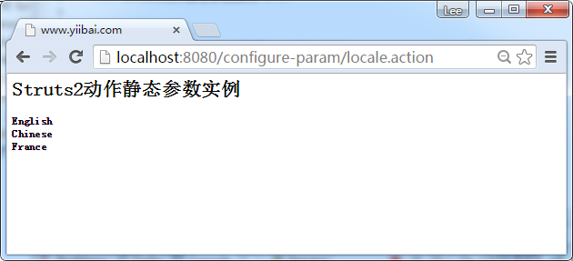

# Struts2配置Action类的静态参数 - Struts2教程

在某些情况下，可能需要一个Action类分配一些预定义或静态的参数值。

## 为动作定义静态参数

在Struts2，可以在 struts.xml 文件中的通过<param>标记进行配置，例如，

**struts.xml**

```
<struts>

   <constant name="struts.custom.i18n.resources" value="global" />
   <constant name="struts.devMode" value="true" />

   <package name="default" namespace="/" extends="struts-default">
    <action name="locale" class="com.yiibai.common.action.LocaleAction">
        <result name="SUCCESS">pages/welcome.jsp</result>
        <param name="EnglishParam">English</param>
                <param name="ChineseParam">Chinese</param>
                 <param name="FranceParam">France</param>
    </action>
   </package>    
</struts>
```

它分配三个预定义的参数值到LocaleAction Action类。

## 从动作获取静态参数

要从struts.xml中获取静态参数值，Action类必须实现参数化Parameterizable接口。动作的静态参数是由staticParams拦截，其中包括在默认堆栈控制

动作的静态参数是由staticParams拦截，包括在默认堆栈 “struts-default.xml” 中控制。

## 1\. Map属性

在操作类初始化期间，staticParams拦截器将通过动作类的setParams()方法获取预先定义的参数值。

```
//...
import com.opensymphony.xwork2.config.entities.Parameterizable;

public class LocaleAction implements Parameterizable{

    Map<String, String> params;
    //...
    public void setParams(Map<String, String> params) {
        this.params = params;
    }
}
```

## 2\. JavaBean 属性

在动作类的初始化，如果创建了getter和setter方法得当，staticParams拦截器将设置预先定义的参数值，以对应于该“参数”的每JavaBean属性。

```
//...
import com.opensymphony.xwork2.config.entities.Parameterizable;

public class LocaleAction implements Parameterizable{

    String englishParam;
    String chineseParam;
    String franceParam;

    public String getEnglishParam() {
        return englishParam;
    }

    public void setEnglishParam(String englishParam) {
        this.englishParam = englishParam;
    }

    public String getChineseParam() {
        return chineseParam;
    }

    public void setChineseParam(String chineseParam) {
        this.chineseParam = chineseParam;
    }

    public String getFranceParam() {
        return franceParam;
    }

    public void setFranceParam(String franceParam) {
        this.franceParam = franceParam;
    }
    //...
}
```

## 2\. 运行实例

在浏览器中打开URL：http://localhost:8080/configure-param/locale.action



代码下载(configure-param) - [http://pan.baidu.com/s/1dDmGDK9](http://pan.baidu.com/s/1dDmGDK9)

