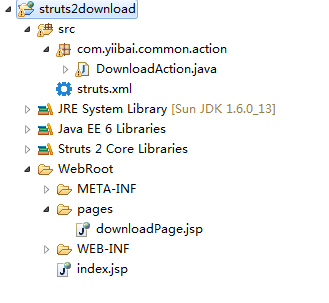
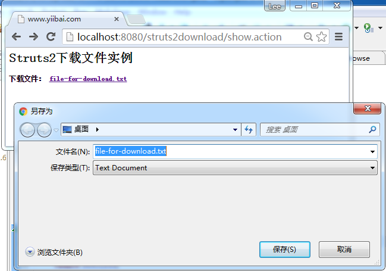

# Struts2下载文件实例 - Struts2教程

这是一个Struts2的例子来说明使用定制返回类型，允许用户下载文件。web工程的文件夹结构如下所示：


## 1\. Action

在Action类中，声明一个 InputStream 的数据类型和getter方法。

**DownloadAction.java**

```
package com.yiibai.common.action;

import java.io.File;
import java.io.FileInputStream;
import java.io.InputStream;
import com.opensymphony.xwork2.ActionSupport;

public class DownloadAction extends ActionSupport{

    private InputStream fileInputStream;

    public InputStream getFileInputStream() {
        return fileInputStream;
    }

    public String execute() throws Exception {
        fileInputStream = new FileInputStream(new File("C:\\file-for-download.txt")); return SUCCESS;
    }
}
```

## 2\. 视图文件

一个正常的页面，有一个下载链接，用于下载文件。

**downloadPage.jsp**

```
<%@ taglib prefix="s" uri="/struts-tags" %>
<html>

<body>
<h1>Struts 2 download file example</h1>

<s:url id="fileDownload" namespace="/" action="download" ></s:url>

<div><div class="ads-in-post hide_if_width_less_800">
<script async src="//pagead2.googlesyndication.com/pagead/js/adsbygoogle.js"></script>
<!-- 728x90 - After2ndH4 -->
<ins class="adsbygoogle hide_if_width_less_800" 
     style="display:inline-block;width:728px;height:90px"
     data-ad-client="ca-pub-2836379775501347"
     data-ad-slot="3642936086"
     data-ad-region="yiibairegion"></ins>
<script>
(adsbygoogle = window.adsbygoogle || []).push({});
</script>
</div></div><h2>Download file - <s:a href="%{fileDownload}">fileABC.txt</s:a>
</h2>

</body>
</html>
```

## 3\. struts.xml

定义下载文件的细节。 &lt;param name=”inputName”&gt; 值是从Action的InputStream属性的名称。

阅读[Struts2的数据流结果文档](http://struts.apache.org/2.x/docs/stream-result.html)以了解更详细信息。

**struts.xml**

```
<?xml version="1.0" encoding="UTF-8" ?>
<!DOCTYPE struts PUBLIC
"-//Apache Software Foundation//DTD Struts Configuration 2.0//EN"
"http://struts.apache.org/dtds/struts-2.0.dtd">

<struts>

<constant name="struts.devMode" value="true" />

<package name="default" namespace="/" extends="struts-default">
   <action name="show">
    <result name="success">pages/downloadPage.jsp</result>
   </action>

   <action name="download" class="com.yiibai.common.action.DownloadAction">
    <result name="success" type="stream">
      <param name="contentType">application/octet-stream</param>
      <param name="inputName">fileInputStream</param>
      <param name="contentDisposition">attachment;filename="file-for-download.txt"</param> <param name="bufferSize">1024</param>
    </result>
   </action>
</package>

</struts>
```

## 4\. 执行结果

在浏览器中打开：http://localhost:8080/struts2download/


## 参考

1.  [http://struts.apache.org/2.x/docs/stream-result.html](http://struts.apache.org/2.x/docs/stream-result.html)
2.  [http://www.iana.org/assignments/media-types/](http://www.iana.org/assignments/media-types/)
3.  [http://www.yiibai.com/struts/struts-download-file-from-website-example.html](http://www.yiibai.com/struts/struts-download-file-from-website-example.html)
4.  [http://www.yiibai.com/java/how-to-download-file-from-website-java-jsp.html](http://www.yiibai.com/java/how-to-download-file-from-website-java-jsp.html)
5.  [http://struts.apache.org/2.x/docs/how-can-we-return-a-text-string-as-the-response.html](http://struts.apache.org/2.x/docs/how-can-we-return-a-text-string-as-the-response.html)

代码下载(struts2download) - [http://pan.baidu.com/s/1jGg0Lzo](http://pan.baidu.com/s/1n2C5S)

