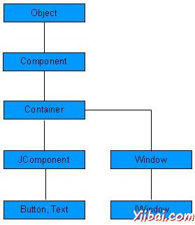

# Swing控件 - Swing

每一个用户界面参考主要有以下三个方面：

*   UI 元素: 有核心视觉元素，最终用户看到并与之交互。 [GWT](http://www.yiibai.com/awt) 提供了一个巨大的名单变化更复杂，本教程我们从基本的广泛使用和常见的元素。

*   布局: 他们定义 UI 元素如何应安排在屏幕上，并提供一个最终的外观和感觉的GUI（图形用户界面）。在“布局”一章，这部分将被覆盖。

*   行为: 这些事件发生时，与用户交互的 UI 元素。这部分将被覆盖在事件处理“一章。

每个Swing 控件继承属性从以下组件的类层次结构。

| Sr. No. | 类 & 描述 |
| --- | --- |
| 1 | [Component](http://www.yiibai.com/swing/swing_component.html) 容器是一个抽象基类的非菜单用户界面控件摆动。部分指图形表示的对象 |
| 2 | [Container](http://www.yiibai.com/swing/swing_container.html) Container是一个组件，它可以包含其他Swing组件。 |
| 3 | [JComponent](http://www.yiibai.com/swing/swing_jcomponent.html) JComponent是一个基类，所有Swing UI 组件。为了使用继承自JComponent 的 swing组件，组件必须是一个包容层次结构，其根是一个顶层的Swing容器。 |

## SWING UI 元素:

以下是常用的控件列表而设计的图形用户界面使用Swing。

| Sr. No. | 控件& 描述 |
| --- | --- |
| 1 | [JLabel](http://www.yiibai.com/swing/swing_jlabel.html) 一个JLabel对象是在容器中放置文本的一个组成部分。 |
| 2 | [JButton](http://www.yiibai.com/swing/swing_jbutton.html) 该类创建标记的按钮。 |
| 3 | [JColorChooser](http://www.yiibai.com/swing/swing_jcolorchooser.html) JColorChooser提供一个用于控制窗格设计，让用户操作和选择颜色。 |
| 4 | [JCheck Box](http://www.yiibai.com/swing/swing_jcheckbox.html) JCheckBox的是一个图形化的组件可以在一个（true）或关闭（false）状态时。 |
| 5 | [JRadioButton](http://www.yiibai.com/swing/swing_jradiobutton.html) JRadioButton类是一个图形化的组件可以在一个（true）或关闭（false）状态时。在一组。 |
| 6 | [JList](http://www.yiibai.com/swing/swing_jlist.html) JList组件向用户展示一个滚动的文本项列表。 |
| 7 | [JComboBox](http://www.yiibai.com/swing/swing_jcombobox.html) JComboBox组件为用户提供了一个选择显示菜单。 |
| 8 | [JTextField](http://www.yiibai.com/swing/swing_jtextfield.html) JTextField的对象是一个文本组件，它允许编辑的单行文本。 |
| 9 | [JPasswordField](http://www.yiibai.com/swing/swing_jpasswordfield.html) JPasswordField中对象是一个专门用于输入密码的文本组件。 |
| 10 | [JTextArea](http://www.yiibai.com/swing/swing_jtextarea.html) JTextArea对象是一个文本组件，它允许编辑的多行文本。 |
| 11 | [ImageIcon](http://www.yiibai.com/swing/swing_imageicon.html) ImageIcon的控件的图标界面，实现从图像绘制图标 |
| 12 | [JScrollbar](http://www.yiibai.com/swing/swing_jscrollbar.html) Scrollbar控件代表一个滚动条组件以让用户从范围选择的值。 |
| 13 | [JOptionPane](http://www.yiibai.com/swing/swing_joptionpane.html) JOptionPane的规定设置标准对话框，提示用户提供值或向其发出通知。 |
| 14 | [JFileChooser](http://www.yiibai.com/swing/swing_jfilechooser.html) JFileChooser的控制代表一个对话框窗口，用户可以选择一个文件。 |
| 15 | [JProgressBar](http://www.yiibai.com/swing/swing_jprogressbar.html) 随着任务的进展，进度条接近完成显示任务的完成百分比。 |
| 16 | [JSlider](http://www.yiibai.com/swing/swing_jslider.html) JSlider让用户以图形界的时间间隔内滑动旋钮选择一个值。 |
| 17 | [JSpinner](http://www.yiibai.com/swing/swing_jspinner.html) JSpinner让用户从一个有序序列中选择一个数字或者一个对象值的单行输入字段。 |

