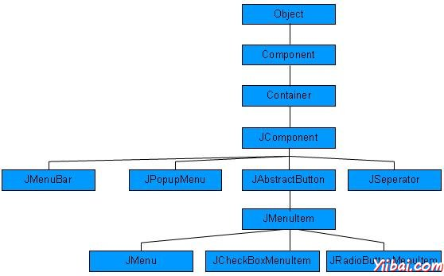

# Swing Menu菜单类 - Swing

正如我们所知道与菜单相关的每一个顶层窗口有一个菜单栏。此菜单栏包括提供给最终用户的各种菜单的选择。此外，每个选择包含这就是所谓的下拉菜单中的选项列表。菜单和菜单项的控件是MenuComponent类的子类。

## 菜单层次结构

## 菜单控件

| Sr. No. | 控件& 描述 |
| --- | --- |
| 1 | [JMenuBar](http://www.yiibai.com/swing/swing_jmenubar_control.html) JMenuBar的对象是与顶层窗口。 |
| 2 | [JMenuItem](http://www.yiibai.com/swing/swing_jmenuitem_control.html) 菜单中的项目必须属于JMenuItem的或任何其子类。 |
| 3 | [JMenu](http://www.yiibai.com/swing/swing_jmenu_control.html) JMenu对象是从菜单栏中显示一个下拉菜单组件。 |
| 4 | [JCheckboxMenuItem](http://www.yiibai.com/swing/swing_jcheckboxmenuitem_control.html) JCheckBoxMenuItem 必须为 JMenuItem的子类。 |
| 5 | [JRadioButtonMenuItem](http://www.yiibai.com/swing/swing_jradiobuttonmenuitem_control.html) JRadioButtonMenuItem对象是JMenuItem的子类。 |
| 6 | [JPopupMenu](http://www.yiibai.com/swing/swing_jpopupmenu_control.html) JPopupMenu弹出可以在一个组件内的指定位置动态弹出。 |

