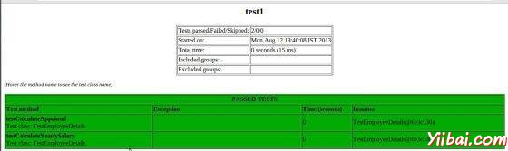

# TestNG编写测试 - TestNG教程

编写[TestNG](http://www.yiibai.com/html/testng)测试基本上包括以下步骤：

*   测试和编写业务逻辑，在代码中插入TestNG的注解..

*   添加一个testng.xml文件或build.xml中在测试信息（例如类名，您想要运行的组，等..）

*   运行 TestNG.

在这里，我们将看到一个完整的例子了TestNG测试使用POJO类，业务逻辑类，将通过TestNG的运行测试XML。

创建 EmployeeDetails.java 在 C: &gt; TestNG_WORKSPACE 是一个 POJO 类.

```
public class EmployeeDetails {

   private String name;
   private double monthlySalary;
   private int age;

   /**
   * @return the name
   */
   public String getName() {
      return name;
   }
   /**
   * @param name the name to set
   */
   public void setName(String name) {
      this.name = name;
   }
   /**
   * @return the monthlySalary
   */
   public double getMonthlySalary() {
      return monthlySalary;
   }
   /**
   * @param monthlySalary the monthlySalary to set
   */
   public void setMonthlySalary(double monthlySalary) {
      this.monthlySalary = monthlySalary;
   }
   /**
   * @return the age
   */
   public int getAge() {
      return age;
   }
   /**
   * @param age the age to set
   */
   public void setAge(int age) {
   this.age = age;
   }
}
```

EmployeeDetails 类是用来

*   get/set 员工的名字的值

*   get/set 员工月薪的值

*   get/set员工年龄的值

创建一个 EmpBusinessLogic.java 在 C: &gt; TestNG_WORKSPACE 其中包含业务逻辑

```
public class EmpBusinessLogic {
   // Calculate the yearly salary of employee
   public double calculateYearlySalary(EmployeeDetails employeeDetails){
      double yearlySalary=0;
      yearlySalary = employeeDetails.getMonthlySalary() * 12;
      return yearlySalary;
   }

   // Calculate the appraisal amount of employee
   public double calculateAppraisal(EmployeeDetails employeeDetails){
      double appraisal=0;
      if(employeeDetails.getMonthlySalary() < 10000){
         appraisal = 500;
      }else{
         appraisal = 1000;
      }
      return appraisal;
   }
}
```

EmpBusinessLogic 类用于计算

*   员工的年薪

*   考核支付予雇员

现在，让我们创建一个TestNG 类名称为 TestEmployeeDetails.java 在 C: &gt; TestNG_WORKSPACE. TestNG类是一个Java类，它包含至少一个TestNG的注解。 这个类包含测试用例进行测试。可以配置，@BeforeXXX和@AfterXXX注解了TestNG测试 (在本章，我们会看到这样[TestNG - Execution Procedure](/testng/testng_execution_procedure.htm)) 它允许执行一些Java逻辑的目标点之前和之后。

```
import org.testng.Assert;
import org.testng.annotations.Test;

public class TestEmployeeDetails {
    EmpBusinessLogic empBusinessLogic = new EmpBusinessLogic();
    EmployeeDetails employee = new EmployeeDetails();

    @Test
    public void testCalculateAppriasal() {
        employee.setName("Rajeev");
        employee.setAge(25);
        employee.setMonthlySalary(8000);
        double appraisal = empBusinessLogic
            .calculateAppraisal(employee);
        Assert.assertEquals(500, appraisal, 0.0, "500");
    }

    // test to check yearly salary
    @Test
    public void testCalculateYearlySalary() {
        employee.setName("Rajeev");
        employee.setAge(25);
        employee.setMonthlySalary(8000);
        double salary = empBusinessLogic
            .calculateYearlySalary(employee);
        Assert.assertEquals(96000, salary, 0.0, "8000");
    }
}
```

TestEmployeeDetails 测试方法，用于类EmpBusinessLogic，它

*   雇员测试的年薪

*   测试评估员工的金额

之前，你可以运行测试，但是必须使用特殊的XML文件，通常命名为testng.xml配置TestNG。此文件的语法很简单，其内容如下。创建这个文件C: &gt; TestNG_WORKSPACE:

```
<?xml version="1.0" encoding="UTF-8"?>
<!DOCTYPE suite SYSTEM "http://testng.org/testng-1.0.dtd" >
<suite name="Suite1">
  <test name="test1">
    <classes>
       <class name="TestEmployeeDetails"/>
    </classes>
  </test>
</suite>
```

以上文件的详情如下：

*   suite代表一个XML文件。它可以包含一个或多个测试，并被定义由&lt;suite&gt;标记

*   标签&lt;test&gt;代表一个测试，并可以包含一个或多个TestNG的类

*   &lt;class&gt;的标签代表一个TestNG的类是一个Java类，它包含至少一个TestNG的注解。它可以包含一个或多个测试方法。

编译使用javac测试用例类。

```
C:TestNG_WORKSPACE>javac EmployeeDetails.java EmpBusinessLogic.java TestEmployeeDetails.java

```

现在TestNG用下面的命令：

```
C:TestNG_WORKSPACE>java -cp "C:TestNG_WORKSPACE" org.testng.TestNG testng.xml

```

如果所有配置正确的话，你应该看到测试结果，在控制台中。此外，TestNG创建了一个非常漂亮的HTML报告，会自动在当前目录下创建一个文件夹名为test-output 。如果打开​​并加载的index.html，会看到类似下面的图片中的一个页面：



