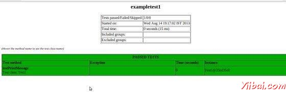
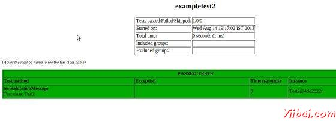

# TestNG套件测试 - TestNG教程

## TestNG套件测试

测试套件的测试是为了测试软件程序的行为或一系列行为的情况下，是一个集合。在[TestNG](http://www.yiibai.com/html/testng)，我们不能定义一套测试源代码，但它代表的套件是一个XML文件执行特征。这也允许灵活的配置要运行的测试。套件可以包含一个或多个测试和被定义由&lt;suite&gt;标签。

testng.xml中有&lt;suite&gt;根标签。它描述了一个测试套件，这反过来又是由多个&lt;test&gt;区段组成。

下表列出了所有的&lt;suite&gt;可接受合法属性。

| 属性 | 描述 |
| --- | --- |
| name | 此套件的名称。这是一个强制性的属性。 |
| verbose | 这个运行级别或冗长。 |
| parallel | 由TestNG 运行不同的线程来运行此套件。 |
| thread-count | 使用的线程数，如果启用并行模式（忽略其他方式）。 |
| annotations | 在测试中使用注释的类型。 |
| time-out | 默认的超时时间，将用于本次测试中发现的所有测试方法。 |

在本章中，我们会告诉你一个例子，有两个Test1 & Test2测试类一起运行测试套件。

## 创建一个类

创建一个Java类进行测试 MessageUtil.java 在 C: &gt; JUNIT_WORKSPACE

```
/*
* This class prints the given message on console.
*/
public class MessageUtil {
    private String message;

    // Constructor
    // @param message to be printed
    public MessageUtil(String message) {
        this.message = message;
    }

    // prints the message
    public String printMessage() {
        System.out.println(message);
        return message;
    }

    // add "Hi!" to the message
    public String salutationMessage() {
        message = "Hi!" + message;
        System.out.println(message);
        return message;
    }
}
```

## 创建测试用例类

创建一个Java类文件名 Test1.java 在C: &gt; TestNG_WORKSPACE

```
import org.testng.Assert;
import org.testng.annotations.Test;

public class Test1 {
    String message = "Manisha";
    MessageUtil messageUtil = new MessageUtil(message);

    @Test
    public void testPrintMessage() {
        System.out.println("Inside testPrintMessage()");
    Assert.assertEquals(message, messageUtil.printMessage());
    }
}
```

创建一个Java类文件名 Test2.java 在C: &gt; TestNG_WORKSPACE

```
import org.testng.Assert;
import org.testng.annotations.Test;

public class Test2 {
    String message = "Manisha";    
    MessageUtil messageUtil = new MessageUtil(message);

    @Test
    public void testSalutationMessage() {
        System.out.println("Inside testSalutationMessage()");
        message = "Hi!" + "Manisha";
        Assert.assertEquals(message,messageUtil.salutationMessage());
    }
}
```

现在，让我们编辑写入testng.xml 在C: &gt; TestNG_WORKSPACE ，将包含&lt;suite&gt;标签如下：

```
<?xml version="1.0" encoding="UTF-8"?>
<!DOCTYPE suite SYSTEM "http://testng.org/testng-1.0.dtd" >
<suite name="Suite1">
  <test name="exampletest1">
    <classes>
       <class name="Test1" />
    </classes>
  </test>
  <test name="exampletest2">
    <classes>
       <class name="Test2" />
    </classes>
  </test>
</suite>      
```

Suite1 包括 exampletest1 和 exampletest2.

所有Java类编译使用javac。

```
C:TestNG_WORKSPACE>javac MessageUtil.java Test1.java Test2.java

```

现在运行 testng.xml，将运行提供的测试用例类中定义的测试用例。

```
C:TestNG_WORKSPACE>java -cp "C:TestNG_WORKSPACE" org.testng.TestNG testng.xml

```

验证输出。

```
Inside testPrintMessage()
Manisha
Inside testSalutationMessage()
Hi!Manisha

===============================================
Suite1
Total tests run: 2, Failures: 0, Skips: 0
===============================================

```

您也可以检查测试输出文件夹;下Suite1文件夹中，可以看到两个HTML创建的exampletest1.html 和 exampletest2.html 内容如下：



