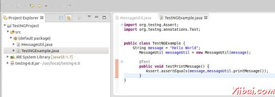
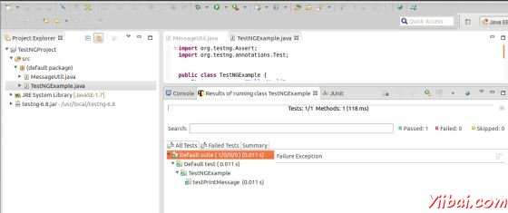

# TestNG Eclipse插件 - TestNG教程

用[eclipse](http://www.yiibai.com/html/eclipse)设置TestNG，下面的步骤必须遵循：

## 步骤1：下载TestNG的归档文件

下载 [http://www.testng.org](http://www.testng.org/)

| OS | 压缩文件名 |
| --- | --- |
| Windows | testng-6.8.jar |
| Linux | testng-6.8.jar |
| Mac | testng-6.8.jar |

假设你上面复制的JAR文件到 C:&gt;TestNG 文件夹.

## 第二步：设置Eclipse环境

*   打开 eclipse -&gt; 右键单击项目，然后单击property &gt; Build Path &gt; Configure Build Path 并添加 testng-6.8.jar 在库中使用 Add External Jar 按钮.


*   我们假设你的eclipse 中 TestNG插件已经内置，如果不是，那么请使用更新站点获取最新版本：

    *   在你的 eclipse IDE, 选择 Help / Software updates / Find and Install.

    *   搜索新功能安装。

    *   新的远程站点。

    *   For Eclipse 3.4 and above, enter [http://beust.com/eclipse](http://beust.com/eclipse).

    *   For Eclipse 3.3 and below, enter [http://beust.com/eclipse1](http://beust.com/eclipse1).

    *   Make sure the check box next to URL is checked and click Next.

    *   然后Eclipse会引导帮您完成整个过程。

现在，你的eclipse已经可以使用 TestNG测试用例的开发做好准备。

## 步骤3：确认Eclipse已经安装TestNG

*   在eclipse中创建一个项目TestNGProject

*   创建一类MessageUtil在项目测试。

```

/*
* This class prints the given message on console.
*/
public class MessageUtil {

   private String message;

   //Constructor
   //@param message to be printed
   public MessageUtil(String message){
      this.message = message;
   }

   // prints the message
   public String printMessage(){
      System.out.println(message);
      return message;
   }   
} 
```

*   在项目中创建一个测试类TestNGExample

```

import org.testng.Assert;
import org.testng.annotations.Test;

public class TestNGExample {
    String message = "Hello World";    
    MessageUtil messageUtil = new MessageUtil(message);

    @Test
    public void testPrintMessage() {      
       Assert.assertEquals(message,messageUtil.printMessage());
   }
}

```

下面应该是项目结构：



最后，通过右击程序和[TestNG](http://www.yiibai.com/html/testng)的运行验证程序的输出。

验证结果。



