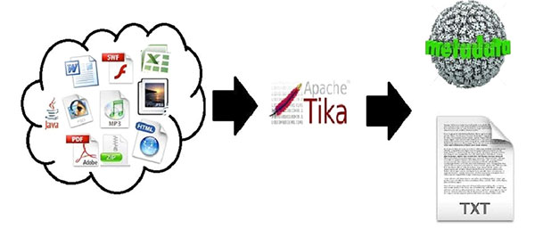
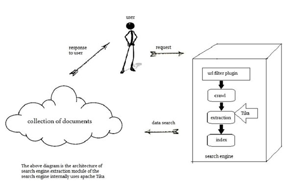

# Tika教程

## Apache Tika 是什么?

*   Apache Tika用于文件类型检测和从各种格式的文件内容提取的库。

*   在内部，Tika使用现有的各种文件解析器和文档类型的检测技术来检测和提取数据。

*   使用Tika，人们可以开发出通用型检测器和内容提取到的不同类型的文件，如电子表格，文本文件，图像，PDF文件甚至多媒体输入格式，在一定程度上提取结构化文本以及元数据。

*   Tika提供用于解析不同文件格式的一个通用API。它采用83个现有的专业解析器库，为每个文档类型。

*   所有这些解析器库是根据一个叫做Parser接口单一接口封装。

## 为什么用Tika?

据filext.com网站统计，大约有1.5万至51K的内容类型，并且这个数字还在与日俱增。数据被存储在不同的格式，如文本文档，excel表格，PDF，图像和多媒体文件，仅举几例。因此，应用程序如搜索引擎和内容管理系统需要从这些文档类型容易提取数据的额外的支持。Apache Tika 通过提供一个通用的API来检测并提取多种文件格式的数据服务达到这一目的。

## Apache Tika 应用

有各种各样的应用程序使用Apache Tika。在这里，我们将讨论严重依赖Apache Tika几个突出的应用。

### 搜索引擎

开发搜索引擎索引的数字文档的文本内容使Tika被广泛使用。

*   搜索引擎是用于搜索的网页信息和索引文件的信息处理系统。

*   抓取工具是通过Web抓取获取使用一些索引技术被索引的文件搜索引擎的重要组成部分。此后，抓取工具传送这些索引文件提取成分。

*   提取成分的职责是提取文档中的文本和元数据。这样提取的内容和元数据是对搜索引擎非常有用。该提取组件包含在Tika中。

*   然后将提取的内容被传递到使用它来建立一个搜索索引搜索引擎的索引器。此外，该搜索引擎使用许多其它方式提取的内容也是如此。

### 文档分析

*   在人工智能领域，有一定的工具来自动分析文件在语义层面，并提取各种数据来自他们。

*   在这种应用中，这些文件是基于在文档的所提取的内容的突出方面进行分类。

*   这些工具使用提Tika内容提取分析从纯文本到不同的数字文档文件。

### 数字资产管理

*   有些组织管理他们的数字资产，如使用一种称为数字资产管理（DAM）的特殊应用程序的照片，电子书，绘图，音乐和视频。

*   这样的应用程序采取的文件类型检测器和元数据提取器的帮助下到的各种文件进行分类。

### 内容分析

*   像亚马逊网站建议根据自己的兴趣刚刚发布了他们的网站内容向个人用户。要做到这一点，这些网站遵循机器学习技术，或采取了类似Facebook的社交媒体网站的帮助下，以提取所需的信息，如喜欢和用户的利益。此收集到的信息将在HTML标签或其他格式需要另外的内容类型检测和提取的形式。

*   为一个文件，内容分析，我们有实现，如UIMA和Mahout的机器学习技术的技术。这些技术是在聚类和分析中的文件中的数据是有用的。

*   Apache Mahout是一个框架，它提供基于Apache Hadoop的ML算法- 一个云计算平台。 Mahout 提供了下面的某个集群和过滤技术的架构。按照这个架构，程序员可以编写自己的ML算法，通过采取各种文本和元数据的组合来产生建议。提供输入这些算法，最近Mahout的版本使用Tika提取二进制内容的文本和元数据。

*   Apache UIMA 分析和处理各种编程语言，并产生UIMA注解。在内部，它使用提卡注解者抽取文档中的文本和元数据。

## 历史

| 年份 | 开发 |
| --- | --- |
| 2006 | Tika的想法是在Lucene项目管理委员会之前设计的。 |
| 2006 | Tika及其在Jackrabbit项目有用的概念进行了讨论。 |
| 2007 | Tika进入Apache孵化器。 |
| 2008 | 版本0.1和0.2发布，Tika从孵化器到Lucene子项目独立。 |
| 2009 | 版本0.3，0.4，和0.5发布。 |
| 2010 | 版本0.6和0.7发布，Tika进入Apache的顶级项目。 |
| 2011 | Tika1.0发布，并Tika的书籍“Tika in Action”也在同一年被发布。 |

