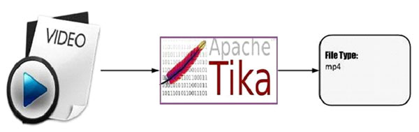
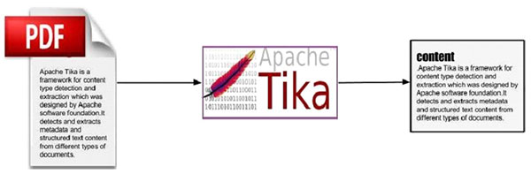
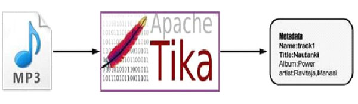
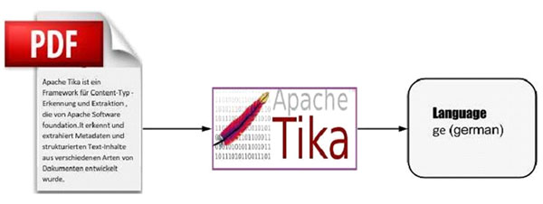

# TIKA架构 - Tika教程

## Tika应用层架构

应用程序员可以很容易地在他们的应用程序集成Tika。Tika提供了一个命令行界面和图形用户界面，使它比较人性化。

在本章中，我们将讨论构成Tika架构的四个重要模块。下图显示了Tika的四个模块的体系结构：

*   语言检测机制。
*   MIME检测机制。
*   Parser接口。
*   Tika Facade 类.

### 语言检测机制

每当一个文本文件被传递到Tika，它将检测在其中的语言。它接受没有语言的注释文件和通过检测该语言添加在该文件的元数据信息。

支持语言识别，Tika 有一类叫做语言标识符在包org.apache.tika.language及语言识别资料库里面包含了语言检测从给定文本的算法。Tika 内部使用N-gram算法语言检测。

### MIME检测机制

Tika可以根据MIME标准检测文档类型。Tika默认MIME类型检测是使用org.apache.tika.mime.mimeTypes。它使用org.apache.tika.detect.Detector 接口大部分内容类型检测。

内部Tika使用多种技术，如文件匹配替换，内容类型提示，魔术字节，字符编码，以及其他一些技术。

### 解析器接口

org.apache.tika.parser 解析器接口是Tika解析文档的主要接口。该接口从提取文档中的文本和元数据，并总结了其对外部用户愿意写解析器插件。

采用不同的具体解析器类，具体为各个文档类型，Tika 支持大量的文件格式。这些格式的具体类不同的文件格式提供支持，无论是通过直接实现逻辑分析器或使用外部解析器库。

### Tika Facade 类

使用的Tika facade类是从Java调用Tika的最简单和直接的方式，而且也沿用了外观的设计模式。可以在 Tika API的org.apache.tika包Tika 找到外观facade类。

通过实现基本用例，Tika作为facade的代理。它抽象了的Tika库的底层复杂性，例如MIME检测机制，解析器接口和语言检测机制，并提供给用户一个简单的接口来使用。

## Tika的特点

*   统一解析器接口：Tika封装在一个单一的解析器接口的第三方解析器库。由于这个特征，用户逸出从选择合适的解析器库的负担，并使用它，根据所遇到的文件类型。

*   低内存占用：Tika因此消耗更少的内存资源也很容易嵌入Java应用程序。也可以用Tika平台像移动那样PDA资源少，运行该应用程序。

*   快速处理：从应用连结内容检测和提取可以预期的。

*   灵活元数据：Tika理解所有这些都用来描述文件的元数据模型。

*   解析器集成：Tika可以使用可在单一应用程序中每个文件类型的各种解析器库。

*   MIME类型检测： Tika可以检测并从所有包括在MIME标准的媒体类型中提取内容。

*   语言检测： Tika包括语言识别功能，因此可以在一个多语种网站基于语言类型的文档中使用。

## Tika的功能

Tika支持多种功能：

*   文档类型检测
*   内容提取
*   元数据提取
*   语言检测

### 文件类型检测

Tika使用不同的检测技术，检测给它的文件的类型。

### 内容提取

Tika有一个解析器库，可以分析各种文档格式的内容，并提取它们。然后检测所述文档的类型，它从解析器库选择的适当的分析器，并传递该文档。不同类别的Tika方法来解析不同的文件格式。

### 元数据提取

随着内容，Tika提取具有相同的程序的文件的元数据中的内容的提取。对于某些文件类型，Tika有接口类提取元数据。

### 语言检测

在内部，Tika如下像一个n-gram算法来检测所述内容的语言的给定文档中。Tika取决于类，如语言识别和Profiler的语言识别。

   