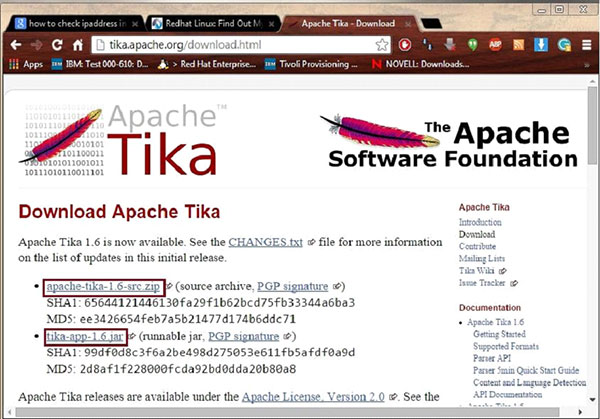
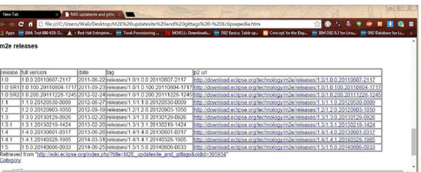
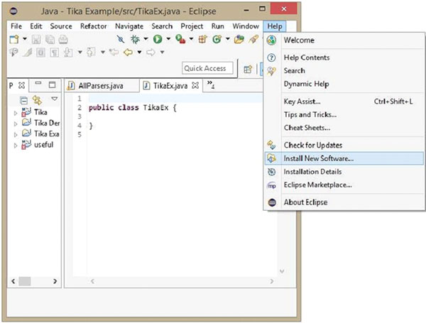
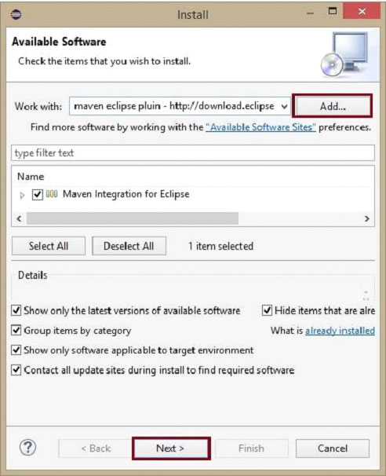

# TIKA环境配置 - Tika教程

本章将指导完成设置Apache Tika在Windows和Linux的配置过程。用户管理是必要的，同时安装了Apache Tika。

## 系统要求

| JDK | Java SE 2 JDK 1.6 或以上 |
|:--- |:--- |
| 内存 | 1 GB RAM (推荐) |
| 硬盘空间 | 无最小要求 |
| 操作系统版本 | Windows XP 或以上, Linux |

### 第1步：验证安装Java

为了验证Java安装，打开控制台并执行下面的Java命令。

| OS | 任务 | 命令 |
| --- | --- | --- |
| Windows | 打开命令控制台 | \&gt;java –version |
| Linux | 打开命令终端 | $java –version |

如果Java已经正确地在您的系统已经安装，那么应该得到以下输出之一，具体取决于您所使用的平台上。

| OS | 输出 |
| --- | --- |
| Windows | Java version "1.7.0_60"Java (TM) SE Run Time Environment (build 1.7.0_60-b19)Java Hotspot (TM) 64-bit Server VM (build 24.60-b09, mixed mode) |
| Lunix | java version "1.7.0_25"Open JDK Runtime Environment (rhel-2.3.10.4.el6_4-x86_64)Open JDK 64-Bit Server VM (build 23.7-b01, mixed mode) |

*   假设本教程的读者都在继续本教程之前把Java1.7.0_60安装在他们的系统中。

*   如果没有安装Java SDK，从下载其最新版本 [http://www.oracle.com/technetwork/java/javase/downloads/index.htmll and have it installed](http://www.oracle.com/technetwork/java/javase/downloads/index.htmll).

### 第2步：设置Java环境

设置JAVA_HOME环境变量指向到安装在机器上的Java基本目录的位置。例如，

| OS | 输出 |
| --- | --- |
| Windows | 设置环境变量 JAVA_HOME to C:\ProgramFiles\java\jdk1.7.0_60 |
| Linux | export JAVA_HOME=/usr/local/java-current |

附加Java编译器的位置到系统路径的完整路径。

| OS | 输出 |
| --- | --- |
| Windows | Append the String; C:\Program Files\Java\jdk1.7.0_60\bin to the end of the system variable PATH. |
| Linux | export PATH=$PATH:$JAVA_HOME/bin/ |

验证命令java版本，命令提示符如上所述。

### 第3步：设置Apache Tika环境

可以在自己的环境中通过使用集成Apache Tika ： 

*   命令行，
*   Tika API,
*   Tika（CLI）的命令行界面，
*   Tika的图形用户界面（GUI），或
*   源代码

对于任何一种方法，首先，必须下载的Tika源代码。

Tika的源代码在 http://Tika.apache.org/download.htmll，在那里找到两个链接：

apache-tika-1.6-src.zip: 它包含的Tika的源代码以及 Tika -app-1.6.jar: 它是一个包含Tika应用程序的JAR文件。

下载这两个文件。Tika的官方网站的快照如下所示。



下载文件后，设置类路径的JAR文件 tika-app-1.6.jar。添加 jar 文件的完整路径，如图表所示。

| OS | Output |
| --- | --- |
| Windows | 添加字符串 “C:\jars\Tika-app-1.6.jar” 到用户环境变量 CLASSPATH |
| Linux | Export CLASSPATH=$CLASSPATH:/usr/share/jars/Tika-app-1.6.tar: |

Apache提供Tika应用程序，使用Eclipse的图形用户界面（GUI）应用程序。

## 使用Eclipse构建Tika-Maven

*   打开Eclipse，并创建一个新的项目。

*   如果在Eclipse中没有Maven，按照给定的步骤进行设置。

    *   打开[ link http://wiki.eclipse.org/M2E_updatesite_and_gittags](http://wiki.eclipse.org/M2E_updatesite_and_gittags). 在那里，会发现m2e插件版本以表格格式



*   挑选的最新版本，并保存在URL网址的p2列的路径。

*   现在重新访问eclipse，在菜单栏中，单击帮助，然后从下拉菜单中选择安装新软件



*   单击 Add 按钮，输入任何想要的名称，因为它是可选的。现在贴在位置字段中保存的 URL。

*   一个新的插件选择在上一步中添加的名字，选中复选框在它前面，然后单击下一步 Next。



*   继续安装。完成后，重新启动Eclipse。

*   现在，右键单击该项目，并在配置选项，选择Convert to Maven项目。

*   将出现创建一个新的POM新的向导。输入组ID为org.apache.tika，进入Tika的最新版本，选择jar 包，然后单击Finish。

Maven项目已成功安装，并且项目转化成Maven。现在，必须配置pom.xml文件。

## 配置XML文件

可以通过Tika Maven的依赖[ http://mvnrepository.com/artifact/org.apache.tika](http://mvnrepository.com/artifact/org.apache.tika)

下面显示的是Apache Tika完整的Maven依赖。

```
<dependency>
   <groupId>org.apache.Tika</groupId>
   <artifactId>Tika-core</artifactId>
   <version>1.6</version>

   <groupId>org.apache.Tika</groupId>
   <artifactId> Tika-parsers</artifactId>
   <version> 1.6</version>

   <groupId> org.apache.Tika</groupId>
   <artifactId>Tika</artifactId>
   <version>1.6</version>

   <groupId>org.apache.Tika</groupId>
   < artifactId>Tika-serialization</artifactId>
   < version>1.6< /version>

   < groupId>org.apache.Tika< /groupId>
   < artifactId>Tika-app< /artifactId>
   < version>1.6< /version>

   <groupId>org.apache.Tika</groupId>
   <artifactId>Tika-bundle</artifactId>
   <version>1.6</version>
</dependency>
```

 