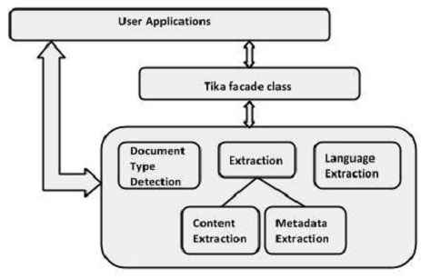

# TIKA参考API - Tika教程

用户可以在使用 Tika 的外观类在应用程序中嵌入Tika。它的方法来探索Tika的所有功能。因为它是一个外网类，Tika抽象的背后有其功能的复杂性。除了这一点，用户还可以使用各种Tika类在他们的应用程序。

## Tika 类 (facade)

这是最突出的Tika类库和正面设计模式。因此，抽象所有的内部实现，并提供了简单的方法来访问Tika功能。下表列出该类的构造函数以及它们的描述。

package : org.apache.tika

class: Tika

| S.No. | 构造函数和说明 |
| --- | --- |
| 1 | **Tika ()**使用默认配置，构建Tika类。 |
| 2 | **Tika (Detector detector)**通过接受检测实例作为参数创建 Tika 的外观 |
| 3 | **Tika (Detector detector, Parser parser)**创建一个Tika外观通过接受检测和解析器实例作为参数。 |
| 4 | **Tika (Detector detector, Parser parser, Translator translator)**创建一个Tika外观通过接受检测器，解析器，并且转换实例作为参数。 |
| 5 | **Tika (TikaConfig config)**创建一个Tika外观通过接受TikaConfig类作为参数的对象。 |

## 方法和说明

以下是 Tika外观类的重要方法：

| S.No. | 方法和描述 |
| --- | --- |
| 1 | **String parseToString (File file)**此方法及其所有变种分析作为参数传递的文件，并返回字符串格式提取的文本内容。默认情况下，这个字符串参数的长度是有限的。 |
| 2 | **int getMaxStringLength ()**返回由parseToString方法返回字符串的最大长度。 |
| 3 | **void setMaxStringLength (int maxStringLength)**设置由parseToString方法返回的字符串的最大长度。 |
| 4 | **Reader parse (File file)**该方法及其所有变型解析作为参数传递的文件，并返回 java.io.Reader对象的形式，所提取的文本内容。 |
| 5 | **String detect (InputStream stream, Metadata metadata)**该方法及其所有变接受InputStream对象和元数据对象作为参数，检测出给定文档的类型，并返回该文件类型的名称作为字符串对象。这种方法提炼使用 Tika 的检测手段。 |
| 6 | **String translate (InputStream text, String targetLanguage)**此方法及其所有变种接受InputStream对象，并表示，我们希望我们的文字被翻译语言的字符串，并把特定的文本所需的语言，尝试自动检测源语言。 |

## 解析器接口

这是Tika包的所有解析器类实现的接口。

package : org.apache.tika.parser

Interface : Parser

## 方法和说明

以下是TikaParser接口的重要方法：

| S.No. | 方法及描述 |
| --- | --- |
| 1 | **parse (InputStream stream, ContentHandler handler, Metadata metadata, ParseContext context)**这个方法将给定的文档解析到XHTML和SAX事件序列。解析后，将放置在ContentHandler类的对象，并在元数据的类的对象的元数据，所提取的文件的内容。 |

## Metadata 类

这个类实现了各种接口，如素材，地理，HttpHeaders，消息，微软Office，气候预测，TIFF，TikaMetadataKeys，TikaMimeKeys，Serializable接口，支持各种数据模型。下表列出了构造函数和这个类的方法及其说明。

**package :** org.apache.tika.metadata

**class :** Metadata

| S.No. | 构造方法及描述 |
| --- | --- |
| 1 | **Metadata()**构造一个新的，空的元数据。 |

| S.No. | 方法及描述 |
| --- | --- |
| 1 | **add (Property property, String value)**增加了一个元数据属性/值映射到给定的文件。使用此功能，可以将该值设置为一个属性。 |
| 2 | **add (String name, String value)**增加了一个元数据属性/值映射到给定的文件。使用这种方法，我们可以使用新名称的值设置为一个文件，从现有的元数据。 |
| 3 | **String get (Property property)**返回给定的元数据属性的值（如果有的话）。 |
| 4 | **String get (String name)**返回给定元数据的名称的值（如果有的话）。 |
| 5 | **Date getDate (Property property)**返回日期的元数据属性的值。 |
| 6 | **String[] getValues (Property property)**返回的元数据属性的所有的值。 |
| 7 | **String[] getValues (String name)**返回给定元数据的名称的所有的值。 |
| 8 | **String[] names()**返回元数据对象的元数据元素的所有的名字。 |
| 9 | **set (Property property, Date date)**设置给定的元数据属性的日期值 |
| 10 | **set(Property property, String[] values)**设置多个值到一个元数据属性。 |

## 语言类标识符

此分类标识了特定内容的语言。下表列出了这个类的构造函数以及它们的描述。

**package :** org.apache.tika.language

**class :** Language Identifier

| S.No. | 构造器和说明 |
| --- | --- |
| 1 | **LanguageIdentifier (LanguageProfile profile)**实例化的语言标识符。在这里必须通过一个LanguageProfile对象作为参数。 |
| 2 | **LanguageIdentifier (String content)**这个构造函数可以通过从文本内容传递一个String实例化一个语言标识符 |

| S.No. | 构造器和说明 |
| --- | --- |
| 1 | **String getLanguage ()**返回给当前LanguageIdentifier对象的语言。 |

 