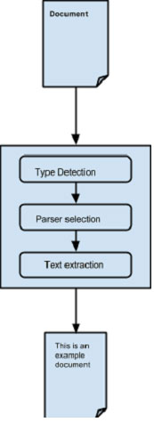
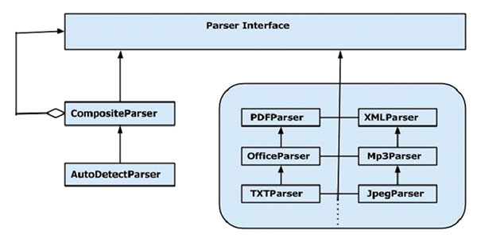

# TIKA内容提取 - Tika教程

Tika使用不同的解析器库来提取给解析器的内容。它选择了正确的语法分析器提取给定的文档类型。

解析文件，一般用于Tika外观facade类的parseToString()方法。下面显示的是所涉及分析过程的步骤和这些由Tika的ParsertoString()方法提取。



抽象的分析过程：

*   最初，当我们传一个文件到Tika，它使用与之适合的类型检测机制和检测文件类型。

*   一旦文档类型是已知的，它选择从解析器库中合适的解析器。解析器库中包含的类使用外部库。

*   然后将文档传送到选择将解析的内容，提取文本，并且还抛出了不可读格式异常解析器。

## 使用Tika内容提取

下面给出的是程序使用Tika facade 类从文件中提取文本：

```
import java.io.File;
import java.io.IOException;

import org.apache.tika.Tika;
import org.apache.tika.exception.TikaException;

import org.xml.sax.SAXException;

public class TikaExtraction {

   public static void main(final String[] args) throws IOException, TikaException {

      //Assume sample.txt is in your current directory		        
      File file = new File("sample.txt");

      //Instantiating Tika facade class
      Tika tika = new Tika();
      String filecontent = tika.parseToString(file);
      System.out.println("Extracted Content: " + filecontent);
   }		 
}
```

将以上代码保存为TikaExtraction.java并在命令提示符下运行：

```
javac TikaExtraction.java 
java TikaExtraction
```

注意：假设 sample.txt 是具有下列内容。

```
Hi students welcome to yiibai

```

它提供了以下的输出：

```
Extracted Content: Hi students welcome to yiibai

```

## 使用Parser接口内容提取

Tika 解析器包提供了使用它可以分析一个文本文档的几个接口和类。下面给出的是org.apache.tika.parser包的框架图。



有几个可用的解析器类，如PDF格式分析器，Mp3Passer，OfficeParser等，逐一分析各自的文件。所有这些类都实现了解析器接口。

### CompositeParser

给出的图表显示Tika通用解析器类CompositeParser 主AutoDetectParser。由于CompositeParser类遵循复合设计模式，可以用一组解析器实例作为一个单独的解析器。CompositeParser类也可以访问所有实现解析器接口的类。

### AutoDetectParser

这是CompositeParser的子类，它提供了自动类型检测。使用此功能，AutoDetectParser自动发送收到的文件到使用该复合方法适当分析器类。

### parse()方法

除了parseToString()，还可以使用分析器接口的parse()方法。该方法的原型如下所示。

```
parse([InputStream](http://docs.oracle.com/javase/6/docs/api/java/io/InputStream.htmll?is-external=true) stream, [ContentHandler](http://docs.oracle.com/javase/6/docs/api/org/xml/sax/ContentHandler.htmll?is-external=true) handler, [Metadata](https://tika.apache.org/1.6/api/org/apache/tika/metadata/Metadata.htmll) metadata, 
[ParseContext](https://tika.apache.org/1.6/api/org/apache/tika/parser/ParseContext.htmll) context)
```

下表列出了它接受作为参数的四个对象。

| S.No. | 对象及描述 |
| --- | --- |
| 1 | **InputStream stream**包含任何文件的InputStream对象的内容 |
| 2 | **ContentHandler handler**Tika通过文档作为XHTML内容到此处理，此后该文件正在使用SAX API处理。它提供了在一个文件有效的后处理的内容。 |
| 3 | **Metadata metadata**元数据对象是用来既作为源和文件的元数据的目标。 |
| 4 | **ParseContext context**此对象使用在如遇有客户端应用程序想要定制解析过程。 |

### 例如：

下面给出一个例子，说明如何使用 parse()方法。

**步骤 1：**

要使用解析器接口的parse()方法，实例化任何为其提供实现这个接口的类。

也有个别解析器类，如PDFParser，OfficeParser，XMLParser等等。可以使用这些个人文件解析器。或者也可以使用CompositeParser或AutoDetectParser在内部使用的所有解析器类，并提取使用合适的解析器文档的内容。

```
Parser parser = new AutoDetectParser();
   (or)
Parser parser = new CompositeParser();  
   (or)        
object of any individual parsers given in Tika Library 
```

**步骤 2：**

创建一个处理类的对象。下面给出的是三个内容处理程序：

| S.No. | 类及描述 |
| --- | --- |
| 1 | **BodyContentHandler**这个类采用XHTML输出的主体部分，并写入该内容到输出写入或输出流。然后重定向XHTML内容到另一个内容处理程序实例。 |
| 2 | **LinkContentHandler**这个类检测，并挑选XHTML文档的所有H-参考标签和转发那些使用类似网络爬虫工具。 |
| 3 | **TeeContentHandler**这个类可以帮助在同时使用多个工具。 |

由于我们的目标是要提取的文件的文本内容，实例化BodyContentHandler如下图所示：

```
BodyContentHandler handler = new BodyContentHandler( );
```

**步骤  3：**

创建的元数据对象，如下所示：

```
Metadata metadata = new Metadata();
```

**步骤  4：**

创建任何输入流对象，并通过您的文件应该被提取到它。

### FileInputstream

通过将文件路径作为参数实例化一个文件对象，这个对象传递给的FileInputStream类的构造函数。

注意：传递给文件对象的路径不应包含空格。

使用这些输入流类的问题是，它们不支持随机访问读取，来高效地处理某些文件格式是必需。要解决此问题，Tika提供TikaInputStream。

```
File file=new File(filepath)
FileInputStream inputstream=new FileInputStream(file);
   (or)
InputStream stream = TikaInputStream.get(new File(filename));
```

**步骤 5：**

创建一个解析的上下文对象，如下所示：

```
ParseContext context =new ParseContext();
```

**步骤 6：**

实例化解析器对象，调用parse方法，并通过所有需要的对象，如下面的原型：

```
parser.parse(inputstream, handler, metadata, context);
```

下面给出的是程序使用的解析器接口内容提取：

```
import java.io.File;
import java.io.FileInputStream;
import java.io.IOException;

import org.apache.tika.exception.TikaException;
import org.apache.tika.metadata.Metadata;
import org.apache.tika.parser.AutoDetectParser;
import org.apache.tika.parser.ParseContext;
import org.apache.tika.parser.Parser;
import org.apache.tika.sax.BodyContentHandler;

import org.xml.sax.SAXException;

public class ParserExtraction {

public static void main(final String[] args) throws IOException,SAXException, TikaException {

   //Assume sample.txt is in your current directory
   File file = new File("sample.txt");

   //parse method parameters
   Parser parser = new AutoDetectParser();
   BodyContentHandler handler = new BodyContentHandler();
   Metadata metadata = new Metadata();
   FileInputStream inputstream = new FileInputStream(file);
   ParseContext context = new ParseContext();

   //parsing the file
   parser.parse(inputstream, handler, metadata, context);
   System.out.println("File content : " + Handler.toString());
   }
}
```

将以上代码保存为 ParserExtraction.java 并在命令提示符下运行：

```
javac  ParserExtraction.java 
java  ParserExtraction
```

假设 sample.txt 包含以下内容。

```
Hi students welcome to yiibai

```

它提供了以下的输出：

```
File content : Hi students welcome to yiibai
```

 