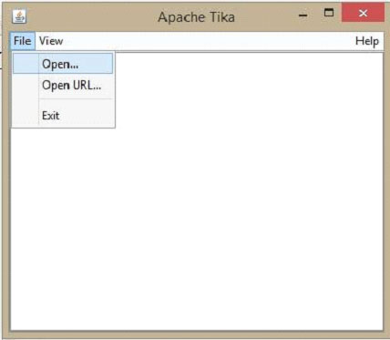
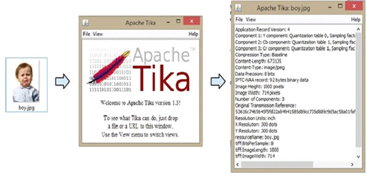

# TIKA图形界面/GUI - Tika教程

## 图形用户界面(GUI)

*   Tika 提供了一个jar文件连同下面的链接它的源代码: [http://tika.apache.org/download.htmll.](http://tika.apache.org/download.htmll)

*   下载文件，并设置JAR类文件路径。

*   提取源代码zip文件夹，打开tika-app文件夹。

*   在解压缩文件夹“tika-1.6\tika-app\src\main\java\org\apache\Tika\gui” 后，会看到两个类文件：ParsingTransferHandler.java 和TikaGUI.java。

*   编译这两个类文件并执行TikaGUI.java类文件，它会打开下面的窗口。

现在让我们看看如何利用Tika的GUI。

在GUI上，点击open打开，浏览并选择一个文件，该文件将被提取，或将其拖动到窗口的空白。

Tika 提取的文件的内容，并在五个不同的格式显示出来，即。元数据，格式化文本，纯文本，主要内容和结构化文本。可以选择任何想要的格式。

以同样的方式，会发现在“tika-1.6\tika-app\src\main\java\org\apache\tika\cliI”文件夹中的CLI类。

下图显示了Tika能做到。当我们把图像托放在图形用户界面上，Tika提取并显示其元数据。

   