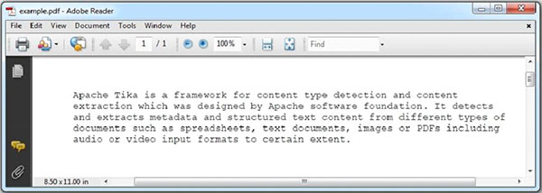
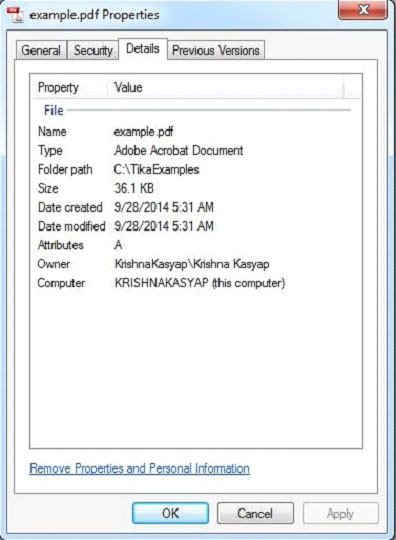

# TIKA提取PDF - Tika教程

下面给出的程序是用来提取PDF文件内容和元数据。

```
import java.io.File;
import java.io.FileInputStream;
import java.io.IOException;

import org.apache.tika.exception.TikaException;
import org.apache.tika.metadata.Metadata;
import org.apache.tika.parser.ParseContext;
import org.apache.tika.parser.pdf.PDFParser;
import org.apache.tika.sax.BodyContentHandler;

import org.xml.sax.SAXException;

public class PdfParse {

   public static void main(final String[] args) throws IOException,TikaException {

      BodyContentHandler handler = new BodyContentHandler();
      Metadata metadata = new Metadata();
      FileInputStream inputstream = new FileInputStream(new File("Example.pdf"));
      ParseContext pcontext = new ParseContext();

      //parsing the document using PDF parser
      PDFParser pdfparser = new PDFParser(); 
      pdfparser.parse(inputstream, handler, metadata,pcontext);

      //getting the content of the document
      System.out.println("Contents of the PDF :" + handler.toString());

      //getting metadata of the document
      System.out.println("Metadata of the PDF:");
      String[] metadataNames = metadata.names();

      for(String name : metadataNames) {
         System.out.println(name+ " : " + metadata.get(name));
      }
   }
}
```

保存上述代码保存为PdfParse.java，并通过使用下面的命令从命令提示编译：

```
javac PdfParse.java
java PdfParse
```

下面给出的是Example.pdf文件的快照：



PDF文档具有以下属性：



执行上述程序后，会得到如下的输出

输出:

```
Contents of the PDF:

Apache Tika is a framework for content type detection and content extraction 
which was designed by Apache software foundation. It detects and extracts metadata 
and structured text content from different types of documents such as spreadsheets, 
text documents, images or PDFs including audio or video input formats to certain extent.  

Metadata of the PDF:

dcterms:modified :     2014-09-28T12:31:16Z
meta:creation-date :     2014-09-28T12:31:16Z
meta:save-date :     2014-09-28T12:31:16Z
dc:creator :     Krishna Kasyap
pdf:PDFVersion :     1.5
Last-Modified :     2014-09-28T12:31:16Z
Author :     Krishna Kasyap
dcterms:created :     2014-09-28T12:31:16Z
date :     2014-09-28T12:31:16Z
modified :     2014-09-28T12:31:16Z
creator :     Krishna Kasyap
xmpTPg:NPages :     1
Creation-Date :     2014-09-28T12:31:16Z
pdf:encrypted :     false
meta:author :     Krishna Kasyap
created :     Sun Sep 28 05:31:16 PDT 2014
dc:format :     application/pdf; version=1.5
producer :     Microsoft® Word 2013
Content-Type :     application/pdf
xmp:CreatorTool :     Microsoft® Word 2013
Last-Save-Date :     2014-09-28T12:31:16Z
```

 