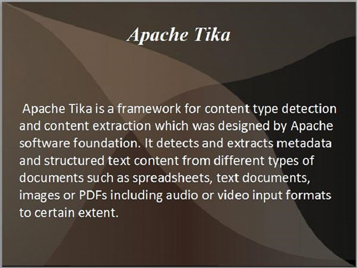
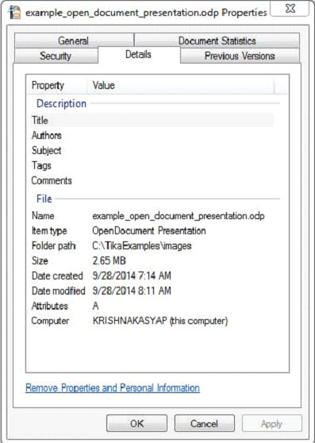

# TIKA提取ODF - Tika教程

下面给出的是程序从打开Office文档格式(ODF)中提取内容和元数据。

```
import java.io.File;
import java.io.FileInputStream;
import java.io.IOException;

import org.apache.tika.exception.TikaException;
import org.apache.tika.metadata.Metadata;
import org.apache.tika.parser.ParseContext;
import org.apache.tika.parser.odf.OpenDocumentParser;
import org.apache.tika.sax.BodyContentHandler;

import org.xml.sax.SAXException;

public class OpenDocumentParse {

   public static void main(final String[] args) throws IOException,SAXException, TikaException{

      //detecting the file type
      BodyContentHandler handler = new BodyContentHandler();
      Metadata metadata = new Metadata();
      FileInputStream inputstream = new FileInputStream(new File("example_open_document_presentation.odp"));
      ParseContext pcontext = new ParseContext();

      //Open Document Parser
      OpenDocumentParser openofficeparser = new OpenDocumentParser (); 
      openofficeparser.parse(inputstream, handler, metadata,pcontext); 
      System.out.println("Contents of the document:" + handler.toString());
      System.out.println("Metadata of the document:");
      String[] metadataNames = metadata.names();

      for(String name : metadataNames) {		        
         System.out.println(name + " :  " + metadata.get(name)); 
      }
   }
}
```

将以上代码保存为OpenDocumentParse.java，并通过使用以下命令，在命令提示符下编译：

```
javac OpenDocumentParse.java
java OpenDocumentParse
```

下面给出的是example_open_document_presentation.odp的快照：



本文档具有以下属性：



执行上述程序后，将得到下面的输出。

输出:

```
Contents of the document:
Apache Tika
Apache Tika is a framework for content type detection and content extraction which was designed 
by Apache software foundation. It detects and extracts metadata and structured text content from 
different types of documents such as spreadsheets, text documents, images or PDFs including audio 
or video input formats to certain extent. 

Metadata of the document:
editing-cycles:   4
meta:creation-date:   2009-04-16T11:32:32.86
dcterms:modified:   2014-09-28T07:46:13.03
meta:save-date:   2014-09-28T07:46:13.03
Last-Modified:   2014-09-28T07:46:13.03
dcterms:created:   2009-04-16T11:32:32.86
date:   2014-09-28T07:46:13.03
modified:   2014-09-28T07:46:13.03
nbObject:   36
Edit-Time:   PT32M6S
Creation-Date:   2009-04-16T11:32:32.86
Object-Count:   36
meta:object-count:   36
generator:   OpenOffice/4.1.0$Win32 OpenOffice.org_project/410m18$Build-9764
Content-Type:   application/vnd.oasis.opendocument.presentation
Last-Save-Date:   2014-09-28T07:46:13.03
```

 