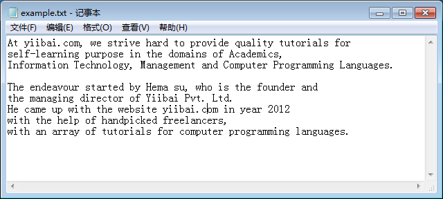
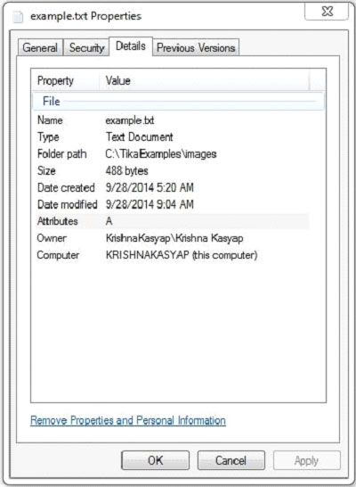

# TIKA提取文本文档 - Tika教程

下面给出的程序是用来提取文本文档的内容和元数据：

```
import java.io.File;
import java.io.FileInputStream;
import java.io.IOException;

import org.apache.tika.exception.TikaException;
import org.apache.tika.metadata.Metadata;
import org.apache.tika.parser.ParseContext;
import org.apache.tika.sax.BodyContentHandler;
import org.apache.tika.parser.txt.TXTParser;

import org.xml.sax.SAXException;

public class TextParser {

   public static void main(final String[] args) throws IOException,SAXException, TikaException {

      //detecting the file type
      BodyContentHandler handler = new BodyContentHandler();
      Metadata metadata = new Metadata();
      FileInputStream inputstream = new FileInputStream(new File("example.txt"));
      ParseContext pcontext=new ParseContext();

      //Text document parser
      TXTParser  TexTParser = new TXTParser();
      TexTParser.parse(inputstream, handler, metadata,pcontext);
      System.out.println("Contents of the document:" + handler.toString());
      System.out.println("Metadata of the document:");
      String[] metadataNames = metadata.names();

      for(String name : metadataNames) {
         System.out.println(name + " : " + metadata.get(name));
      }
   }
}
```

保存上述代码作为TextParser.java，并通过使用下面的命令从命令提示编译：

```
javac TextParser.java
java TextParser
```

下面给出的是example.txt文件的快照：



文本文件具有以下属性：



执行上述程序后，将得到下面的输出。

输出:

```
Contents of the document:

```

At Yiibai.com, we strive hard to provide quality tutorials for self-learning purpose in the domains of Academics, Information Technology, Management and Computer Programming Languages.

The endeavour started by Hema su, who is the founder and the managing director of  Yiibai Pvt. Ltd. He came up with the website yiibai.com in year 2014 with the help of handpicked freelancers, with an array of tutorials for computer programming languages.

Metadata of the document: Content-Encoding: windows-1252 Content-Type: text/plain; charset=windows-1252  