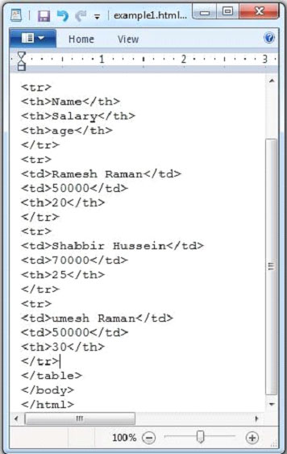

# TIKA提取HTML文档 - Tika教程

下面给出的是该程序用于从HTML文档提取内容和元数据。

```
import java.io.File;
import java.io.FileInputStream;
import java.io.IOException;

import org.apache.tika.exception.TikaException;
import org.apache.tika.metadata.Metadata;
import org.apache.tika.parser.ParseContext;
import org.apache.tika.parser.html.HtmlParser;
import org.apache.tika.sax.BodyContentHandler;

import org.xml.sax.SAXException;

public class HtmlParse {

   public static void main(final String[] args) throws IOException,SAXException, TikaException {

      //detecting the file type
      BodyContentHandler handler = new BodyContentHandler();
      Metadata metadata = new Metadata();
      FileInputStream inputstream = new FileInputStream(new File("example.htmll"));
      ParseContext pcontext = new ParseContext();

      //Html parser 
      HtmlParser htmlparser = new HtmlParser();
      htmlparser.parse(inputstream, handler, metadata,pcontext);
      System.out.println("Contents of the document:" + handler.toString());
      System.out.println("Metadata of the document:");
      String[] metadataNames = metadata.names();

      for(String name : metadataNames) {
         System.out.println(name + ":   " + metadata.get(name));  
      }
   }
}
```

保存上述代码保存为HtmlParse.java，并通过使用下面的命令从命令提示编译：

```
javac HtmlParse.java
java HtmlParse 
```

下面给出的是 example.htmll 文档的快照。



HTML文档有以下属性：


执行上述程序后，将得到下面的输出。

输出:

```
Contents of the document:
	Name	                     Salary	    age
	Ramesh Raman	             50000	    20
	Shabbir Hussein	             70000          25
	Umesh Raman	             50000	    30
	Somesh	                     50000	    35
Metadata of the document:
title:   HTML Table Header
Content-Encoding:   windows-1252
Content-Type:   text/html; charset=windows-1252
dc:title:   HTML Table Header
```

 