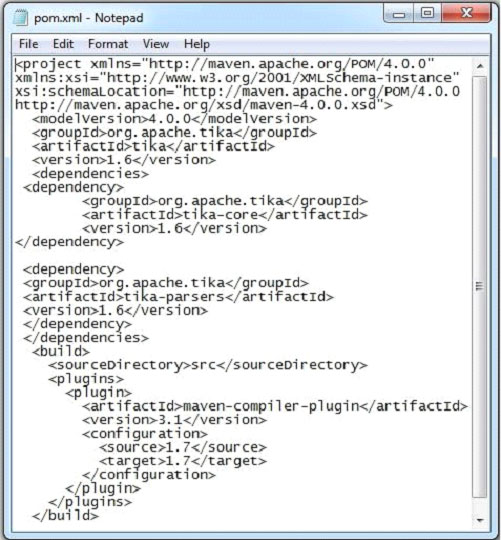
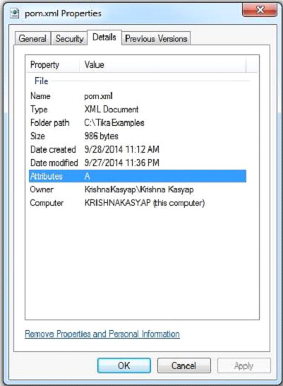

# TIKA提取XML文档 - Tika教程

下面给出的程序是用来从XML文档提取内容和元数据：

```
import java.io.File;
import java.io.FileInputStream;
import java.io.IOException;

import org.apache.tika.exception.TikaException;
import org.apache.tika.metadata.Metadata;
import org.apache.tika.parser.ParseContext;
import org.apache.tika.parser.xml.XMLParser;
import org.apache.tika.sax.BodyContentHandler;

import org.xml.sax.SAXException;

public class XmlParse {

   public static void main(final String[] args) throws IOException,SAXException, TikaException {

      //detecting the file type
      BodyContentHandler handler = new BodyContentHandler();
      Metadata metadata = new Metadata();
      FileInputStream inputstream = new FileInputStream(new File("pom.xml"));
      ParseContext pcontext = new ParseContext();

      //Xml parser
      XMLParser xmlparser = new XMLParser(); 
      xmlparser.parse(inputstream, handler, metadata, pcontext);
      System.out.println("Contents of the document:" + handler.toString());
      System.out.println("Metadata of the document:");
      String[] metadataNames = metadata.names();

      for(String name : metadataNames) {
         System.out.println(name + ": " + metadata.get(name));
      }
   }
}
```

保存上述代码保存为XmlParse.java，并通过使用下面的命令从命令提示编译：

```
javac XmlParse.java
java XmlParse 
```

下面给出的是pom.xml文件的快照



本文档具有以下属性：



执行上述程序后，将得到下面的输出。

输出:

```
Contents of the document:   
4.0.0
org.apache.tika
tika
1.6
org.apache.tika
tika-core
1.6
org.apache.tika
tika-parsers
1.6
src
maven-compiler-plugin
3.1
1.7
1.7

Metadata of the document:
Content-Type:   application/xml 
```

 