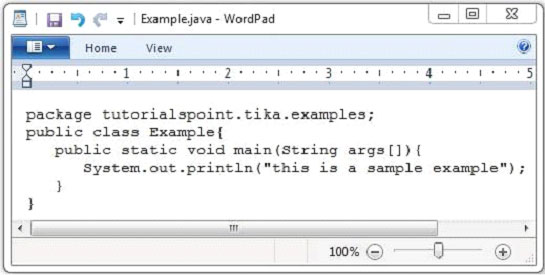
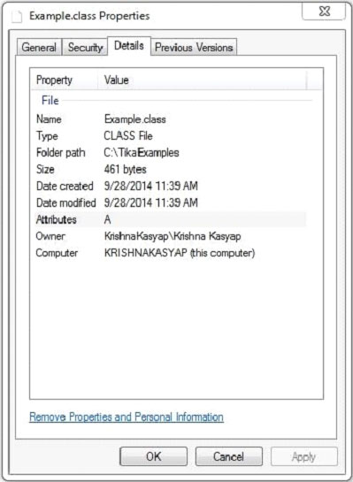

# TIKA提取.class文件 - Tika教程

下面给出的是该程序提取.class文件的内容和元数据。

```
import java.io.File;
import java.io.FileInputStream;
import java.io.IOException;

import org.apache.tika.exception.TikaException;
import org.apache.tika.metadata.Metadata;
import org.apache.tika.parser.ParseContext;
import org.apache.tika.parser.asm.ClassParser;
import org.apache.tika.sax.BodyContentHandler;

import org.xml.sax.SAXException;

public class JavaClassParse {

   public static void main(final String[] args) throws IOException,SAXException, TikaException {

      //detecting the file type
      BodyContentHandler handler = new BodyContentHandler();
      Metadata metadata = new Metadata();
      FileInputStream inputstream = new FileInputStream(new File("Example.class"));
      ParseContext pcontext = new ParseContext();

      //Html parser
      ClassParser  ClassParser = new  ClassParser();
      ClassParser.parse(inputstream, handler, metadata,pcontext);
      System.out.println("Contents of the document:" + handler.toString());
      System.out.println("Metadata of the document:");
      String[] metadataNames = metadata.names();

      for(String name : metadataNames) {		        
         System.out.println(name + " :  " + metadata.get(name));  
      }
   }
}
```

保存上述代码作为JavaClassParse.java，并通过使用下面的命令从命令提示编译：

```
javac JavaClassParse.java
java JavaClassParse 
```

下面给出的是Example.java编译执行后，将得到example.class文件的快照：



此.class文件有以下属性：



执行上述程序后，将得到下面的输出。

输出:

```
Contents of the document:
package yiibai.tika.examples;
public synchronized class Example {
   public void Example();
   public static void main(String[]);
}

Metadata of the document:
title: Example
resourceName: Example.class
dc:title: Example
```

 