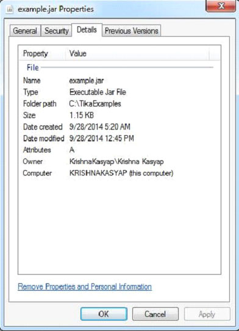

# TIKA提取JAR文件 - Tika教程

下面给出的程序是用来从一个Java存档(JAR)文件提取内容和元数据：

```

import java.io.File;
import java.io.FileInputStream;
import java.io.IOException;

import org.apache.tika.exception.TikaException;
import org.apache.tika.metadata.Metadata;
import org.apache.tika.parser.ParseContext;
import org.apache.tika.sax.BodyContentHandler;
import org.apache.tika.parser.pkg.PackageParser;

import org.xml.sax.SAXException;

public class PackageParse {

   public static void main(final String[] args) throws IOException,SAXException, TikaException {

      //detecting the file type
      BodyContentHandler handler = new BodyContentHandler();
      Metadata metadata = new Metadata();
      FileInputStream inputstream = new FileInputStream(new File("Example.jar"));
      ParseContext pcontext = new ParseContext();

      //Package parser
      PackageParser packageparser = new PackageParser();
      packageparser.parse(inputstream, handler, metadata,pcontext);
      System.out.println("Contents of the document: " + handler.toString());
      System.out.println("Metadata of the document:");
      String[] metadataNames = metadata.names();

      for(String name : metadataNames) {
         System.out.println(name + ":   " + metadata.get(name));
      }
   }
}
```

保存上述代码为PackageParse.java，并通过使用下面的命令从命令提示编译：

```
javac PackageParse.java
java PackageParse 
```

在这里，我们通过下面的Example.java文件得到jar文件。


jar文件具有以下属性：



执行上述程序后，将得到下面的输出。

输出:

```
Contents of the document:
META-INF/MANIFEST.MF
yiibai/tika/examples/Example.class

Metadata of the document:
Content-Type:   application/zip
```

 