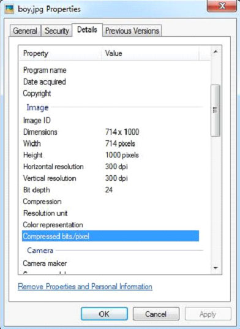

# TIKA提取图像文件 - Tika教程

下面给出的该程序是从一个JPEG图像中提取的内容和元数据。

```
import java.io.File;
import java.io.FileInputStream;
import java.io.IOException;

import org.apache.tika.exception.TikaException;
import org.apache.tika.metadata.Metadata;
import org.apache.tika.parser.ParseContext;
import org.apache.tika.parser.jpeg.JpegParser;
import org.apache.tika.sax.BodyContentHandler;

import org.xml.sax.SAXException;

public class JpegParse {

   public static void main(final String[] args) throws IOException,SAXException, TikaException {

      //detecting the file type
      BodyContentHandler handler = new BodyContentHandler();
      Metadata metadata = new Metadata();
      FileInputStream inputstream = new FileInputStream(new File("boy.jpg"));
      ParseContext pcontext = new ParseContext();

      //Jpeg Parse
      JpegParser  JpegParser = new JpegParser();
      JpegParser.parse(inputstream, handler, metadata,pcontext);
      System.out.println("Contents of the document:" + handler.toString());
      System.out.println("Metadata of the document:");
      String[] metadataNames = metadata.names();

      for(String name : metadataNames) { 		        
         System.out.println(name + ": " + metadata.get(name));
      }
   }
}
```

保存上述代码为JpegParse.java，并通过使用下面的命令从命令提示编译：

```
javac JpegParse.java
java JpegParse 
```

在这里，我们通过下面的example.jpeg文件：


JPEG文件具有以下属性：



在执行上面的应用程序，会得到如下的输出。

输出:

```
Contents of the document:

Metadata of the document:
IPTC-NAA record: 92 bytes binary data
Number of Components: 3
Image Height: 1000 pixels
Resolution Units: inch
Data Precision: 8 bits
tiff:BitsPerSample: 8
Compression Type: Baseline
Component 1: Y component: Quantization table 0, Sampling factors 1 horiz/1 vert
Component 2: Cb component: Quantization table 1, Sampling factors 1 horiz/1 vert
tiff:ImageLength: 1000
Component 3: Cr component: Quantization table 1, Sampling factors 1 horiz/1 vert
X Resolution: 300 dots
tiff:ImageWidth: 714
Application Record Version: 4
Image Width: 714 pixels
Original Transmission Reference:
 53616c7465645f5fd22a84941585d89cc735d889c9d5ac58a01faf2c92ee3c6f9bcb38359bbe1eef
Y Resolution: 300 dots
```

 