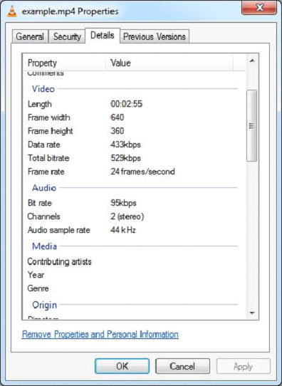

# TIKA提取mp4文件 - Tika教程

下面给出的程序是用来从mp4文件提取内容和元数据：

```
import java.io.File;
import java.io.FileInputStream;
import java.io.IOException;

import org.apache.tika.exception.TikaException;
import org.apache.tika.metadata.Metadata;
import org.apache.tika.parser.ParseContext;
import org.apache.tika.parser.mp4.MP4Parser;
import org.apache.tika.sax.BodyContentHandler;

import org.xml.sax.SAXException;

public class Mp4Parse {

   public static void main(final String[] args) throws IOException,SAXException, TikaException {

      //detecting the file type
      BodyContentHandler handler = new BodyContentHandler();
      Metadata metadata = new Metadata();
      FileInputStream inputstream = new FileInputStream(new File("example.mp4"));
      ParseContext pcontext = new ParseContext();

      //Html parser
      MP4Parser MP4Parser = new MP4Parser();
      MP4Parser.parse(inputstream, handler, metadata,pcontext);
      System.out.println("Contents of the document:  :" + handler.toString());
      System.out.println("Metadata of the document:");
      String[] metadataNames = metadata.names();

      for(String name : metadataNames) {
         System.out.println(name + ": " + metadata.get(name));
      }
   }  
}
```

保存上述代码保存为JpegParse.java，并通过使用下面的命令从命令提示编译：

```
javac Mp4Parse.java
java Mp4Parse 
```

下面给出的是example.mp4的快照属性：



执行上述程序后，得到如下的输出

输出:

```
Contents of the document:

Metadata of the document:
dcterms:modified: 2014-01-06T12:10:27Z
meta:creation-date: 1904-01-01T00:00:00Z
meta:save-date: 2014-01-06T12:10:27Z
Last-Modified: 2014-01-06T12:10:27Z
dcterms:created: 1904-01-01T00:00:00Z
date: 2014-01-06T12:10:27Z
tiff:ImageLength: 360
modified: 2014-01-06T12:10:27Z
Creation-Date: 1904-01-01T00:00:00Z
tiff:ImageWidth: 640
Content-Type: video/mp4
Last-Save-Date: 2014-01-06T12:10:27Z
```

 