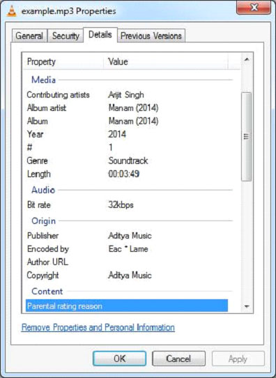

# TIKA提取MP3文件 - Tika教程

下面给出的程序是用于提取MP3文件内容和元数据：

```
import java.io.File;
import java.io.FileInputStream;
import java.io.IOException;

import org.apache.tika.exception.TikaException;
import org.apache.tika.metadata.Metadata;
import org.apache.tika.parser.ParseContext;
import org.apache.tika.parser.mp3.LyricsHandler;
import org.apache.tika.parser.mp3.Mp3Parser;
import org.apache.tika.sax.BodyContentHandler;

import org.xml.sax.SAXException;

public class Mp3Parse {

   public static void main(final String[] args) throws Exception, IOException, SAXException, TikaException {

      //detecting the file type
      BodyContentHandler handler = new BodyContentHandler();
      Metadata metadata = new Metadata();
      FileInputStream inputstream = new FileInputStream(new File("example.mp3"));
      ParseContext pcontext = new ParseContext();

      //Mp3 parser
      Mp3Parser  Mp3Parser = new  Mp3Parser();
      Mp3Parser.parse(inputstream, handler, metadata, pcontext);
      LyricsHandler lyrics = new LyricsHandler(inputstream,handler);

      while(lyrics.hasLyrics()) {
    	  System.out.println(lyrics.toString());
      }

      System.out.println("Contents of the document:" + handler.toString());
      System.out.println("Metadata of the document:");
      String[] metadataNames = metadata.names();

      for(String name : metadataNames) {		        
    	  System.out.println(name + ": " + metadata.get(name));
      }
   }
}
```

保存上述代码保存为JpegParse.java，并通过使用下面的命令从命令提示编译：

```
javac Mp3Parse.java
java Mp3Parse 
```

在这里，我们传递一个example.mp3文件具有以下属性：



执行上述程序后，将得到下面的输出。

如果给定的文件有任何的歌词，我们的应用程序将捕获和显示，和输出。

输出:

```
Contents of the document:
Kanulanu Thaake
Arijit Singh
Manam (2014), track 01/06
2014
Soundtrack
30171.65
eng - 
DRGM
Arijit Singh
Manam (2014), track 01/06
2014
Soundtrack
30171.65
eng - 
DRGM

Metadata of the document:
xmpDM:releaseDate: 2014
xmpDM:duration: 30171.650390625
xmpDM:audioChannelType: Stereo
dc:creator: Arijit Singh
xmpDM:album: Manam (2014)
Author: Arijit Singh
xmpDM:artist: Arijit Singh
channels: 2
xmpDM:audioSampleRate: 44100
xmpDM:logComment: eng - 
DRGM
xmpDM:trackNumber: 01/06
version: MPEG 3 Layer III Version 1
creator: Arijit Singh
xmpDM:composer: Music : Anoop Rubens | Lyrics : Vanamali
xmpDM:audioCompressor: MP3
title: Kanulanu Thaake
samplerate: 44100
meta:author: Arijit Singh
xmpDM:genre: Soundtrack
Content-Type: audio/mpeg
xmpDM:albumArtist: Manam (2014)
dc:title: Kanulanu Thaake
```

 